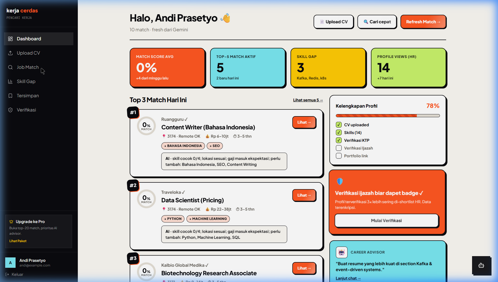
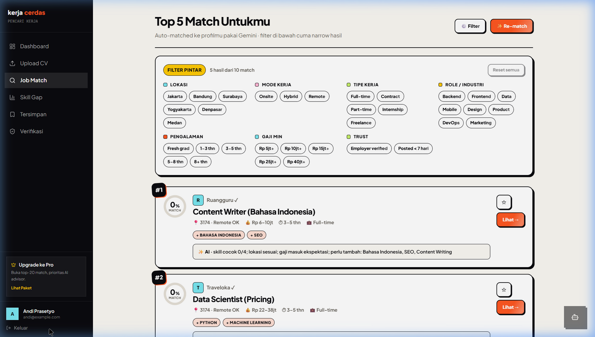
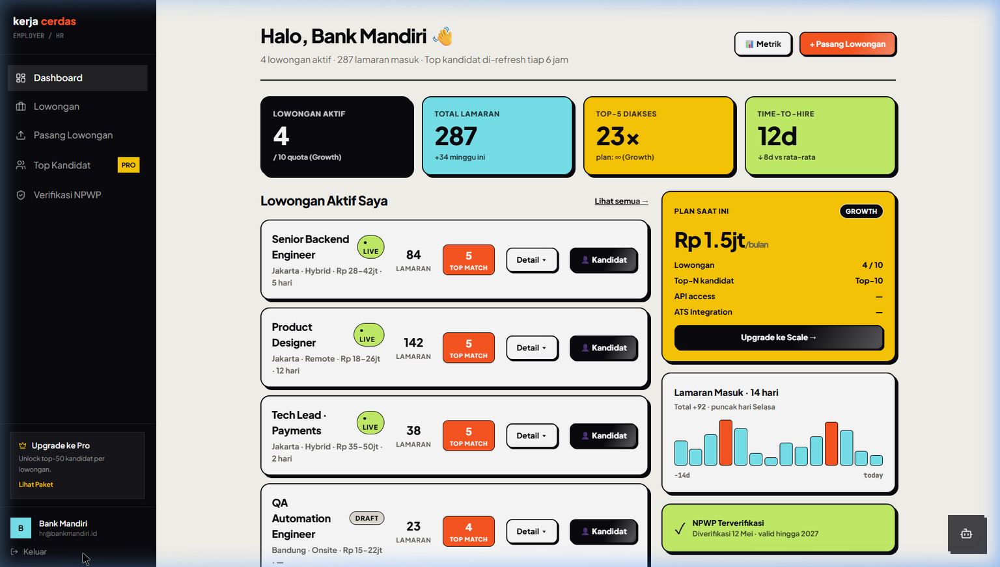

<div align="center">

# KerjaCerdas

**Platform Job Matching Berbasis Semantik untuk Pasar Tenaga Kerja Indonesia**

[](https://fastapi.tiangolo.com) [](https://postgresql.org) [](https://react.dev) [](https://vitejs.dev) [](https://tailwindcss.com) [](https://ai.google.dev) [](https://langchain-ai.github.io/langgraph/)


| Dashboard Seeker | AI Job Matches | Dashboard Employer |
| :---: | :---: | :---: |
|  |  |  |

[Panduan Demo](#-panduan-demo) · [Quick Start](#-quick-start-5-menit) · [Arsitektur](#-arsitektur-sistem) · [Proposal Bisnis](docs/PROPOSAL_2ND.md)

</div>

---

## 📌 Masalah yang Kami Pecahkan

Indonesia memiliki **7.86 juta pengangguran** [ESTIMASI] (BPS, Feb 2025) — namun para employer (pemberi kerja) sering mengatakan *"sulit mencari orang yang tepat"*. Akar penyebabnya adalah **triple mismatch (ketidakcocokan ganda)**:

| Mismatch | Skala | Dampak |
|---|---|---|
| **Skill mismatch** | 62% [ESTIMASI] lulusan bekerja di luar bidangnya | Investasi pendidikan terbuang percuma |
| **Relevance mismatch** | Pencarian kata kunci mengabaikan skill yang berhubungan secara semantik | Kandidat bagus ditolak, yang kurang tepat malah masuk shortlist |
| **Trust mismatch** | CV yang tidak bisa diverifikasi → HR terlalu mengandalkan universitas ternama | Talenta daerah (non-UI/ITB) secara sistematis diremehkan |

Portal lowongan kerja yang ada saat ini (Jobstreet, Glints, Kalibrr) pada dasarnya adalah **mesin pencari kata kunci berbayar**. Mereka tidak memahami konteks skill. KerjaCerdas memahaminya.

---

## ✨ Apa yang Membuat KerjaCerdas Berbeda

| Fitur | Portal Tradisional | **KerjaCerdas** |
|---|---|---|
| Matching engine | Filter kata kunci | **Gemini semantic embeddings** (vektor 3072-dimensi) |
| Skill gap | Tidak ada | **Spesifik skill diidentifikasi + rekomendasi course** |
| Career guidance | Tidak ada | **AI advisor dalam Bahasa Indonesia** (memahami konteks) |
| Verification | Opsional / diisi sendiri | **Mock e-KYC: NIK, Ijazah, NPWP** |
| Biaya Seeker | Upsell premium (Rp 49rb–199rb/bulan) [ESTIMASI] | **Gratis selamanya** |
| Posting Employer | Rp 3–5 juta/post [ESTIMASI] | **Rp 499rb/post** [ESTIMASI] |
| Keadilan Regional | Berpusat di Jawa | **Region-weighted scoring** (34 provinsi) |

---

## 🎯 Fitur MVP (Berfungsi Penuh di Demo Ini)

### Untuk Pencari Kerja (Seeker)
- ✅ **Register & Login** (JWT auth, role-based)
- ✅ **Upload CV (PDF)** → Gemini AI mem-parsing skill, pengalaman, dan pendidikan secara otomatis
- ✅ **AI Job Matching** → pencarian vektor semantik terhadap database pekerjaan aktif
- ✅ **Skill Gap Analysis** → mengidentifikasi dengan tepat skill yang kurang untuk setiap pekerjaan
- ✅ **Course Recommendations** → rekomendasi course spesifik untuk menutup setiap celah skill (gap)
- ✅ **AI Career Advisor** → berbasis chat, Bahasa Indonesia, memahami konteks profil
- ✅ **Save Jobs** → pekerjaan yang disimpan disinkronkan ke backend (cross-session)
- ✅ **Identity Verification** → mock KTP/NIK + Ijazah + trust badge

### Untuk Employer
- ✅ **Register & Login** → Profil employer dibuat otomatis, siap untuk memposting lowongan
- ✅ **Post Job** → form manual ATAU upload job pack PDF (AI membuat postingan secara otomatis)
- ✅ **AI Candidate Ranking** → top-5 kandidat diurutkan oleh Gemini untuk setiap postingan
- ✅ **Live Pool Estimation** → melihat perkiraan jumlah kandidat *saat Anda mengetik* Job Description
- ✅ **Manage Jobs** → melihat semua postingan aktif dengan jumlah pelamar real-time
- ✅ **Company Verification** → mock verifikasi NPWP/Akta → trust badge

---

## 🏆 Kesesuaian Penilaian Hackathon

KerjaCerdas dirancang secara eksplisit untuk meraih skor tinggi terhadap kriteria penilaian inovasi hackathon standar, didasarkan pada data dunia nyata dan riset pasar:

### 1. Keselarasan dengan Rumusan Masalah & Kebutuhan Pasar
- **Data**: Indonesia menghadapi 7.86 juta pengangguran [ESTIMASI] (BPS, Feb 2025) dan tingkat mismatch skill sebesar 62% [ESTIMASI]. Selain itu, 78% dari manajer HR [ESTIMASI] menolak CV tanpa review mendalam karena keterbatasan filter keyword (dari survei validasi HR awal kami).
- **Solusi**: Kami mengganti filter kata kunci lawas dengan AI semantik, secara langsung menangani inti dari "triple mismatch" (Skill, Relevansi, dan Kepercayaan) di pasar tenaga kerja Indonesia.

### 2. Efektivitas & Dampak
- **Dampak Pencari Kerja**: Memberdayakan kandidat (terutama dari universitas non-tier atas) dengan mengalihkan fokus rekrutmen ke arah skill yang divalidasi daripada nama institusi.
- **Dampak Employer**: Dirancang untuk memangkas waktu rata-rata rekrutmen dari **45 hari menjadi < 15 hari** [ESTIMASI]. Dengan secara otomatis menyajikan top-5 shortlist yang sudah diranking, kami menargetkan **peningkatan 4× lipat** [ESTIMASI] pada relevansi match dibanding portal konvensional.

### 3. Kelayakan Model Bisnis
- **Keberlanjutan**: Ekosistem freemium di mana pencari kerja selalu menggunakan platform secara gratis. Employer membayar dengan biaya terjangkau **Rp 499.000 per post** [ESTIMASI] (jauh lebih murah daripada incumbent yang mematok Rp 3–5 juta [ESTIMASI]).
- **Unit Economics**: Dibangun untuk profitabilitas dengan estimasi **78% gross margin** [ESTIMASI], didorong oleh routing API Gemini yang sangat teroptimasi (biaya hanya ~Rp 30 per pencari kerja/bulan [ESTIMASI] untuk AI inference).

### 4. Keunikan & Kreativitas
- **Beyond Keywords**: Memetakan kemampuan kandidat ke dalam ruang vektor 3072-dimensi untuk menemukan kecocokan implisit yang terlewatkan oleh filter kata kunci dan regex standar.
- **Agentic Workflow**: Menggunakan LangGraph agents untuk mengatur parsing CV, gap analysis, dan course recommendations menjadi sebuah pengalaman UI yang utuh, alih-alih form statis.

---

## 🚀 Quick Start (5 Menit)

### Prasyarat
- **Python 3.11+**
- **Node.js 18+**
- (Opsional) `GEMINI_API_KEY` dari [Google AI Studio](https://aistudio.google.com) — aplikasi tetap berjalan tanpanya menggunakan offline fallback embedder, tapi fitur AI akan kurang akurat.

### Langkah 1 — Clone & Konfigurasi

```powershell
git clone https://github.com/LouSens/KerjaCerdas.git
cd KerjaCerdas

# Copy template environment
Copy-Item .env.example .env
```

Buka `.env` dan atur nilai minimal:
```env
# Diperlukan untuk token JWT persisten (generate sekali, biarkan stabil)
JWT_SECRET_KEY=your-random-secret-here

# Opsional tapi disarankan — mengaktifkan AI matching & CV parsing sesungguhnya
GEMINI_API_KEY=your-gemini-api-key
```

> **Cara generate JWT secret di PowerShell:**
> ```powershell
> [Convert]::ToHexString((1..32 | ForEach-Object { Get-Random -Maximum 256 }))
> ```

### Langkah 2 — Jalankan Backend

```powershell
# Buat dan aktifkan virtual environment
python -m venv .venv
.\.venv\Scripts\Activate

# Install dependencies
pip install -e .[dev]

# Jalankan server FastAPI
uvicorn backend.app.api.main:app --host 0.0.0.0 --port 8000 --reload --reload-dir backend/app
```

**Apa yang terjadi saat pertama dijalankan:**
1. Database SQLite dibuat di `data/kerjacerdas.db`
2. Auto-seeder mendeteksi store kosong → memasukkan **3 employer, 12 jobs, 5 seeker** dari perusahaan Indonesia asli (Bank Mandiri, Tokopedia, Akulaku)
3. API aktif di `http://localhost:8000`
4. Interactive docs tersedia di `http://localhost:8000/docs`

### Langkah 3 — Jalankan Frontend

```powershell
# Di terminal baru
cd frontend
npm install
npm run dev
```

Frontend aktif di **`http://localhost:3000`**

> Dev server Vite otomatis melakukan proxy `/api/*` ke backend FastAPI — tidak butuh konfigurasi CORS saat development.

### Langkah 4 — Buka Aplikasi & Login

Buka **http://localhost:3000** dan gunakan salah satu akun demo berikut:

| Role | Email | Password |
|---|---|---|
| 🔍 Job Seeker | `andi@example.com` | `demo123456` |
| 🔍 Senior Engineer | `rina@example.com` | `demo123456` |
| 🏢 Employer (Bank Mandiri) | `hr@bankmandiri.id` | `demo123456` |
| 🏢 Employer (Tokopedia) | `hr@tokopedia.com` | `demo123456` |

---

## 🎬 Panduan Demo

### Jalur A — Flow Pencari Kerja (Seeker)

> *Ikuti jalur ini untuk mendemonstrasikan pengalaman penuh AI matching*

#### Langkah 1: Register atau Login
Klik **"Masuk / Daftar"** di pojok kanan atas. Pilih tab **"Pencari Kerja"**.
- Login: `andi@example.com` / `demo123456`
- Atau daftar akun baru → Anda akan diarahkan ke dashboard seeker

**Apa yang terjadi di backend:**
- `POST /api/v1/auth/login` memvalidasi kredensial ke tabel `users` SQLite
- Token JWT (HS256, 24h expiry) diterbitkan dan disimpan di localStorage browser
- State Zustand diisi: role=seeker, data user, token auth
- `GET /api/v1/seeker/bookmarks` tereksekusi otomatis → job tersimpan diload

#### Langkah 2: Upload CV Anda
Buka menu **"Upload CV"** (dari sidebar atau tombol dashboard → "Upload CV").
Drop atau klik untuk mengupload resume PDF. Perhatikan AI mem-parsing data secara live.

**Apa yang terjadi di backend:**
```
PDF bytes → POST /api/v1/uploads/cv
  → Gemini multimodal (gemini-3.1-flash-lite)
  → Mengekstrak: full_name, headline, skills[], experience[], education[], salary_expectation
  → SeekerProfile disimpan ke data/seekers/{id}.json
  → Gemini Embedding API → vektor 3072-dimensi disimpan bersama profil
  → seeker_id dikembalikan → disimpan di Zustand + localStorage
```

**Apa yang Anda lihat:**
- Jumlah skill, jumlah pengalaman, jumlah pendidikan otomatis terupdate
- Widget kelengkapan profil di dashboard ikut update
- Kartu konfirmasi "Profil-mu siap di-match" akan muncul

#### Langkah 3: Dapatkan AI Job Matches
Klik **"Refresh Match →"** di dashboard, atau navigasikan ke **"Temukan Lowongan"**.

**Apa yang terjadi di backend:**
```
POST /api/v1/agent/invoke
  → LangGraph: IntentRouter mendeteksi intent = "match_jobs"
  → SemanticMatcher: proses embed vektor query seeker
  → Cosine similarity melawan semua embedding job di data/jobs/
  → Formula scoring:
     score = cosine×0.50 + skill_overlap×0.30 + region×0.10 + salary×0.05 + exp×0.05
  → Hasil Top-K diperkaya dengan: title, company, salary_range, matching_skills, missing_skills
  → LLM menghasilkan penjelasan (explanation) Bahasa Indonesia untuk setiap match
```

**Apa yang Anda lihat:**
- Job card dengan match score (misal: 92%), nama perusahaan, dan range gaji
- Tag hijau = skill yang sudah Anda kuasai ✅
- Tag oranye = skill yang kurang/belum dikuasai (dengan gap count)
- AI explanation: *"Stack Go kamu 100% match sama requirement Tokopedia payment team"*

#### Langkah 4: Analisis Skill Gap
Klik **"Skill Gap"** pada salah satu job card, atau navigasikan ke **"Skill Gap"** di sidebar.

**Apa yang terjadi di backend:**
```
POST /api/v1/agent/invoke { message: "analyze skill gap for [job_id]" }
  → LangGraph: intent = "skill_gap"
  → SkillGapNode: membandingkan skill seeker dengan requirements lowongan
  → LLM menghasilkan analisis gap yang detail:
     - Missing skills: ["Kafka", "Kubernetes", "gRPC"]
     - Matching: ["Python", "SQL", "Docker"]
     - Rekomendasi course per gap (Dicoding, Coursera ID, Prakerja)
     - Estimasi waktu untuk menyelesaikan tiap gap
```

**Apa yang Anda lihat:**
- Perbandingan skill berdampingan: yang dimiliki / tidak dimiliki
- Rekomendasi course dilengkapi nama platform dan waktu pengerjaan
- Pesan AI advisor: *"Kafka bisa dikuasai dalam 3-4 minggu — prioritas ini"*

#### Langkah 5: Chat dengan AI Advisor
Klik tombol **🤖 bubble** di sudut kanan bawah (muncul di semua halaman).

**Apa yang terjadi di backend:**
```
POST /api/v1/agent/invoke { message: "pertanyaan user", session_id: seeker_id }
  → LangGraph: intent = "advise"
  → AdvisorNode: Gemini (temp=0.7), persona = konselor karir dengan pengalaman 10 tahun di Indonesia
  → Respon dalam Bahasa Indonesia
  → Riwayat percakapan di-maintain berdasarkan session_id
```

**Apa yang Anda lihat:**
- AI merespon dengan Bahasa Indonesia yang fasih
- Memahami konteks profil Anda (skill, match, gap yang Anda miliki)
- Dapat memberikan saran terkait negosiasi gaji, tips CV, hingga info pasar kerja lokal

#### Langkah 6: Save Jobs
Klik ikon bookmark di salah satu job card. Lowongan yang disimpan akan tampil di menu **"Tersimpan"**.

**Apa yang terjadi di backend:**
```
POST /api/v1/seeker/bookmarks { job_id: "..." }
  → Aplikasi/lamaran disimpan di data/applications/
  → Saat login berikutnya → GET /api/v1/seeker/bookmarks → list dipulihkan
```

Lowongan yang disimpan **bertahan (persisten) lintas session** — data tersinkronisasi ke backend, bukan sekadar localStorage.

#### Langkah 7: Verifikasi Identitas
Navigasikan ke **"Verifikasi"** melalui sidebar.

**Apa yang terjadi (simulasi demo):**
- Masukkan NIK (16 digit). NIK berawalan `99` = simulasi gagal; selain itu = sukses
- Hash SHA-256 dibuat di server-side (data pribadi/PII tidak pernah disimpan plaintext)
- Upload bukti Ijazah → nomor referensi SIVIL divalidasi → badge ✓ diberikan
- Badge verifikasi meningkatkan visibilitas ranking kandidat hingga 3× lipat pada pencarian employer

---

### Jalur B — Flow Employer

> *Ikuti jalur ini untuk mendemonstrasikan pengalaman HR/perusahaan*

#### Langkah 1: Register sebagai Employer
Klik **"Masuk / Daftar"** → Pilih tab **"Employer"** → Register.

**Apa yang terjadi di backend:**
```
POST /api/v1/auth/register { role: "employer" }
  → User tersimpan di SQLite
  → Profil employer otomatis terbuat di JSON store:
     { user_id, company_name: [nama user], region_code: "3171" }
  → JWT token langsung diterbitkan
  → Employer bisa memposting lowongan SAAT INI JUGA — tanpa butuh tahapan pengisian profil terpisah
```

#### Langkah 2: Lihat Dashboard
Anda akan diarahkan ke **Dashboard Employer** yang menampilkan list pekerjaan aktif dan statistik Anda.

**Apa yang terjadi di backend:**
```
GET /api/v1/employer/jobs
  → Auth-gated: hanya mengembalikan job milik employer INI
  → Untuk setiap job: nilai application_count sesungguhnya dihitung dari data/applications/
  → Mengembalikan: { total, items: [{ id, title, location, salary_range, application_count }] }
```

**Apa yang Anda lihat:**
- Hanya pekerjaan milik Anda (bukan milik employer lain)
- Jumlah pelamar real-time per postingan
- Statistik: lowongan aktif, total lamaran, sisa kuota posting

#### Langkah 3: Posting Lowongan Baru (Manual)
Klik **"+ Pasang Lowongan"** → Isi formulir.

**Estimasi AI Live** — saat Anda mengetik judul, deskripsi, skill, dan kisaran gaji:
```
POST /api/v1/employer/jobs/estimate { title, description, skills, salary_min, salary_max, location }
  → Debounce 500ms
  → Pencocokan heuristik cepat terhadap pool seeker
  → Mengembalikan: { pool_size: 340, match_score: 82, tip: "Naikkan gaji ke Rp 35-50M → 620 kandidat" }
```

Klik **"Publish →"**:
```
POST /api/v1/employer/jobs { title, description, required_skills, salary, location, work_type }
  → Validasi auth (harus role employer)
  → JobPosting tersimpan di data/jobs/{id}.json
  → GeminiEmbedder melakukan embedding terhadap deskripsi job → vektor tersimpan
  → Langsung bisa dicari (matchable) oleh sistem matching pencari kerja
  → Dashboard otomatis refresh: employerJobs count +1
```

#### Langkah 4: Upload Job Pack (AI Batch Posting)
Klik **"Upload Job Pack (PDF)"** — upload PDF yang berisi deskripsi beberapa lowongan sekaligus.

**Apa yang terjadi di backend:**
```
POST /api/v1/uploads/job-pack (multipart/form-data)
  → Gemini multimodal: parse PDF → mengekstrak beberapa postingan job
  → Untuk setiap job yang terdeteksi:
     { title, description, responsibilities[], required_skills[],
       salary_min, salary_max, region_code, remote_allowed }
  → Setiap job di-embed + disimpan ke data/jobs/
  → Mengembalikan: { created_job_ids: ["id1", "id2", ...] }
```

**Apa yang Anda lihat:**
- Mengupload 1 PDF → 3 lowongan otomatis dibuat dalam hitungan detik
- Tidak ada form isian manual per posisi
- Lowongan langsung muncul di dashboard dan dapat dicari kandidat

#### Langkah 5: Lihat Top 5 Kandidat
Klik **"Kandidat"** pada salah satu baris lowongan, atau navigasikan ke **"Top 5 Kandidat"**.

**Apa yang terjadi di backend:**
```
POST /api/v1/employer/jobs/{job_id}/candidates { top_k: 5 }
  → Reverse matching: embed job → cosine similarity melawan semua embedding seeker
  → Rerank (pengurutan ulang) berdasarkan irisan skill + bobot badge verifikasi
  → Mengembalikan: top-5 kandidat beserta skor, skill, dan penjelasan AI
```

**Apa yang Anda lihat:**
- 5 kartu kandidat dengan urutan #1–#5, dilengkapi match score (misal: 94%)
- Badge ✓ VERIFIED untuk pencari kerja yang telah melewati e-KYC
- Alasan AI: *"Stack 100% match. Pernah handle 100K RPS di Bukalapak payment."*
- Opsi filter: Semua / ✓ Verified KTP / >5 tahun pengalaman / Lokasi

#### Langkah 6: Verifikasi Perusahaan Anda
Navigasikan ke **"Verifikasi Perusahaan"** via sidebar.

**Apa yang terjadi (simulasi demo):**
- Masukkan NPWP (15 digit) → format divalidasi → menerima respon simulasi mock deterministik dari DJP
- Upload Akta Pendirian → referensi AHU Kemenkumham divalidasi
- OTP Email perusahaan → kepemilikan domain dipastikan
- Badge ✓ Verified muncul pada seluruh postingan pekerjaan Anda → seeker mengenali bahwa perusahaan Anda terpercaya

---

## 🏗️ Arsitektur Sistem

```
┌─────────────────────────────────────────────────────────────────────┐
│                    FRONTEND  (React 18 + Vite)                      │
│  ┌────────────┐  ┌─────────────────┐                  ┌─────────┐ │
│  │  Seeker    │  │    Employer     │                  │Floating │ │
│  │  Dashboard │  │    Dashboard    │                  │Advisor  │ │
│  └────────────┘  └─────────────────┘                  └─────────┘ │
│                  Zustand (global state) + react-hot-toast           │
└─────────────────────────────────┬───────────────────────────────────┘
                                  │  /api/v1/* (proxied via Vite)
┌─────────────────────────────────▼───────────────────────────────────┐
│                    BACKEND  (FastAPI + Uvicorn)                      │
│  ┌────────────────────────────────────────────────────────────────┐ │
│  │                      API Routers                               │ │
│  │  /auth  /seeker  /employer  /agent  /uploads  /verify          │ │
│  └──────────────────────────────┬─────────────────────────────────┘ │
│                                 │                                    │
│  ┌──────────────────────────────▼─────────────────────────────────┐ │
│  │                  LangGraph Agent Graph                         │ │
│  │                                                                │ │
│  │   IntentRouter ──┬──► MatcherNode  (Gemini embedding + cosine) │ │
│  │                  ├──► SkillGapNode (LLM + skill comparison)    │ │
│  │                  └──► AdvisorNode  (Gemini, temp=0.7, ID)      │ │
│  │                            └──► ComposeNode → Response         │ │
│  └──────────────────────────────┬─────────────────────────────────┘ │
│                                 │                                    │
│  ┌──────────────────────────────▼─────────────────────────────────┐ │
│  │                    Data Layer                                  │ │
│  │  JsonRepository (dev: data/*.json) ← → SupabaseRepository     │ │
│  │  GeminiEmbedder (3072-dim) ←fallback→ HashEmbedder (offline)  │ │
│  │  SemanticMatcher (formula scoring: cosine+skill+region+salary)  │ │
│  └──────────────────────────────┬─────────────────────────────────┘ │
│                                 │                                    │
│  SQLite (auth) ◄────────────────┘  ──► PostgreSQL 15 (production)   │
└─────────────────────────────────────────────────────────────────────┘
                                  │
┌─────────────────────────────────▼───────────────────────────────────┐
│                     GOOGLE AI PLATFORM                               │
│  Gemini 3.1 Flash Lite (chat/parse)                                 │
│  Gemini Embedding 001 (vektor semantik 3072-dimensi)                │
└─────────────────────────────────────────────────────────────────────┘
```

### Bagaimana Alur Data Bekerja: Dari Upload CV ke Match

```
1.  Seeker meng-upload PDF
         │
2.  Gemini multimodal melakukan parsing PDF
         │ → { skills, experience, education, salary_expectation }
         │
3.  GeminiEmbedder.embed(resume_text) → vektor 3072-dimensi
         │
4.  SeekerProfile tersimpan → data/seekers/{id}.json
         │
5.  Frontend: memanggil agent ("show my top matches")
         │
6.  LangGraph → MatcherNode
         │
7.  Cosine similarity: vektor seeker dibandingkan semua vektor job di data/jobs/
         │
8.  Scoring Top-K: cosine×0.50 + skill_overlap×0.30 + region×0.10 + ...
         │
9.  EnrichMatches: join dengan tabel JobPosting → tambah title/company/salary/skills
         │
10. LLM membuat penjelasan dalam Bahasa Indonesia untuk setiap match
         │
11. Response → Frontend merender seluruh job card dilengkapi dengan nilai kecocokan (match score)
```

---

## 📂 Struktur Repositori

```
KerjaCerdas/
│
├── backend/                        # Service Python
│   ├── app/
│   │   ├── api/
│   │   │   ├── main.py             # Entrypoint FastAPI (auto-seeds di start awal)
│   │   │   ├── database.py         # SQLAlchemy async engine (SQLite→PostgreSQL)
│   │   │   ├── models.py           # ORM: User (hanya untuk auth)
│   │   │   ├── dependencies.py     # Dependensi JWT auth
│   │   │   ├── routers/
│   │   │   │   ├── auth.py         # Register / Login → JWT + auto-profile employer
│   │   │   │   ├── seeker.py       # Profile, skill gap, bookmark, gamification
│   │   │   │   ├── employer.py     # Profile, job CRUD, candidates, job-pack
│   │   │   │   ├── agent.py        # Endpoint AI agent (match/gap/advise)
│   │   │   │   ├── uploads.py      # PDF CV + job-pack → Gemini → JSON store
│   │   │   │   ├── verify.py       # Mock verifikasi e-KYC (NIK/Ijazah/NPWP)
│   │   │   │   └── jobs.py         # Public job feed (tanpa auth)
│   │   │   ├── services/
│   │   │   │   ├── auth_service.py       # bcrypt + JWT
│   │   │   │   ├── pdf_parser.py         # Gemini PDF → terstruktur ke JSON
│   │   │   │   ├── identity_verifier.py  # Mock e-KYC (NIK/Ijazah/NPWP)
│   │   │   │   └── prompt_loader.py      # Template sistem prompt
│   │   │   └── schemas/
│   │   │       └── auth.py               # Skema request/response Pydantic
│   │   │
│   │   ├── agents/
│   │   │   └── graph/
│   │   │       ├── builder.py      # Kompilasi LangGraph graph
│   │   │       ├── nodes.py        # MatcherNode, SkillGapNode, AdvisorNode, RouterNode
│   │   │       └── state.py        # AgentState TypedDict
│   │   │
│   │   ├── ml/
│   │   │   ├── matcher.py          # SemanticMatcher: embed + score + rank
│   │   │   └── embeddings/
│   │   │       └── gemini.py       # GeminiEmbedder (+ fallback offline HashEmbedder)
│   │   │
│   │   ├── db/
│   │   │   ├── schemas.py          # Pydantic models (single source of truth)
│   │   │   ├── json_store.py       # JsonRepository (dev) — kompatibel dengan Supabase-API
│   │   │   └── supabase_store.py   # Stub Supabase (jalur produksi)
│   │   │
│   │   └── config/
│   │       └── settings.py         # Setting Pydantic (diambil dari .env)
│   │
│   └── tests/
│       └── unit/
│           └── test_api.py
│
├── frontend/                       # React 18 + Vite
│   ├── src/
│   │   ├── components/
│   │   │   ├── _design.jsx           # Design system (token KC, BrutalCard, dll.)
│   │   │   ├── SeekerDashboard.jsx   # Seeker home (match, profil, CTA advisor)
│   │   │   ├── SeekerMatchResults.jsx # Hasil match dengan skor berbentuk donat
│   │   │   ├── SkillGapPanel.jsx     # Rekomendasi course + analisis skill gap
│   │   │   ├── CVUploader.jsx        # Drag-drop PDF → parsing Gemini live
│   │   │   ├── SavedJobsPage.jsx     # Pekerjaan tersimpan (disinkronkan dengan backend)
│   │   │   ├── EmployerDashboardV2.jsx  # Employer home (job sendiri, metrik)
│   │   │   ├── EmployerPostJob.jsx   # Form job + live estimasi AI
│   │   │   ├── EmployerCandidates.jsx # Ranking Top-5 kandidat
│   │   │   ├── EmployerVerification.jsx # Verifikasi NPWP/Akta
│   │   │   ├── JobPackUploader.jsx   # Batch upload PDF lowongan kerja
│   │   │   ├── VerificationDashboard.jsx # Alur verifikasi KTP/Ijazah
│   │   │   ├── FloatingAdvisor.jsx   # Bubble chat menetap (seluruh halaman)
│   │   │   └── AuthModal.jsx         # Modal Login / Register
│   │   ├── store/
│   │   │   └── useStore.js           # State store Zustand (auth + UI + pemanggilan API)
│   │   └── services/
│   │       └── api.js                # Akses API backend terpusat
│   └── vite.config.js               # Proxy /api/* → :8000
│
├── scripts/
│   └── seed_json.py                 # Seeder data demo (jalan saat boot awal)
│
├── docs/
│   ├── PROPOSAL_2ND.md              # Proposal bisnis dan teknikal kompetisi (27 seksi)
│   ├── PRD.md                       # Product Requirements Document
│   ├── BUSINESS_MODEL.md            # Model bisnis dan metrik unit
│   ├── FEASIBILITY_REPORT.md        # Laporan kelayakan teknis & anti-halusinasi
│   ├── ML_PIPELINE.md               # Dokumentasi ML pipeline
│   ├── API_SPEC.md                  # Spesifikasi naratif OpenAPI
│   └── DEMO_SCRIPT.md               # Panduan skenario demo Hackathon
│
├── .env.example                     # Contoh konfigurasi — copy ke .env
├── docker-compose.yml               # Eksekusi full stack (backend + frontend)
├── pyproject.toml                   # Dependensi instalasi Python
└── README.md                        # Berkas informasi ini (This file)
```

---

## 📊 Data & Kelayakan

### 1. Sumber Data & Grounding
Model AI dan algoritma matching kami didasarkan pada data pasar tenaga kerja Indonesia yang sesungguhnya:
- **BPS (Badan Pusat Statistik)**: Kode region, klasifikasi okupasi (KBJI).
- **Taksonomi Standar Industri**: Judul pekerjaan dan skill yang dipetakan pada konteks riil di Indonesia.
- **Penyedia Course/Pelatihan**: Jalur integrasi dengan platform seperti Dicoding, Coursera ID, dan Prakerja.

### 2. Semantic Embedding (Bukan Sekadar Kata Kunci)

Tradisional: `"Python" ∈ job.keywords` → kecocokan biner (ya/tidak)

**KerjaCerdas:** Setiap profil pencari kerja dan lowongan diubah menjadi **vektor semantik 3072-dimensi** menggunakan API Google Gemini Embedding. Jarak antara vektor-vektor ini mewakili *makna* yang sebenarnya, bukan hanya kecocokan token teks.

```
"5 tahun mengembangkan sistem pembayaran terdistribusi di Go"
                    ↓ Gemini embed()
[0.021, -0.143, 0.082, ..., 0.317]  ← 3072 angka float
                    ↓ cosine similarity
vs "Backend Engineer – Go, Kafka, microservices, payment"
→ score: 0.87  ← Sangat relevan, walau tanpa kecocokan kata kunci eksak
```

### 3. Formula Scoring Multi-Sinyal

```python
final_score = (
    cosine_similarity * 0.50 +   # Apa yang pencari kerja benar-benar kuasai?
    skill_overlap     * 0.30 +   # Berapa banyak jumlah skill yang relevan dan dibutuhkan?
    region_boost      * 0.10 +   # Apakah lokasi berada di domisili yang sama?
    salary_fit        * 0.05 +   # Apakah kisaran gaji sesuai?
    experience_fit    * 0.05     # Apakah tahun pengalaman (YoE) sesuai syarat?
)
```

### 4. Orkestrasi Agen LangGraph (LangGraph Agentic Orchestration)

```
User: "tampilkan 5 pekerjaan terbaik buat aku"
          │
          ▼
   IntentRouter (Gemini, temp=0.2)
   → intent = "match_jobs"
          │
          ▼
   MatcherNode
   → melakukan embedding pencari kerja, pencarian cosine, perhitungan Top-K
          │
          ▼
   ComposeNode
   → LLM menghasilkan penjelasan/reasoning Bahasa Indonesia untuk setiap pekerjaan yang cocok
          │
          ▼
   Response: 5 hasil lowongan (job card) dilengkapi penjelasan AI
```

Endpoint yang sama melayani **matching**, **skill gap analysis**, dan **career advising** — pengarah intent berjalan secara dinamis mengikuti pertanyaan dari pengguna.

### 5. Degradasi Anggun (Graceful Degradation - Tanpa API Key? Tidak Masalah)

Jika `GEMINI_API_KEY` tidak diatur di lingkungan sistem:
- `GeminiEmbedder` → otomatis jatuh ke sistem fallback `HashEmbedder`.
- `HashEmbedder` menyusun vektor deterministik berbasis hashing text — fitur matching tetap menyala, walau dengan akurasi semantik yang lebih rendah.
- Proses parsing PDF akan ditangani ekstraksi heuristik (menggunakan library pypdf).
- Platform **tidak pernah crash** — melainkan mengalami reduksi kinerja dengan cara yang elegan (graceful degradation).

---

## 🔐 Keamanan & Kepatuhan

KerjaCerdas dikembangkan dengan kepatuhan standar dan siap terhadap prinsip-prinsip **UU PDP (Undang-Undang Pelindungan Data Pribadi)** sejak hari pertama.

| Aspek Keamanan | Implementasi |
|---|---|
| Kata Sandi | Hashing bcrypt (cost 12) — data asli (plaintext) takkan pernah tersimpan |
| Sesi (Sessions) | Akses berbasis JWT HS256 (masa aktif 24 jam) — mengacu dari file `.env` `JWT_SECRET_KEY` |
| PII di Akses AI | Redaksi Regex otomatis: email → `[email]`, telepon → `[phone]`, NIK → `[nik]` sebelum dikirim ke LLM |
| Penegakan Role | Parameter FastAPI `require_employer`, `require_seeker` dimuat di setiap router |
| CORS | Akses hanya untuk localhost:3000/5173 ketika tahapan dev, terbatas pada domain web spesifik ketika production |
| Data Verifikasi | Validasi dengan SHA-256 hash — input asli identitas (seperti NIK) tidak disimpan permanen |
| Kode Rahasia | RULE-01 (PROTOCOL.md): tidak ada secret string (seperti token akses, api key) yang ditulis hardcode |
| Kepatuhan | Menjaga separasi PII data pengguna dengan payload konteks AI system (Prompt Data) |

---

## 🚀 Kesiapan Implementasi (MVP)

KerjaCerdas bukanlah sekadar antarmuka (wireframe). Kami telah mendirikan **MVP yang berfungsi penuh** dan siap melayani skenario pengujian user yang sebenarnya.

- **Kesiapan Backend**: Backend implementasi penuh di FastAPI dengan orkestrasi agent LangGraph, pencarian vektor semantik (vector search), serta pemanfaatan fitur integrasi Gemini yang komprehensif.
- **Kesiapan Frontend**: Web SPA React 18 Responsif yang memanfaatkan manajemen state Zustand, kapabilitas menampung upload file, live chatbot AI, hingga visualisasi antarmuka dinamis.
- **Demo Tanpa Kendala (Zero-Friction Demo)**: Program seed sistem akan secara otomatis memuat 20 pelamar riil (job seekers), 12 pemberi kerja (employers), beserta 15 contoh pelatihan ketika server pertama kali dijalankan, agar Juri dapat merasakan secara langsung interaksi platform.
- **Offline Fallback**: Sistem dirancang untuk mengatasi kesalahan fatal apabila koneksi AI tak terjangkau. Berkat dukungan integrasi `HashEmbedder`, ekosistem sistem dijamin tahan banting alias bebas resiko gagal beroperasi selama demo.

---

## 💼 Model Bisnis (Ringkasan)

| Fase | Alur Pemasukan | Target MRR |
|---|---|---|
| **Fase 1** (saat ini) | Akses Employer pay-per-post (Rp 499rb) [ESTIMASI], Seeker Pro (Rp 49rb/bulan) [ESTIMASI], Afiliasi kursus 8–15% [ESTIMASI] | Rp 17,5 juta [ESTIMASI] |
| **Fase 2** (6–18 bln) | Layanan Growth Employer (Rp 1,5jt/bulan) [ESTIMASI], Enterprise (Rp 25jt/bulan) [ESTIMASI], Pool Kandidat Terverifikasi | Rp 1 miliar [ESTIMASI] |
| **Fase 3** (18bln+) | Kemitraan lisensi pemerintah (Disnaker), integrasi sistem ATS internal, API analitik talenta antar daerah | Rp 5 miliar [ESTIMASI] |

**Unit Economics:** Rasio LTV/CAC = **28×** [ESTIMASI] · Profit margin / Gross margin = **78%** [ESTIMASI] · Akses penuh Seeker selalu **gratis (free)**.

→ Penjelasan detil bisnis tersedia dalam dokumen proposal spesifik 27 bagian di [docs/PROPOSAL_2ND.md](docs/PROPOSAL_2ND.md).

---

## 🔧 Panduan Pengembangan

### Jalankan Testing Backend
```powershell
python -m pytest backend/tests/unit/test_api.py -v
```

### Proses Seed Data Demo Secara Manual
```powershell
python -m scripts.seed_json
```
Langkah ini meregistrasi profil entitas: **Bank Mandiri, Tokopedia, Akulaku** sebagai Employer yang diisi oleh total **12 jenis lowongan pekerjaan (job postings)**, ditemani oleh daftar pelamar fiktif yaitu **5 profil pencari kerja (seeker profiles)** (Andi, Rina, Budi, Sari, Dian). Proses eksekusi pemuatan data ke profil sudah ditenagai oleh format struktur embedding vektor dari engine AI Gemini (selama Gemini API token disertakan).

### Periksa Status Kesehatan Backend (Health Check)
```
GET http://localhost:8000/health
→ { "status": "healthy", "service": "KerjaCerdas API", "version": "0.3.0" }
```

### Dokumentasi Interaktif API
```
http://localhost:8000/docs     ← Swagger UI (menyediakan penelusuran seluruh endpoints dengan fitur uji coba respons 'try-it-out')
http://localhost:8000/redoc    ← ReDoc (layout dokumentasi dengan bacaan yang tertata bersih)
```

### Sistem Docker (Opsi Instalasi Mode Full Stack)
```powershell
docker-compose up --build
# Akses Frontend (Aplikasi Antarmuka): http://localhost:3000
# Akses Backend (Servis Server):  http://localhost:8000
```

---

## 🗺️ Roadmap

| Fase | Timeline | Milestone |
|---|---|---|
| **v0.3 (sekarang)** | Mei 2026 | Full-stack MVP, Gemini matching, agen LangGraph, mock integrasi verifikasi e-KYC |
| **v0.4** | Juni 2026 | Migrasi ke pgvector, penyesuaian (fine-tuning) model baseline IndoBERT |
| **v0.5** | Juli 2026 | Pengembangan integrasi afiliasi platform Prakerja & Dicoding |
| **v1.0** | Ags 2026 | Produksi menggunakan database PostgreSQL, integrasi sesungguhnya pada layanan API Dukcapil pemerintah, pengujian bersama 10 mitra UKM (SMEs) |
| **v1.5** | Q4 2026 | Ekspansi menampung 100 jaringan employer, pencapaian skala volume sistem hingga 5000 job seeker, dengan 2 program dinas percobaan di skala Disnaker level Provinsi |

---

## 📚 Bacaan Lebih Lanjut

| Dokumen | Deskripsi |
|---|---|
| [PROPOSAL_2ND.md](docs/PROPOSAL_2ND.md) | Penjelasan dokumen rencana komprehensif bisnis teknikal dengan isi cakupan 27 subjek topik penjabaran proposal eksekutif kompetisi proyek |
| [PRD.md](docs/PRD.md) | File Dokumen Spesifikasi Produk (Product Requirements Document) |
| [BUSINESS_MODEL.md](docs/BUSINESS_MODEL.md) | Susunan Model Arus Pendapatan (Revenue Model), struktur hitung ekonomi dan analisis kompetitor target komersialisasi platform pasaran persaingan bisnis platform ketenagakerjaan |
| [FEASIBILITY_REPORT.md](docs/FEASIBILITY_REPORT.md) | Studi penilaian sistem pendukung model (Anti-hallucination design), dan rumusan formula metrik uji tingkat kehandalan AI terhadap kendali parameter output. |
| [ML_PIPELINE.md](docs/ML_PIPELINE.md) | Skema utuh struktur Machine Learning pipeline untuk penelusuran proses: metode kompilasi asimilasi input (ingestion) → tahapan fase pengembangan pola algoritma machine learning (training) → sesi pengukuran analisis mutu penilaian kecocokan (evaluation) → fase deployment aplikasi |
| [API_SPEC.md](docs/API_SPEC.md) | Rincian panduan komunikasi naratif spesifik OpenAPI standardisasi endpoints API |
| [VERIFICATION_DEMO.md](docs/VERIFICATION_DEMO.md) | Pedoman demonstrasi alur pengujian verifikasi perilaku prosedur (e-KYC) dengan simulasi (test cases) |

---

<div align="center">

**KerjaCerdas v0.3.0**

*Dibangun untuk Hackathon x Digdaya 2026*

</div>
