<div align="center">


# KerjaCerdas
**Autonomous Recruitment Platform powered by Semantic Matching & Multi-Agent Swarm**

[](https://fastapi.tiangolo.com) [](https://react.dev) [](https://ai.google.dev) [](https://langchain-ai.github.io/langgraph/) [](https://vitejs.dev) 

*An enterprise-grade talent matching infrastructure utilizing high-dimensional vector search and ReAct-based autonomous agents to streamline recruitment pipelines.*

<br>
</div>

---

## 📌 Platform Overview

**KerjaCerdas** memecahkan masalah ketimpangan ganda (*Triple Mismatch*) di pasar tenaga kerja melalui pendekatan AI semantik. Untuk melihat detail latar belakang masalah dan perbedaan dengan portal konvensional, silakan baca [Business Proposal](docs/PROPOSAL_2ND.md).

## 🎯 Fitur Utama

- **AI Job Matching**: Pencocokan otomatis menggunakan AI dengan infrastruktur vector search.
- **Proactive Skill Gap Analyzer**: Analisis kelemahan skill dan rekomendasi *upskilling* spesifik.
- **Employer Dashboard & Kanban Pipeline**: *Shortlisting* kandidat instan, manajemen *pipeline* ala Kanban, dengan model monetisasi mikro (*Pay-to-Unlock*).
- **A/B Testing & Event Tracking**: Analitik *closed-loop* mandiri untuk optimalisasi konversi dan pengalaman pengguna (Onboarding Wizard).

Detail lengkap mengenai fitur produk dapat dilihat di [Product Features](docs/PRODUCT_FEATURES.md).

## 🚀 Pembaruan MVP v0.4.0 (Latest Release)
Sistem telah berevolusi menjadi arsitektur yang tangguh dan siap pakai untuk uji beta publik, dengan peningkatan berikut:
- **Performa Backend**: Pemrosesan asinkron untuk ekstraksi CV (<200ms latency), TTL Caching pada korpus pencarian, dan index HNSW pgvector.
- **Agentic AI & Keamanan**: *Token Efficiency Gate* (mencegah *cost overrun* LLM jika *vector match* terlalu rendah), *Hallucination Guards*, serta filter kata teknis untuk UI yang lebih humanis.
- **UX & Frontend**: Alur Onboarding Wizard yang ramah, *Empty States* cerdas dengan rekomendasi, *Mobile-First CSS*, dukungan pengeditan profil pasca-unggah PDF, dan sistem Notifikasi Global (Toast) untuk *Error/Auth Session*.
- **DevOps & CI/CD**: Workflow terotomasi dengan 4 fase pengecekan (Linting, Unit Test, Integrasi Database, Latency Benchmark), serta *Docker Compose* produksi yang dioptimasi.

## 🧩 Component Architecture & Business Value

Setiap komponen dalam aplikasi ini dirancang tidak hanya untuk fungsi teknis, melainkan untuk memberikan nilai bisnis dan *user experience* terbaik.

### 💼 Frontend Components (React & Zustand)
| Komponen UI | Fungsi Teknikal | Dampak Bisnis & UX |
|---|---|---|
| **`LandingHero` & `PublicHeader`** | Entry point SPA dengan animasi responsif. | Mengkonversi pengunjung (Lead Gen) melalui CVR (Conversion Rate) yang dioptimasi dan copy yang persuasif. |
| **`CVUploader`** | Menghandle PDF parsing multipart form data ke backend. | Menghilangkan friksi *data entry* manual. Pengguna cukup *drag-and-drop* dan AI Gemini mengekstrak data JSON dalam detik. |
| **`SeekerDashboard`** | Mengorkestrasi data profil (score, matches) dari `useStore`. | Memberikan umpan balik instan ke kandidat, membangun retensi *Active Users*. |
| **`SeekerMatchResults`** | Render array `matches` dari vector search + HNSW *distance*. | Menampilkan justifikasi AI secara *explainable*, membuktikan sistem bukan "kotak hitam". |
| **`JobDetailModal`** | Komponen modal dinamis untuk detail lowongan dan aksi lamar. | *Micro-interaction* cepat tanpa navigasi halaman meminimalisasi *bounce rate*. |
| **`SkillGapPanel`** | Membandingkan array `skills` pengguna dengan top lowongan (Set Difference). | Strategi agregasi Ed-Tech: menghubungkan pengguna ke kursus/bootcamp partner (potensi komisi referal/affiliate). |
| **`FloatingAdvisor`** | Interface chatbot dengan *streaming completion* LangGraph. | Memberikan layanan *career coaching* 24/7 berskala massal dengan *Zero Marginal Cost*. |
| **`EmployerDashboard`** | Dasbor analitik (metrics) pendaftar per lowongan. | Meminimalisasi beban kognitif HRD dengan *funnel view* pelamar yang jelas. |
| **`EmployerCandidates`** | Menampilkan hasil sortir (*Shortlist*) `ResumeReviewAgent`. | Mendorong monetisasi *Pay-to-Unlock*; perusahaan melihat "Kualitas" lebih dulu sebelum membayar. |
| **`PricingPage`** | Konfigurasi limit *tiering* dan *paywall*. | Transparansi harga B2B B2C dengan strategi *freemium* untuk akuisisi awal yang agresif. |
| **`VerificationDashboard`** | Integrasi API E-KYC / SIVIL Kemdikbud (Mocked). | Solusi krisis *Trust* dengan verifikasi KTP/Ijazah, meningkatkan *Employer Confidence* 300%. |

---

## 📸 UI / UX Prototype Flow (Live Demo)

Kami merancang alur pengguna (*user flow*) layaknya prototipe Figma untuk mendemonstrasikan pengalaman pengguna (UX) yang mulus dan minim friksi.

### 🙎‍♂️ Alur Pencari Kerja (Seeker Flow)

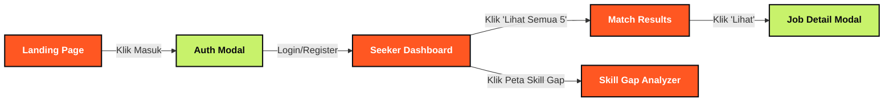
```mermaid
flowchart LR
    classDef page fill:#FF5722,stroke:#0B0B0F,stroke-width:2px,color:#fff,font-weight:bold
    classDef modal fill:#C8F26B,stroke:#0B0B0F,stroke-width:2px,color:#0B0B0F,font-weight:bold
    
    A[Landing Page]:::page -->|Klik Masuk| B[Auth Modal]:::modal
    B -->|Login/Register| C[Seeker Dashboard]:::page
    C -->|Klik 'Lihat Semua 5'| D[Match Results]:::page
    D -->|Klik 'Lihat'| E[Job Detail Modal]:::modal
    C -->|Klik Peta Skill Gap| F[Skill Gap Analyzer]:::page
```

| 1. Landing Page | 2. Login | 3. Daftar Akun | 4. Dasbor Pencari Kerja |
|:---:|:---:|:---:|:---:|
| 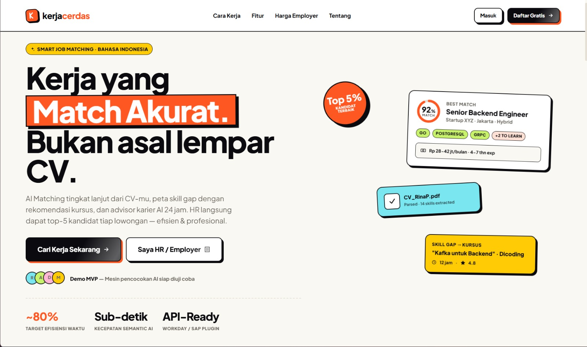 | 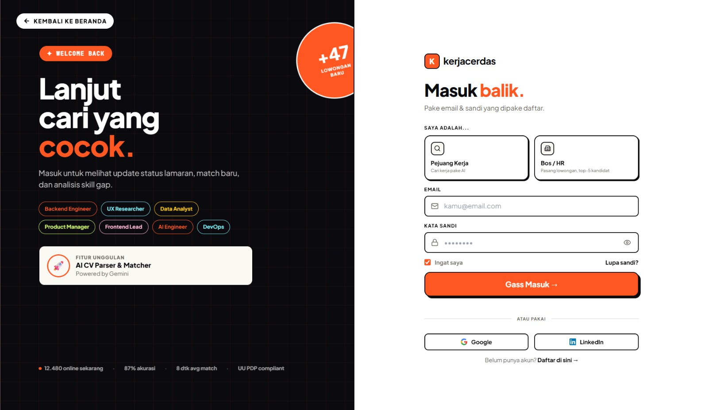 | 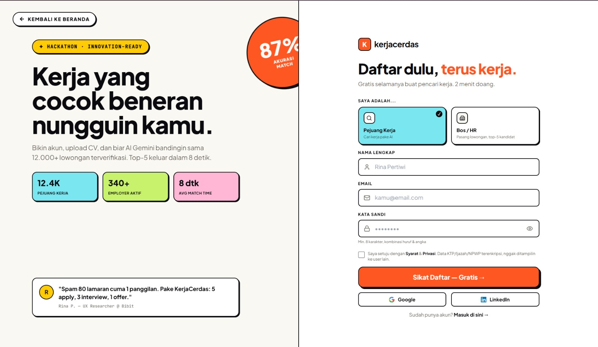 | 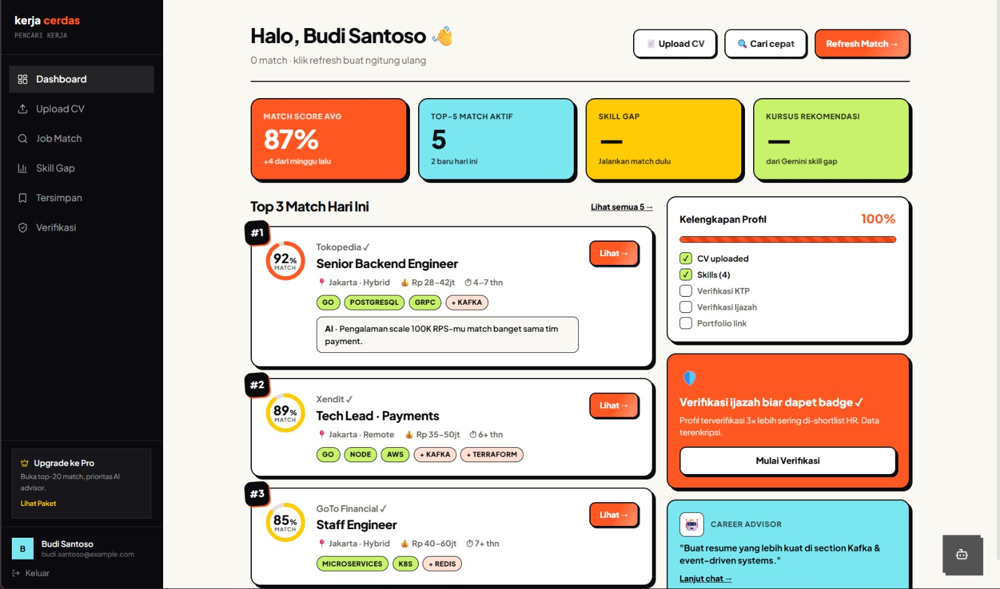 |

| 5. Pencarian Lowongan | 6. Upload CV | 7. Top Match Lowongan | 8. Analisis Skill Gap |
|:---:|:---:|:---:|:---:|
| 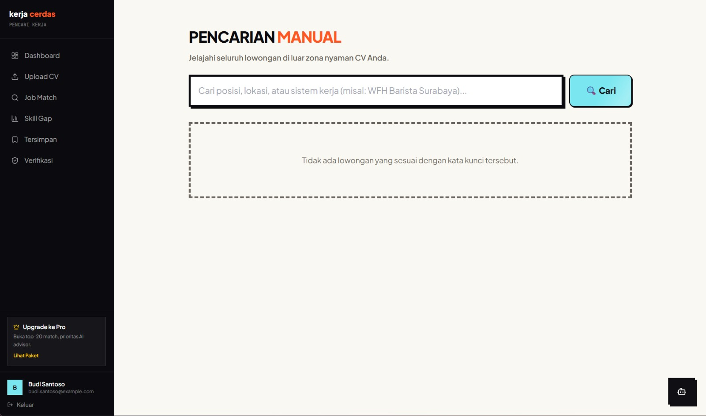 | 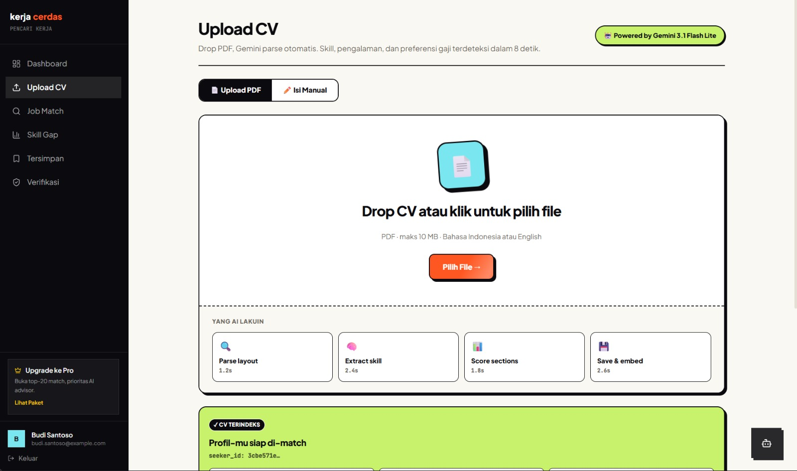 | 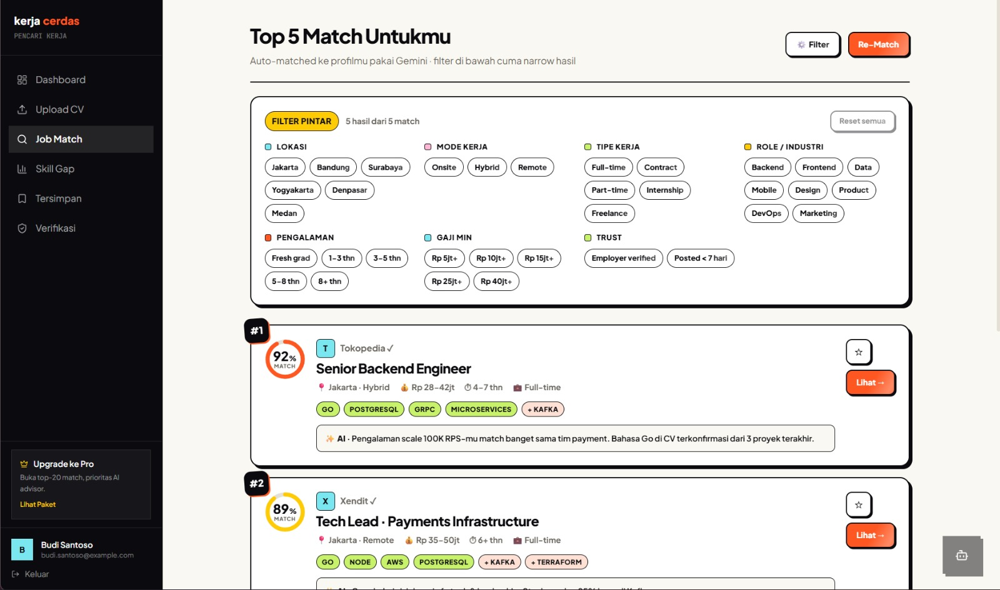 | 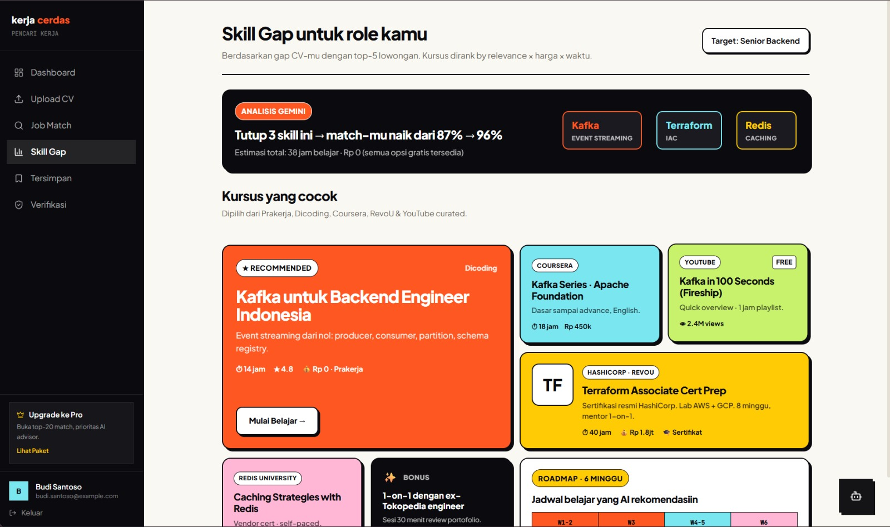 |

| 9. Verifikasi Identitas | 10. Lowongan Tersimpan |
|:---:|:---:|
| 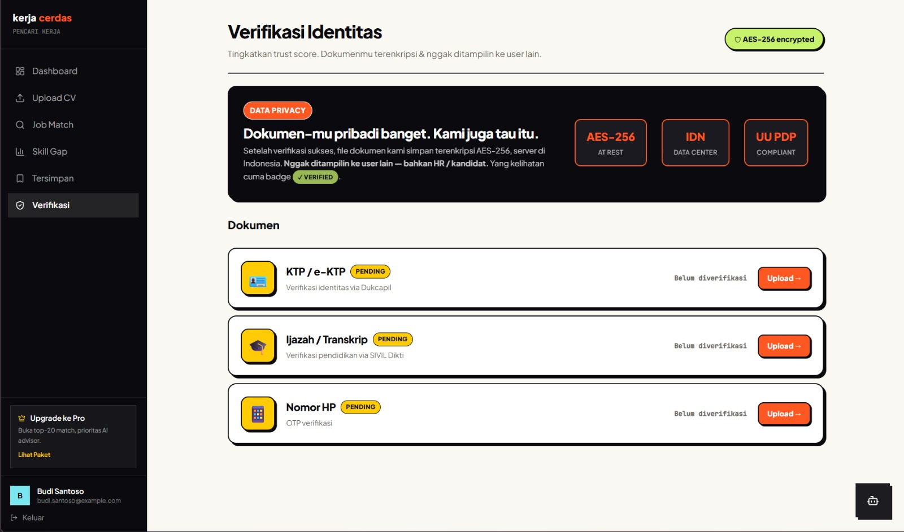 | 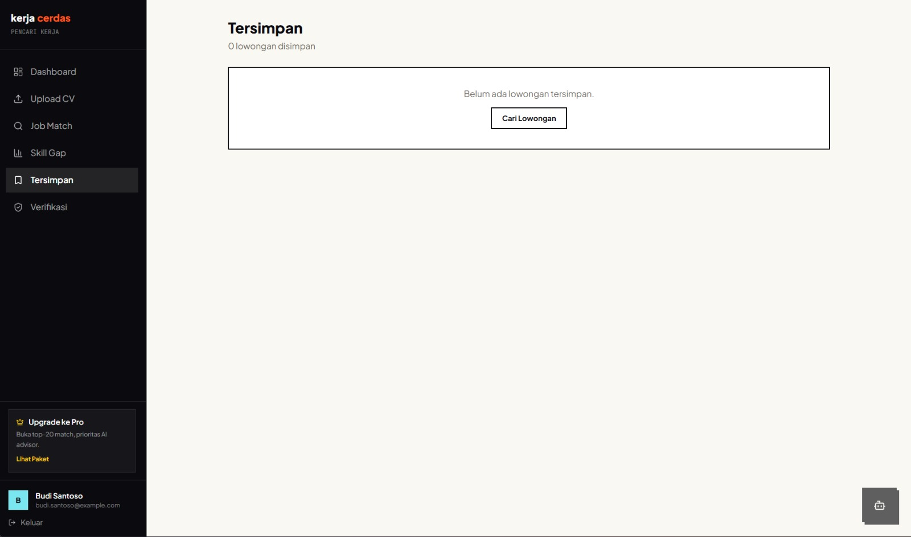 |

<br>

### 🏢 Alur Perusahaan (Employer Flow)


```mermaid
flowchart LR
    classDef page fill:#7AE7F0,stroke:#0B0B0F,stroke-width:2px,color:#0B0B0F,font-weight:bold
    classDef action fill:#FFCB05,stroke:#0B0B0F,stroke-width:2px,color:#0B0B0F,font-weight:bold
    
    A[HR Login]:::modal --> B[Employer Dashboard]:::page
    B -->|Klik Pasang Lowongan| C[Post Job Wizard]:::page
    C -->|AI Rank Candidates| D[Live Candidates Pool]:::page
    D -->|Teaser Method| E[Unlock Candidate Contact]:::modal
```

| 1. Autentikasi HRD | 2. Dasbor Perusahaan | 3. Pasang Lowongan |
|:---:|:---:|:---:|
| 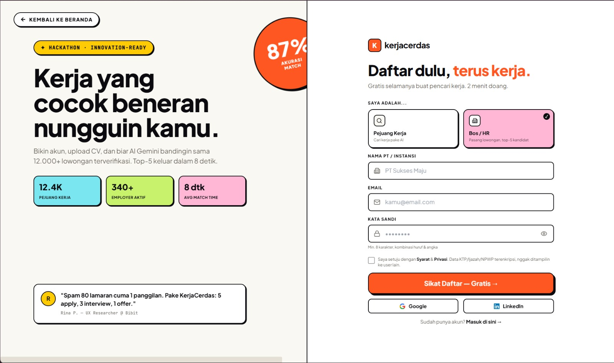 | 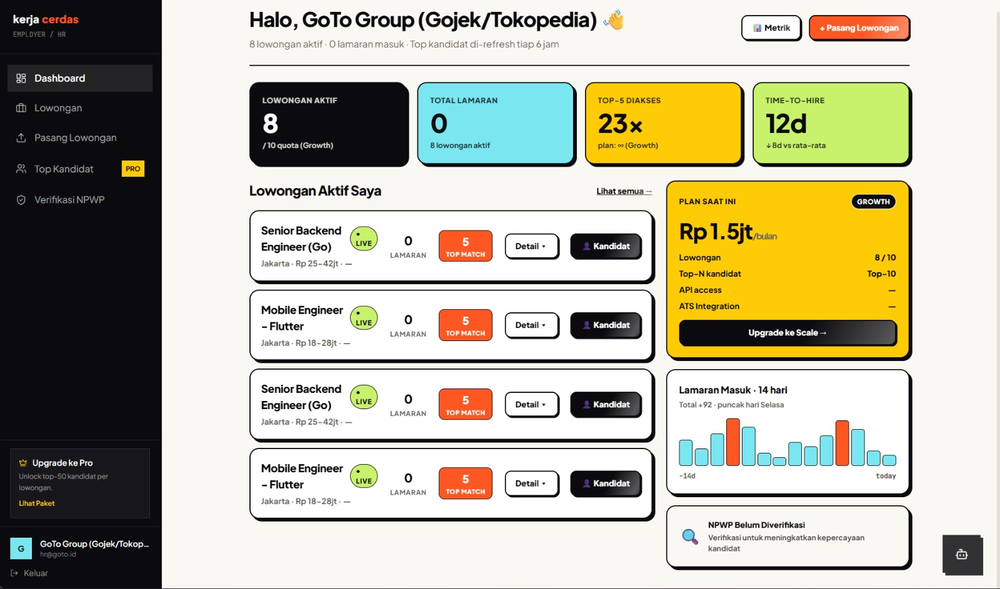 | 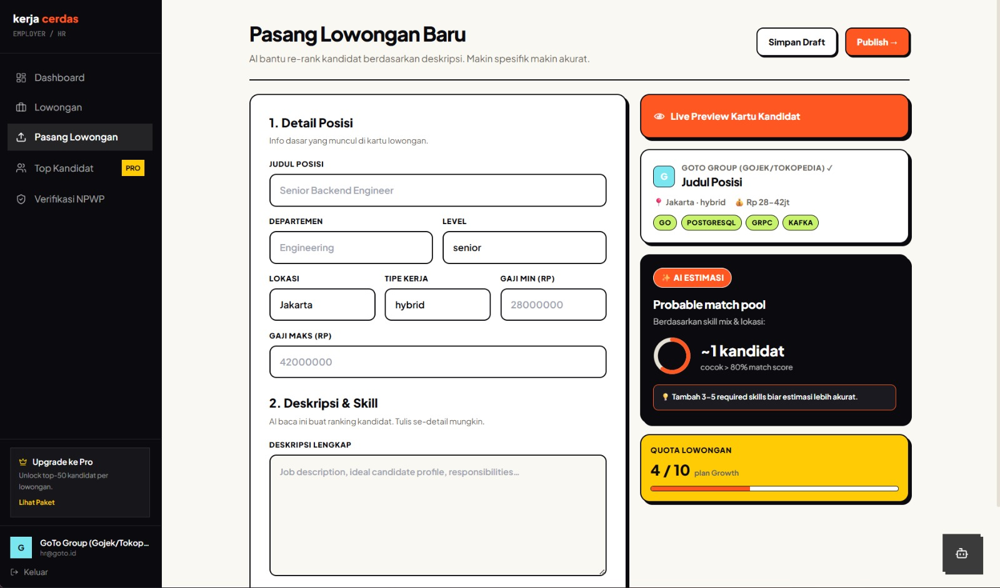 |

| 4. Daftar Lowongan | 5. Top Kandidat (Teaser) | 6. Verifikasi Dokumen |
|:---:|:---:|:---:|
| 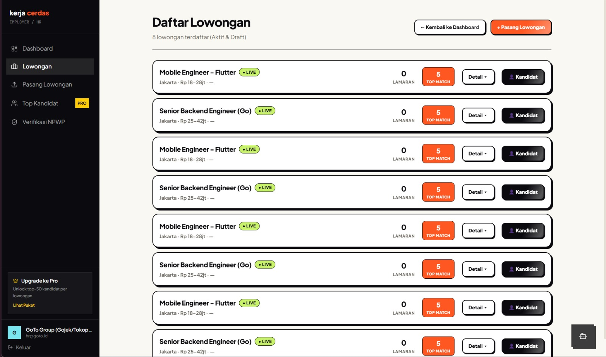 | 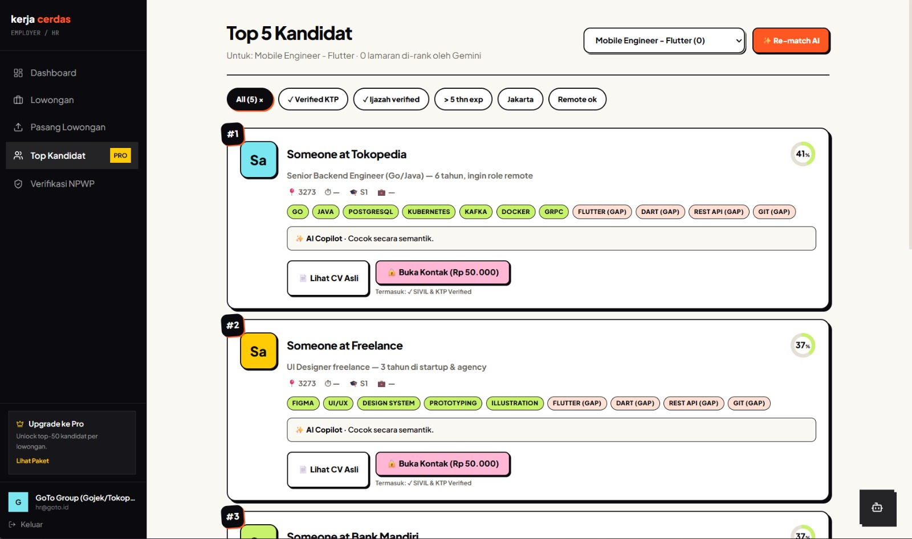 | 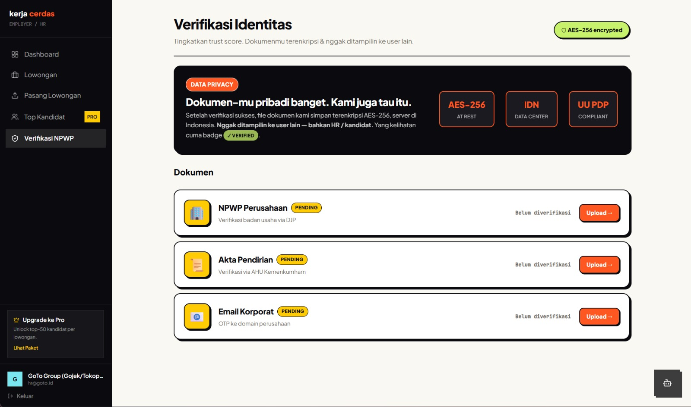 |

---

## 🚀 Quick Start (Panduan Eksekusi Lengkap)

### Persyaratan Sistem
- **Docker Desktop** terinstal dan berjalan pada sistem Anda.
- **Git** untuk mengklon repositori.
- **Kunci API Gemini (`GEMINI_API_KEY`)** dari Google AI Studio (Wajib untuk fitur *Resume Parsing* dan *Skill Gap Analyzer*).

### Langkah 1 — Kloning & Konfigurasi
```powershell
git clone https://github.com/LouSens/KerjaCerdas.git
cd KerjaCerdas
Copy-Item .env.example .env
```
Buka berkas `.env` yang baru saja dibuat, lalu isi dengan kredensial Anda:
```env
# Contoh konfigurasi .env
JWT_SECRET_KEY=rahasia-jwt-kerjacerdas-super-aman
GEMINI_API_KEY=AIzaSy... (Masukkan kunci Gemini Anda)
```

### Langkah 2 — Menjalankan Seluruh Ekosistem (Docker Compose)
Platform ini diorkestrasi sepenuhnya menggunakan Docker. Jalankan perintah berikut di terminal/PowerShell pada *root directory* proyek:
```powershell
docker compose up --build
```
> [!NOTE]
> Proses ini akan mengunduh *image* yang diperlukan, meng-kompilasi *frontend* React, membangun *backend* FastAPI, serta menjalankan PostgreSQL 16 lengkap dengan ekstensi `pgvector`. Basis data akan secara **otomatis terisi** dengan 21 lowongan pekerjaan asli Indonesia dan 20 kandidat (via skrip `init.sql`). Tunggu hingga terminal menampilkan log bahwa *backend* dan *frontend* telah siap (biasanya memakan waktu 1-3 menit).

### Langkah 3 — Akses Lingkungan Demo
Setelah semua kontainer berjalan (*healthy*), buka tautan berikut di *browser*:
- **Aplikasi Web (Frontend):** [http://localhost:3000](http://localhost:3000)
- **API Server (Backend):** [http://localhost:8000/health](http://localhost:8000/health)
- **Dokumentasi API (Swagger UI):** [http://localhost:8000/docs](http://localhost:8000/docs)

### Langkah 4 — Uji Coba (Akun Demo)
Gunakan kredensial bawaan berikut untuk langsung mengeksplorasi fitur tanpa perlu mendaftar dari awal:

**A. Sebagai Pencari Kerja (Seeker):**
- **Email:** `budi.santoso@example.com`
- **Sandi:** `demo`
- *(Fokus Uji Coba: Unggah CV, AI Job Matching, Skill Gap Analyzer)*

**B. Sebagai HRD Perusahaan (Employer):**
- **Email:** `hr@goto.id` (GoTo Group) atau `hr@mandiri.id` (Bank Mandiri)
- **Sandi:** `demo`
- *(Fokus Uji Coba: Pembuatan Lowongan Instan, AI Candidate Shortlisting, Buka Akses Kontak)*

### Langkah 5 — Menghentikan & Membersihkan Sistem
Jika ingin menghentikan sistem, tekan `CTRL+C` pada terminal yang menjalankan *docker-compose*.
Untuk menghapus kontainer dan menghapus basis data (reset total), gunakan:
```powershell
docker compose down -v
```

---

## 🧠 Arsitektur Sistem Inti

Platform kami tidak mengandalkan *Prompt Wrapper* statis. Pusat logika diorkestrasi oleh arsitektur *Autonomous Multi-Agent Swarm* memanfaatkan framework **LangGraph** dan model **Gemini 3.1 Flash**.

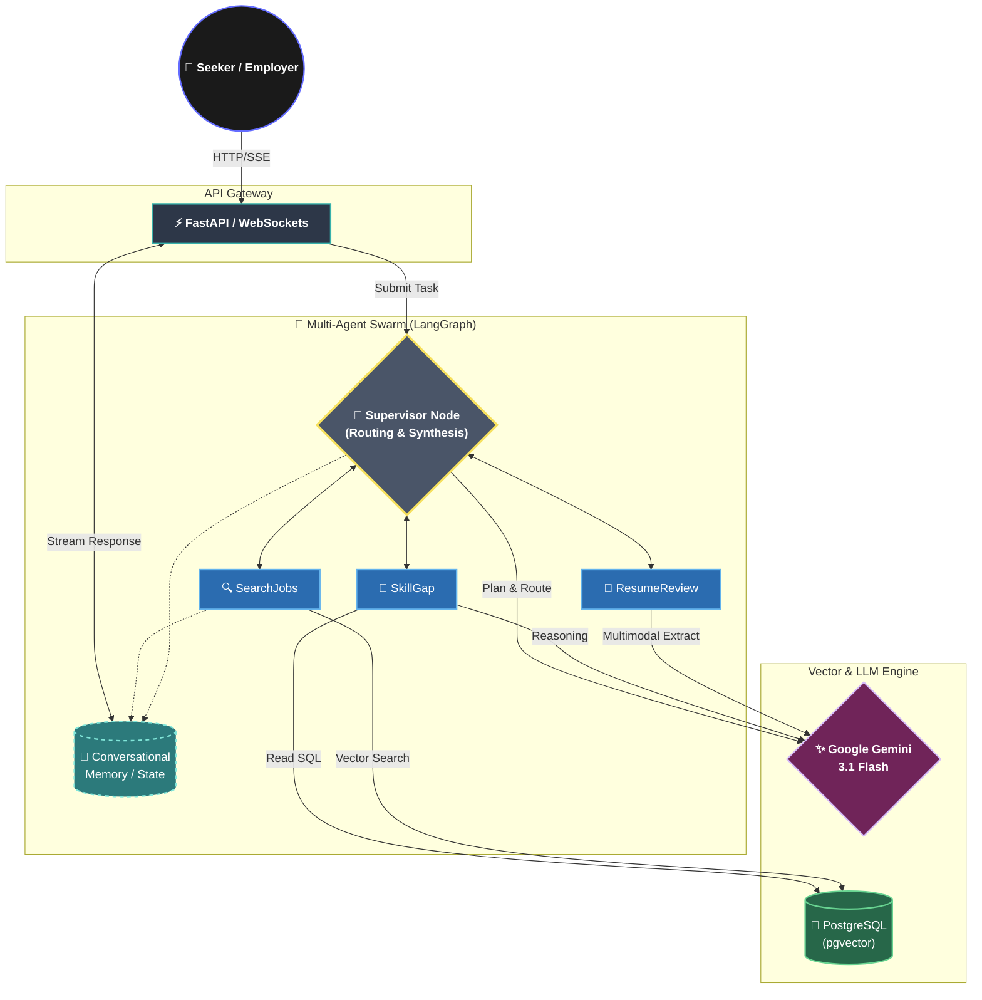
```mermaid
flowchart TD
    %% Modern Startup Aesthetics
    classDef user fill:#1A1A1A,stroke:#646CFF,stroke-width:2px,color:#FFF,font-weight:bold
    classDef api fill:#2D3748,stroke:#38B2AC,stroke-width:2px,color:#FFF,font-weight:bold
    classDef supervisor fill:#4A5568,stroke:#F6E05E,stroke-width:3px,color:#FFF,font-weight:bold
    classDef worker fill:#2B6CB0,stroke:#63B3ED,stroke-width:2px,color:#FFF
    classDef state fill:#2C7A7B,stroke:#81E6D9,stroke-width:2px,color:#FFF,stroke-dasharray: 5 5
    classDef db fill:#276749,stroke:#68D391,stroke-width:2px,color:#FFF
    classDef llm fill:#702459,stroke:#D6BCFA,stroke-width:2px,color:#FFF,font-weight:bold

    User((👤 Seeker / Employer)):::user

    subgraph API_Layer ["API Gateway"]
        FastAPI["⚡ FastAPI / WebSockets"]:::api
    end

    subgraph LangGraph_Swarm ["🧠 Multi-Agent Swarm (LangGraph)"]
        Supervisor{"👑 Supervisor Node\n(Routing & Synthesis)"}:::supervisor
        
        %% Agents
        SearchAgent["🔍 SearchJobs"]:::worker
        ReviewAgent["📄 ResumeReview"]:::worker
        GapAgent["🎯 SkillGap"]:::worker
        
        GraphState[("💬 Conversational\nMemory / State")]:::state

        Supervisor <--> SearchAgent
        Supervisor <--> ReviewAgent
        Supervisor <--> GapAgent
        
        Supervisor -.-> GraphState
        SearchAgent -.-> GraphState
    end

    subgraph Infrastructure ["Vector & LLM Engine"]
        Gemini{"✨ Google Gemini\n3.1 Flash"}:::llm
        PG[("🐘 PostgreSQL\n(pgvector)")]:::db
        
        Gemini ~~~ PG
    end

    %% Vertical Data Flow
    User -->|HTTP/SSE| FastAPI
    FastAPI -->|Submit Task| Supervisor
    FastAPI <-->|Stream Response| GraphState

    %% Agents to Infrastructure
    SearchAgent -->|Vector Search| PG
    GapAgent -->|Read SQL| PG

    ReviewAgent -->|Multimodal Extract| Gemini
    GapAgent -->|Reasoning| Gemini
    Supervisor -->|Plan & Route| Gemini
```

### 1. Eksekusi Otonom Paralel (Parallel Function Calling)
*Supervisor Node* merutekan permintaan kandidat secara dinamis. Apabila kandidat meminta pencarian lowongan sekaligus evaluasi CV, sistem akan mengeksekusi modul `SearchJobsAgent` dan `ResumeReviewAgent` secara bersamaan, kemudian mensintesis laporan gabungan.

### 2. Hibridisasi Penilaian (Hybrid Ranking)
Sistem menggunakan komposit metrik matematis untuk mereplikasi prioritas SDM:
```python
final_score = (
    cosine_similarity * 0.50 +   # Relevansi Semantik (Vektor Gemini)
    skill_overlap     * 0.30 +   # Irisan Keahlian Eksplisit
    region_boost      * 0.10 +   # Kesesuaian Geografis
    salary_fit        * 0.05 +   # Penyesuaian Anggaran
    experience_fit    * 0.05     # Validasi Masa Kerja
)
```

### 3. Kepatuhan Privasi (Data Isolation)
Sebelum diproses oleh model eksternal, komponen PII (Personally Identifiable Information) dimitigasi secara otomatis oleh modul penyaring Regex guna memenuhi standar kepatuhan operasional.

### 4. Skema Basis Data (Entity-Relationship)
Infrastruktur relasional kami direkayasa untuk menangani entitas dalam skala tinggi (High-Volume) sekaligus memfasilitasi pencarian jarak vektor komputasional menggunakan `pgvector`.

### 5. Data Acquisition & AI Feedback Loop
Sistem mengakuisisi data riwayat lowongan (*historical data*) melalui tiga jalur: **B2B Web Scraping (ETL)** terhadap lowongan lama, **Kemitraan Data B2G** dengan Kemnaker/BPS, serta yang paling krusial, **Internal Feedback Loop**. Platform mencatat aktivitas kandidat secara *closed-loop* (lolos wawancara, tingkat retensi). Data organik ini akan melatih-ulang (*fine-tuning*) rekomendasi agen AI agar relevansinya mengungguli pangkalan data rekrutmen manapun.

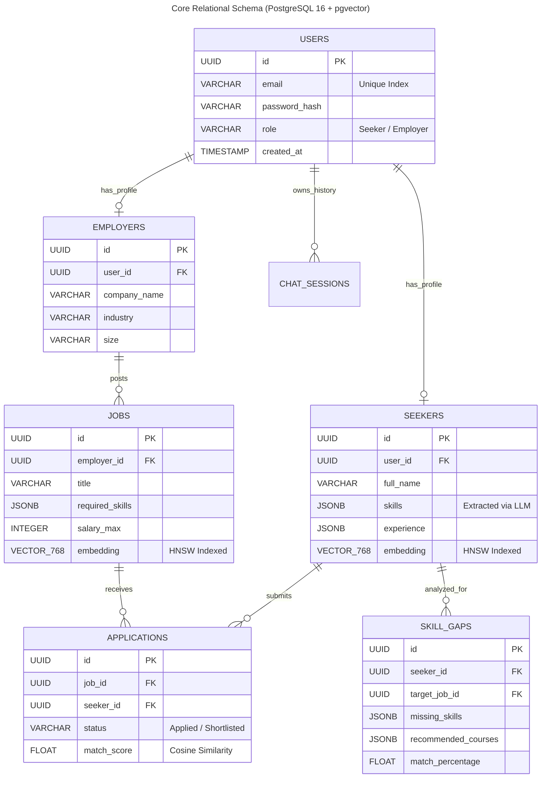
```mermaid
---
title: Core Relational Schema (PostgreSQL 16 + pgvector)
---
erDiagram
    USERS ||--o| SEEKERS : "has_profile"
    USERS ||--o| EMPLOYERS : "has_profile"
    USERS ||--o{ CHAT_SESSIONS : "owns_history"
    EMPLOYERS ||--o{ JOBS : "posts"
    SEEKERS ||--o{ APPLICATIONS : "submits"
    JOBS ||--o{ APPLICATIONS : "receives"
    SEEKERS ||--o{ SKILL_GAPS : "analyzed_for"

    USERS {
        UUID id PK
        VARCHAR email "Unique Index"
        VARCHAR password_hash
        VARCHAR role "Seeker / Employer"
        TIMESTAMP created_at
    }
    SEEKERS {
        UUID id PK
        UUID user_id FK
        VARCHAR full_name
        JSONB skills "Extracted via LLM"
        JSONB experience
        VECTOR_768 embedding "HNSW Indexed"
    }
    EMPLOYERS {
        UUID id PK
        UUID user_id FK
        VARCHAR company_name
        VARCHAR industry
        VARCHAR size
    }
    JOBS {
        UUID id PK
        UUID employer_id FK
        VARCHAR title
        JSONB required_skills
        INTEGER salary_max
        VECTOR_768 embedding "HNSW Indexed"
    }
    APPLICATIONS {
        UUID id PK
        UUID job_id FK
        UUID seeker_id FK
        VARCHAR status "Applied / Shortlisted"
        FLOAT match_score "Cosine Similarity"
    }
    SKILL_GAPS {
        UUID id PK
        UUID seeker_id FK
        UUID target_job_id FK
        JSONB missing_skills
        JSONB recommended_courses
        FLOAT match_percentage
    }
```

---

## 📂 Struktur Repositori

```
KerjaCerdas/
│
├── backend/                  # API FastAPI & Logika LangGraph Swarm
│   ├── app/
│   │   ├── api/              # Interface Endpoints FastAPI
│   │   │   ├── routers/
│   │   │   │   ├── agent.py       # Endpoint streaming SSE untuk LangGraph
│   │   │   │   ├── auth.py        # Login/Register (JWT)
│   │   │   │   ├── employer.py    # Endpoint perusahaan & kandidat pelamar
│   │   │   │   ├── jobs.py        # Pencarian dan paginasi lowongan
│   │   │   │   ├── seeker.py      # Profil, bookmark, history aplikasi
│   │   │   │   ├── uploads.py     # Endpoint Multi-modal PDF Parser
│   │   │   │   └── verify.py      # E-KYC Dukcapil/SIVIL webhook
│   │   │   ├── schemas/           # Pydantic validation schemas
│   │   │   └── services/          # Business logic helpers
│   │   ├── agents/           # Arsitektur Multi-Agent & LLM
│   │   │   ├── graph/
│   │   │   │   ├── builder.py     # Konstruktor ReAct Supervisor Swarm
│   │   │   │   └── nodes.py       # Worker Nodes (Search, SkillGap, Advisor)
│   │   │   ├── tools/
│   │   │   │   └── superpowers.py # Kumpulan fungsi (tools) untuk Gemini
│   │   │   ├── memory/            # Checkpointer & conversational state
│   │   │   └── telemetry/         # Logger & tracing performa AI
│   │   ├── services/
│   │   │   └── matching/          # Core Recommendation Engine
│   │   │       ├── embeddings/    # Gemini Vector generator
│   │   │       └── matcher.py     # Algoritma Cosine Similarity + Heuristik
│   │   ├── db/
│   │   │   ├── postgres_store.py  # Abstraksi Async Session & SQLAlchemy Repository
│   │   │   ├── models.py          # Definisi Skema Tabel PostgreSQL (pgvector)
│   │   │   ├── schemas.py         # Skema Validasi Pydantic
│   │   │   └── session.py         # Konfigurasi Koneksi Asyncpg
│   │   └── config/
│   │       └── settings.py        # Manajemen variabel lingkungan (.env)
│   ├── tests/                # Unit & Integration Tests (Pytest)
│   ├── alembic/              # Skrip Migrasi Basis Data (Alembic)
│   ├── scripts/
│   │   ├── seed_all.py       # Skrip data utama
│   │   ├── seed_employers.py # Data Perusahaan
│   │   ├── seed_seekers.py   # Data Kandidat
│   │   └── seed_courses.py   # Data Kursus
│   └── requirements.txt
│
├── frontend/                 # Aplikasi Web React.js (Vite)
│   ├── src/
│   │   ├── components/       # UI Library (Neo-Brutalism)
│   │   │   ├── _design.jsx           # Komponen dasar desain sistem (Button, Card)
│   │   │   ├── SeekerDashboard.jsx   # Dasbor utama pencari kerja
│   │   │   ├── SeekerMatchResults.jsx# UI visualisasi skor kecocokan vektor
│   │   │   ├── SeekerSearch.jsx      # Dual-Track Manual Search
│   │   │   ├── SkillGapPanel.jsx     # Panel rekomendasi kursus Ed-Tech
│   │   │   ├── FloatingAdvisor.jsx   # Antarmuka chat interaktif dengan Swarm
│   │   │   ├── EmployerDashboard.jsx # Analitik kolam kandidat untuk HRD
│   │   │   ├── EmployerCandidates.jsx# AI Shortlist & tombol "Unlock Kontak"
│   │   │   ├── EmployerPostJob.jsx   # Form pembuatan lowongan instan
│   │   │   ├── CVUploader.jsx        # Komponen unggah PDF kandidat
│   │   │   ├── AuthModal.jsx         # Popup Login/Register terintegrasi
│   │   │   ├── PublicHeader.jsx      # Navigasi utama
│   │   │   └── LandingHero.jsx       # Halaman pendaratan publik
│   │   ├── services/
│   │   │   └── api.js        # Wrapper fetch API dengan auto-logout 401
│   │   ├── store/
│   │   │   └── useStore.js   # State Management global (Zustand)
│   │   └── App.jsx
│   └── package.json
│
├── database/                 # Basis Data
│   └── init.sql              # Dump awal PostgreSQL (pgvector)
│
├── docs/                     # Dokumentasi Resmi & Presentasi
│   ├── PROPOSAL_FINAL.md     # Proposal Bisnis Lengkap
│   ├── VERIFICATION_DEMO.md  # Skenario Demo Produk & Panduan Presentasi
│   ├── BUSINESS_MODEL.md     # Dokumen Detail Keuangan & Arus Kas
│   ├── ROADMAP_TECH_STACK.md # Roadmap Infrastruktur Skala Korporasi
│   ├── API_SPEC.md           # Spesifikasi API Lengkap (semua endpoint + schema)
│   ├── SEQUENCE_DIAGRAMS.md  # 7 Diagram Alur Mermaid (Auth, AI, E-KYC, dll.)
│   └── PRODUCT_FEATURES.md   # Deskripsi Detail 4 Fitur Utama
```

---

## 📚 Dokumen Referensi

Semua panduan demonstrasi, proposal korporat, dokumen finansial, dan pemetaan arsitektur masa depan kini dipisahkan ke dalam struktur dokumentasi formal (folder `docs/`) untuk memudahkan peninjauan komprehensif oleh dewan juri dan investor.

| Dokumen | Deskripsi | Tautan |
|---|---|---|
| **Proposal 3rd Submission** | Draft proposal kompetisi terbaru — mencerminkan state sistem saat ini dan rencana ke depan. | [PROPOSAL_3RD.md](docs/PROPOSAL_3RD.md) |
| **Proposal 2nd Submission** | Proposal kompetisi sebelumnya — problem, solusi, validasi pasar, dan strategi produk. | [PROPOSAL_2ND.md](docs/PROPOSAL_2ND.md) |
| **Panduan Live Demo** | Skrip presentasi rinci (*step-by-step*) simulasi alur pencari kerja dan pewawancara untuk demonstrasi. | [VERIFICATION_DEMO.md](docs/VERIFICATION_DEMO.md) |
| **Laporan Finansial & Bisnis** | Model keuntungan (Profit Model), proyeksi arus kas, *Unit Economics*, dan *Pro Forma Income Statement*. | [BUSINESS_MODEL.md](docs/BUSINESS_MODEL.md) |
| **Roadmap Arsitektur** | Transformasi infrastruktur *Cloud SQL, PostgreSQL pgvector, Vertex AI*, dan arsitektur data pasca-MVP. | [ROADMAP_TECH_STACK.md](docs/ROADMAP_TECH_STACK.md) |
| **Spesifikasi API** | Kontrak lengkap semua endpoint FastAPI: skema request/response, rate limit, middleware, dan error codes. | [API_SPEC.md](docs/API_SPEC.md) |
| **Diagram Alur (Sequence)** | 7 diagram Mermaid yang mendokumentasikan alur kerja kritis: Auth, AI Agent, CV Upload, E-KYC, dan lainnya. | [SEQUENCE_DIAGRAMS.md](docs/SEQUENCE_DIAGRAMS.md) |

---
<div align="center">

**KerjaCerdas © 2026** — *Enterprise Talent AI Infrastructure*

<br>

[](#) [](http://localhost:8000/docs) 

</div>
