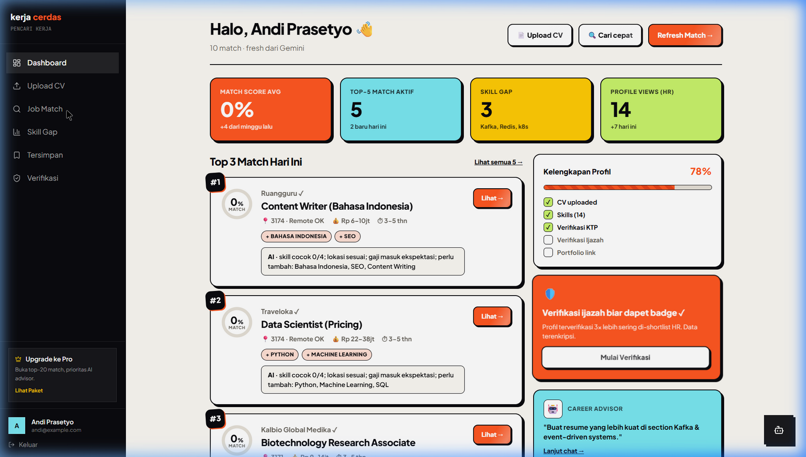
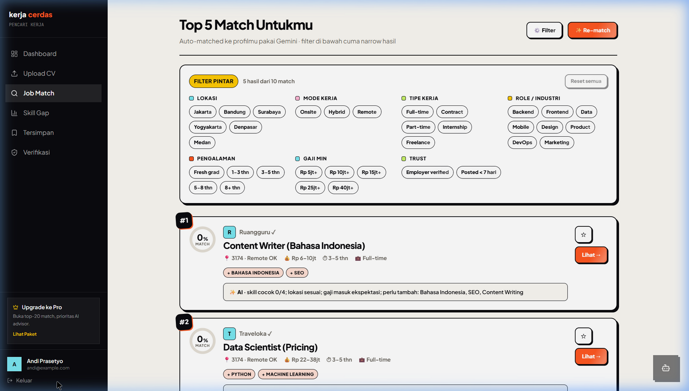
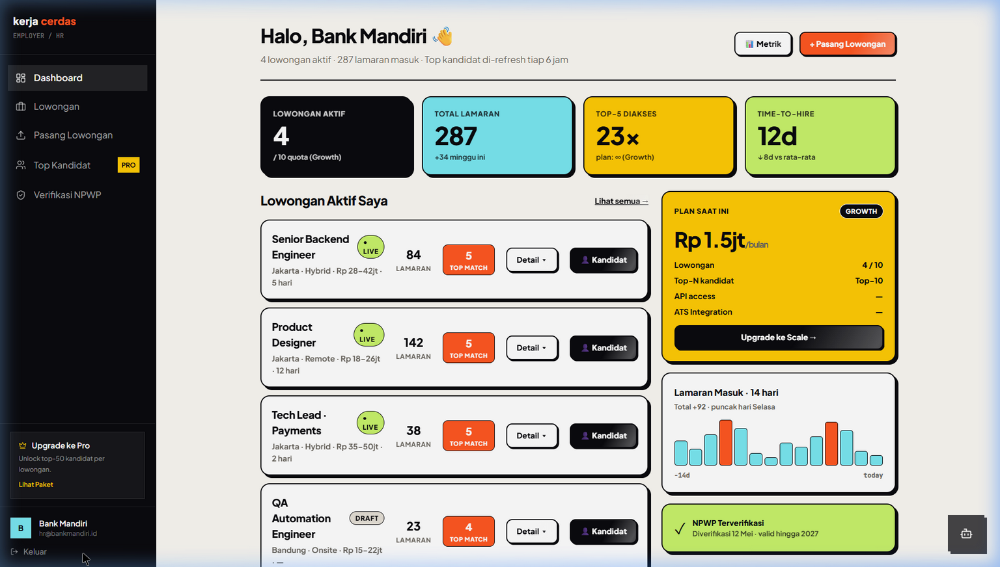

<div align="center">


# KerjaCerdas
**Autonomous Recruitment Platform powered by Semantic Matching & Multi-Agent Swarm**

[](https://fastapi.tiangolo.com) [](https://react.dev) [](https://ai.google.dev) [](https://langchain-ai.github.io/langgraph/) [](https://vitejs.dev) 

*An enterprise-grade talent matching infrastructure utilizing high-dimensional vector search and ReAct-based autonomous agents to streamline recruitment pipelines.*

<br>

[](#-panduan-demo-terperinci) [](#-arsitektur-sistem-inti) [](#-quick-start-5-menit) [](docs/PROPOSAL_FINAL.md)

</div>

---

## 📌 Problem We Solve

Indonesia has **7.86 million unemployed** (BPS, Feb 2025) — but employers often say *"it's hard to find the right people"*. The root cause is **triple mismatch**:

| Mismatch | Impact |
|---|---|
| **Structural Mismatch** (*Oversupply* pekerja umum vs *Undersupply* talenta digital) | Pertumbuhan industri modern terhambat kelangkaan SDM |
| **Relevance Mismatch** (Pencarian *keyword* mengabaikan semantik) | Kandidat bagus ditolak; yang kurang tepat malah masuk shortlist |
| **Trust Mismatch** (CV tak terverifikasi & penipuan loker) | Talenta daerah diremehkan, pelamar terjebak loker bodong |

Portal kerja yang ada (Jobstreet, Glints, Kalibrr) pada dasarnya adalah **mesin keyword berbayar**. Mereka tidak memahami konteks skill. KerjaCerdas memahaminya.

---

## ✨ Key Differences

| Feature | Traditional Portal | **KerjaCerdas (Enterprise AI)** |
|---|---|---|
| **Matching Engine** | Kaku *Keyword* Filters | **Gemini Semantic Embeddings (3072-dim)** |
| **Agentic Architecture** | Simple Chat Bot | **ReAct Multi-Agent Supervisor Swarm** |
| **Sistem Navigasi UI** | Satu Arah | **Dual-Track (AI Autopilot & Manual Search)** |
| **Skill Gap & Course** | Tidak ada | **Skill gap spesifik + rekomendasi kursus** |
| **Monetisasi B2B** | Biaya Langganan/Iklan di Muka | **Hybrid: Pay-to-Unlock (Rp 50rb) & SaaS Pro** |

---

## 🎯 MVP Features (Fully functional in this demo)

### For Seeker
- ✅ **Upload CV (PDF)** — Gemini AI parse skill, pengalaman, pendidikan otomatis.
- ✅ **AI Job Matching** — pencarian vektor semantik terhadap 84+ lowongan aktif.
- ✅ **Dual-Track Manual Search** — Cari loker manual namun tetap disematkan skor AI Match Ranking!
- ✅ **Proactive Skill Gap Analyzer** — identifikasi skill yang kurang per lowongan + link kursus.
- ✅ **Mock Interview Prep** — [NEW] Latihan interview disesuaikan posisi spesifik.
- ✅ **ATS Resume Review** — [NEW] Kritik ATS terhadap struktur CV kandidat.
- ✅ **AI Career Advisor** — chat Bahasa Indonesia, sadar konteks profil.

### For Employer
- ✅ **Post Lowongan** — form manual + live AI pool estimation saat mengetik.
- ✅ **Upload Job Pack (PDF)** — Gemini batch-parse PDF → banyak lowongan otomatis.
- ✅ **AI Candidate Ranking** — top-5 kandidat diranking Gemini per lowongan secara otomatis.
- ✅ **Direct Contact Unlock** — Buka akses kontak orisinal kandidat dengan skema B2B Microtransaction.

---

## 📸 Screenshots

<div align="center">
  
  
  
</div>

---

## 🚀 Quick Start (5 Menit)

### Prerequisites
- **Python 3.11+**
- **Node.js 18+**
- (Optional) `GEMINI_API_KEY` from Google AI Studio.

### Langkah 1 — Clone & Konfigurasi
```powershell
git clone https://github.com/LouSens/KerjaCerdas.git
cd KerjaCerdas

Copy-Item .env.example .env
```
Isi nilai minimal di `.env`:
```env
JWT_SECRET_KEY=your-random-secret-here
GEMINI_API_KEY=your-gemini-api-key
```

### Langkah 2 — Jalankan Backend
```powershell
python -m venv .venv
.\.venv\Scripts\Activate
pip install -e .[dev]

uvicorn backend.app.api.main:app --host 0.0.0.0 --port 8000 --reload --reload-dir backend/app
```
*(Basis data JSON lokal MVP akan dimuat otomatis beserta 84 lowongan & 20 profil kandidat).*

### Langkah 3 — Jalankan Frontend
Buka terminal baru:
```powershell
cd frontend
npm install
npm run dev
```
Frontend aktif di **`http://localhost:3000`**

---

## 🎬 Detailed Demo Guide

### Path A — Seeker Flow

#### 1. Login & Initialization
`andi@example.com` / `demo123456` → diarahkan ke Seeker Dashboard. Data *Zustand store* (profil, matches, aplikasi) di-hydrate.

#### 2. Upload CV *atau* Isi Profil Manual
- **Upload PDF**: Gemini mengurai data (*parsing*) → skill/pengalaman/pendidikan otomatis terekstrak.
- **Isi Manual**: Input *skills* satu per satu tanpa PDF.

#### 3. AI Job Matches (Default Autopilot)
Secara otomatis *SemanticMatcher* membandingkan vektor kandidat dengan 84 vektor loker dan menampilkan **Match Ranking** tertinggi.

#### 4. Dual-Track Manual Search (Skenario "Aha!" untuk Juri)
- Di *Dashboard*, klik **"Cari Cepat"**.
- Ketikkan posisi di luar CV Andi (misal: "Dokter Bedah" atau "Senior Backend").
- Loker akan muncul, **TETAPI dengan lencana skor AI Match yang sangat rendah (N/A atau 20%)**. Ini membuktikan algoritma tidak buta terhadap pencarian manual!

#### 5. Proactive Skill Gap & Upskilling
Pada hasil pencarian manual bernilai rendah tadi, klik **"🧠 Cek Gap"**.
`AnalyzeGapAgent` (dari Supervisor Swarm) akan mengambil alih, membongkar habis kelemahan spesifik Andi untuk loker tersebut, dan menyarankan kursus di Dicoding/Coursera.

#### 6. Mock Interview & Resume Review
Sambil menguji AI Advisor (bubble 🤖 di kanan bawah), perintahkan: *"Beri saya simulasi interview untuk posisi tersebut"*. Agen `InterviewPrepAgent` akan menjalankan perannya secara otomatis.

---

### Path B — Employer Flow

#### 1. Login sebagai Employer
`hr@tokopedia.com` / `demo123456` → diarahkan ke Employer Dashboard.

#### 2. Profil Perusahaan
Navigasi ke **"Profil Perusahaan"** untuk memodifikasi informasi, status perusahaan, dan validasi data.

#### 3. Post Lowongan Baru (AI Live Pool)
Klik **"+ Pasang Lowongan"**. Saat Anda mengetik spesifikasi pekerjaan, algoritma vektor akan secara *real-time* menampilkan estimasi jumlah kandidat di dalam basis data yang sesuai dengan ketikan Anda.

#### 4. AI Candidate Ranking (Anti-Fatigue)
Klik menu **"Kandidat"** pada baris lowongan. HRD tidak melihat ratusan CV statis, melainkan **Top-5 Kandidat Terbaik** yang sudah diurutkan (Rerank) berdasarkan *skill overlap* dan *Cosine Similarity*.
- Klik **Unlock Kontak** (Simulasi tagihan Rp 50.000) untuk mengekstrak nomor telepon dan email pelamar yang terverifikasi.

## 🧠 Agentic AI Architecture (Autonomous Swarm)

Kami tidak menggunakan *Prompt Wrapper* statis. Otak dari KerjaCerdas ditenagai oleh pola *Autonomous Multi-Agent Swarm* menggunakan **LangGraph (`create_react_agent`)** dan **Gemini 3.1 Flash**. 


```mermaid
graph TD
    User([User / Seeker]) -->|Chat / Request| UI[React Frontend Neo-Brutalism]
    UI -->|REST API| API[FastAPI Orchestrator]
    
    subgraph Agentic Pipeline [ReAct Supervisor Swarm]
        API --> Supervisor{Gemini Brain / Supervisor}
        
        Supervisor -->|Call Tool| ToolSearch[SearchJobsAgent]
        Supervisor -->|Call Tool| ToolGap[AnalyzeGapAgent]
        Supervisor -->|Call Tool| ToolPrep[InterviewPrepAgent]
        Supervisor -->|Call Tool| ToolResume[ResumeReviewAgent]
        
        ToolSearch -.-> Supervisor
        ToolGap -.-> Supervisor
        ToolPrep -.-> Supervisor
        ToolResume -.-> Supervisor
    end
    
    subgraph Data & Tooling
        ToolSearch <-->|pgvector_similarity| VectorDB[(pgvector / JSON)]
        ToolGap <-->|fetch_courses| ExtAPI[Dicoding/Coursera API]
        Supervisor <-->|fetch_history| MemDB[(LangGraph MemorySaver)]
    end
    
    Supervisor -->|Final JSON/Markdown| API
```

### 1. Eksekusi Alat Paralel (Parallel Function Calling)
Gemini Supervisor tidak lagi diarahkan secara statis. Jika kandidat meminta: *"Carikan loker React dan analisa CV saya"*, Supervisor akan secara mandiri menjalankan `SearchJobsAgent` dan `ResumeReviewAgent` **secara bersamaan (paralel)**, menggabungkan hasilnya, dan menjawab dalam satu langkah cerdas.

### 2. Dual-Track UX: AI Matcher & Custom Search
- **Default AI Matcher**: Saat kandidat login, UI langsung menampilkan *Match Ranking* berdasarkan kecocokan CV (Vector Similarity).
- **Custom Manual Search**: Kandidat memiliki opsi melakukan pencarian manual. Uniknya, **AI Match Score tetap disematkan** pada hasil pencarian manual tersebut.

### 3. Penyaringan Output & Isolasi Data
- **Redaction PII**: Sebelum *resume_text* masuk ke LLM, nomor telepon, email, dan NIK di-*mask* menggunakan Regex untuk mematuhi UU PDP.
- **Data Isolation**: LangGraph diinisialisasi secara *ephemeral* per *request* berbasis JWT `user_id`. Agen tidak berbagi memori state antar pengguna.

---

## 🏗️ System Architecture

### Alur Data V: Dual-Track Matching

**Jalur AI Autopilot (Default):**
1. Seeker upload CV (PDF)
2. Gemini multimodal parse → ekstraksi `{ skills, experience, education, salary }`
3. GeminiEmbedder.embed(resume_text) → vektor semantik 768-dim
4. SeekerProfile tersimpan ke → `data/seekers/{id}.json`
5. SemanticMatcher membandingkan vektor kandidat dengan ratusan vektor loker secara otomatis.
6. UI menampilkan daftar loker berurutan dengan label skor "Match Ranking".

**Jalur Pencarian Kustom + Supervisor Swarm:**
1. Kandidat melakukan pencarian *keyword* kustom (contoh: "Data Scientist").
2. Jika skor kualifikasi AI sangat rendah, kandidat menekan tombol "🧠 Cek Gap".
3. *LangGraph Swarm* merutekan *intent* ke `AnalyzeGapAgent`.
4. Agen membongkar spesifikasi lowongan, membandingkannya dengan CV kandidat.
5. Agen menarik rekomendasi program Ed-Tech (Upskilling) dari data kursus terafiliasi.

### Formula Scoring Multi-Sinyal (Hybrid Ranking)
Algoritma kami bukan sekadar *cosine similarity* mentah, melainkan kombinasi tertimbang (*weighted*) untuk mengakomodasi batasan (*hard-constraints*) nyata HRD:
```python
final_score = (
    cosine_similarity * 0.50 +   # Semantic skill match (vektor dari Gemini)
    skill_overlap     * 0.30 +   # Jaccard intersection dari skill eksplisit
    region_boost      * 0.10 +   # Bonus untuk kesamaan domisili / WFA
    salary_fit        * 0.05 +   # Ekspektasi gaji dalam rentang budget perusahaan
    experience_fit    * 0.05     # Tahun pengalaman relevan dengan syarat lowongan
)
```

---

## 📂 Repository Structure

```
KerjaCerdas/
│
├── backend/                  # API FastAPI & Logika LangGraph Swarm
│   ├── app/
│   │   ├── api/              # Interface Endpoints FastAPI
│   │   │   ├── routers/
│   │   │   │   ├── agent.py       # Endpoint streaming SSE untuk LangGraph
│   │   │   │   ├── auth.py        # Login/Register (JWT)
│   │   │   │   ├── employer.py    # Endpoint perusahaan & kandidat pelamar
│   │   │   │   ├── jobs.py        # Pencarian dan paginasi lowongan
│   │   │   │   ├── seeker.py      # Profil, bookmark, history aplikasi
│   │   │   │   ├── uploads.py     # Endpoint Multi-modal PDF Parser
│   │   │   │   └── verify.py      # E-KYC Dukcapil/SIVIL webhook
│   │   │   ├── schemas/           # Pydantic validation schemas
│   │   │   └── services/          # Business logic helpers
│   │   ├── agents/           # Arsitektur Multi-Agent & LLM
│   │   │   ├── graph/
│   │   │   │   ├── builder_v2.py  # Konstruktor ReAct Supervisor Swarm
│   │   │   │   └── nodes.py       # Worker Nodes (Search, SkillGap, Advisor)
│   │   │   ├── tools/
│   │   │   │   └── superpowers.py # Kumpulan fungsi (tools) untuk Gemini
│   │   │   ├── memory/            # Checkpointer & conversational state
│   │   │   └── telemetry/         # Logger & tracing performa AI
│   │   ├── services/
│   │   │   └── matching/          # Core Recommendation Engine
│   │   │       ├── embeddings/    # Gemini Vector generator
│   │   │       ├── matcher.py     # Algoritma Cosine Similarity + Heuristik
│   │   │       └── ranker.py      # Pembobotan skor
│   │   ├── db/
│   │   │   ├── json_store.py      # Asyncio.Lock File-based Repository (MVP)
│   │   │   └── migrations/        # Skrip transisi ke PostgreSQL (pgvector)
│   │   └── config/
│   │       └── settings.py        # Manajemen variabel lingkungan (.env)
│   ├── tests/                # Unit & Integration Tests (Pytest)
│   └── requirements.txt
│
├── frontend/                 # Aplikasi Web React.js (Vite)
│   ├── src/
│   │   ├── components/       # UI Library (Neo-Brutalism)
│   │   │   ├── _design.jsx           # Komponen dasar desain sistem (Button, Card)
│   │   │   ├── SeekerDashboard.jsx   # Dasbor utama pencari kerja
│   │   │   ├── SeekerMatchResults.jsx# UI visualisasi skor kecocokan vektor
│   │   │   ├── SeekerSearch.jsx      # Dual-Track Manual Search
│   │   │   ├── SkillGapPanel.jsx     # Panel rekomendasi kursus Ed-Tech
│   │   │   ├── FloatingAdvisor.jsx   # Antarmuka chat interaktif dengan Swarm
│   │   │   ├── EmployerDashboard.jsx # Analitik kolam kandidat untuk HRD
│   │   │   ├── EmployerCandidates.jsx# AI Shortlist & tombol "Unlock Kontak"
│   │   │   ├── EmployerPostJob.jsx   # Form pembuatan lowongan instan
│   │   │   ├── CVUploader.jsx        # Komponen unggah PDF kandidat
│   │   │   ├── AuthModal.jsx         # Popup Login/Register terintegrasi
│   │   │   ├── PublicHeader.jsx      # Navigasi utama
│   │   │   └── LandingHero.jsx       # Halaman pendaratan publik
│   │   ├── services/
│   │   │   └── api.js        # Wrapper fetch API dengan auto-logout 401
│   │   ├── store/
│   │   │   └── useStore.js   # State Management global (Zustand)
│   │   └── App.jsx
│   └── package.json
│
├── data/                     # Local Storage Data (Berisi JSON objects)
│   ├── employers/            # Profil entitas perusahaan
│   ├── jobs/                 # Basis data lowongan terstruktur
│   ├── seekers/              # Repositori vektor talenta
│   ├── applications/         # Riwayat status lamaran
│   └── ai_logs/              # Rekaman jejak pemikiran agen
│
├── docs/                     # Dokumentasi Resmi & Presentasi
│   ├── PROPOSAL_FINAL.md     # Proposal Bisnis Lengkap (Juri Hackathon)
│   ├── VERIFICATION_DEMO.md  # Skenario Demo Produk
│   └── API_SPEC.md           # Spesifikasi API OpenAPI/Swagger
│
└── scripts/
    ├── seed_json.py          # Skrip populasi data palsu untuk Demo
    └── sync_sqlite.py        # Skrip uji coba migrasi RDBMS
```

---

## 🗺️ Roadmap & Future Tech Stack

| Versi | Fase Eksekusi | Milestone & Tech Stack |
|---|---|---|
| **v2.0 (sekarang)** | Fase MVP | **Autonomous Swarm** (ReAct), Dual-Track Search UI, Gemini 3.1 Flash. |
| **v2.1** | Fase Stabilisasi | **Google Cloud Platform (GCP)** migration. Implementasi **Cloud SQL (PostgreSQL + pgvector)** menggantikan SQLite lokal. |
| **v2.5** | Fase Kepatuhan | **Google Vertex AI** Enterprise deployment untuk menjamin *Zero Data Retention Policy* (kepatuhan UU PDP). Penyimpanan PDF via **Google Cloud Storage**. |
| **v3.0** | Fase Ekspansi | Ekspansi Skala Korporat. *SaaS Enterprise API License* terintegrasi HRIS, 500 employer network, 50.000 seeker. |

---

## 💼 Business Model

| Fase | Alur Pendapatan | Target MRR |
|---|---|---|
| **Fase 1** | *Hybrid*: B2B Pay-to-Unlock (Rp 50rb) + Langganan **KerjaCerdas Pro** (Rp 299rb/bln) + Afiliasi *Ed-Tech* | Rp 17.5 juta |
| **Fase 2** | Enterprise API License (SaaS, Rp 25jt/bln) untuk integrasi HRIS MNC | Rp 1 miliar |
| **Fase 3** | Lisensi Pemerintahan (Disnaker), *Talent Analytics Subscriptions* | Rp 5 miliar |

**Unit Economics:** LTV/CAC = 28× · Gross margin = 78% · Kandidat selalu **gratis**.
→ Detail lengkap: [Proposal](docs/PROPOSAL_FINAL.md)

---

<div align="center">

**KerjaCerdas © 2026** — *Enterprise Talent AI Infrastructure*

<br>

[](#) [](http://localhost:8000/docs) 

</div>
