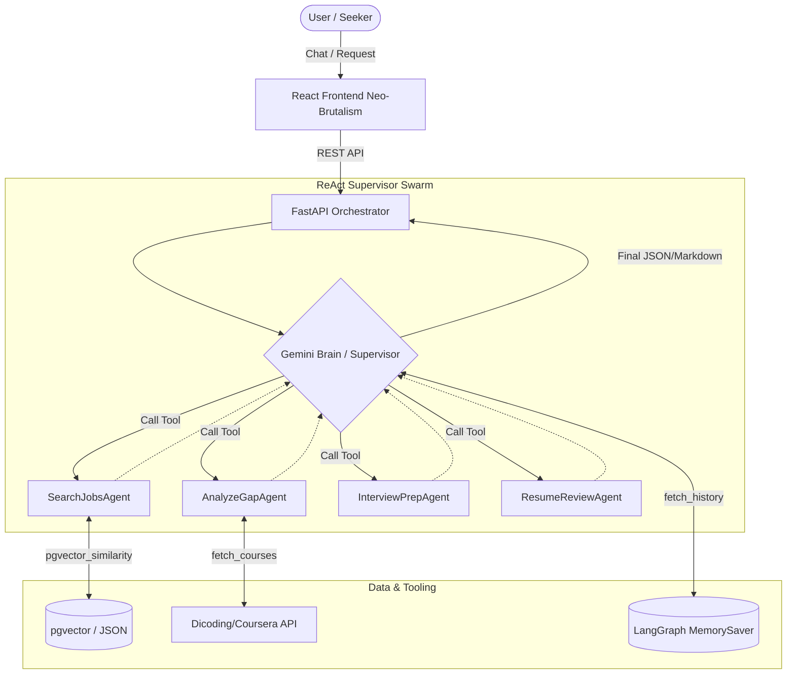

<div align="center">


# 🚀 KerjaCerdas AI
**Platform Rekrutmen Otonom Berbasis *Semantic Matching* & *Multi-Agent Swarm***

Pemenang Potensial Hackathon Tingkat Nasional 2026 🏆

[](https://fastapi.tiangolo.com) [](https://react.dev) [](https://ai.google.dev) [](https://langchain-ai.github.io/langgraph/) [](https://vitejs.dev) [](https://react.dev)

*Ucapkan selamat tinggal pada penyortiran CV manual. KerjaCerdas menggunakan AI Vektor untuk mencocokkan makna (semantik) dari skill kandidat dengan kebutuhan perusahaan dalam hitungan detik.*

[Panduan Demo](#-panduan-demo-skenario-juri) · [Quick Start](#-quick-start-5-menit) · [Arsitektur](#-arsitektur-sistem) · [Proposal Bisnis](docs/PROPOSAL_FINAL.md)

</div>

---

## 📌 Masalah yang Kami Pecahkan

Indonesia memiliki **7.86 juta pengangguran** (BPS, Feb 2025) — namun employer sering mengatakan *"sulit mencari orang yang tepat"*. Akar penyebabnya adalah **triple mismatch**:

| Mismatch | Dampak |
|---|---|
| **Structural Mismatch** (*Oversupply* pekerja umum vs *Undersupply* talenta digital) | Pertumbuhan industri modern terhambat kelangkaan SDM |
| **Relevance Mismatch** (Pencarian *keyword* mengabaikan semantik) | Kandidat bagus ditolak; yang kurang tepat malah masuk shortlist |
| **Trust Mismatch** (CV tak terverifikasi & penipuan loker) | Talenta daerah diremehkan, pelamar terjebak loker bodong |

Portal kerja yang ada (Jobstreet, Glints, Kalibrr) pada dasarnya adalah **mesin keyword berbayar**. Mereka tidak memahami konteks skill. KerjaCerdas memahaminya.

---

## ✨ Perbedaan Utama KerjaCerdas

| Fitur | Portal Tradisional | **KerjaCerdas (Enterprise AI)** |
|---|---|---|
| **Matching Engine** | Filter *Keyword* Kaku | **Gemini Semantic Embeddings (3072-dim)** |
| **Agentic Architecture** | Bot Chat Sederhana | **ReAct Multi-Agent Supervisor Swarm** |
| **Sistem Navigasi UI** | Satu Arah | **Dual-Track (AI Autopilot & Manual Search)** |
| **Skill Gap & Course** | Tidak ada | **Skill gap spesifik + rekomendasi kursus** |
| **Monetisasi UMKM** | Rp 3–5 juta/post | **Pay-to-Unlock Rp 50.000 (Microtransaction)** |

---

## 🎯 Fitur MVP (Berjalan Penuh di Demo Ini)

### Untuk Pencari Kerja (Seeker)
- ✅ **Upload CV (PDF)** — Gemini AI parse skill, pengalaman, pendidikan otomatis.
- ✅ **AI Job Matching** — pencarian vektor semantik terhadap 84+ lowongan aktif.
- ✅ **Dual-Track Manual Search** — Cari loker manual namun tetap disematkan skor AI Match Ranking!
- ✅ **Proactive Skill Gap Analyzer** — identifikasi skill yang kurang per lowongan + link kursus.
- ✅ **Mock Interview Prep** — [NEW] Latihan interview disesuaikan posisi spesifik.
- ✅ **ATS Resume Review** — [NEW] Kritik ATS terhadap struktur CV kandidat.
- ✅ **AI Career Advisor** — chat Bahasa Indonesia, sadar konteks profil.

### Untuk Employer
- ✅ **Post Lowongan** — form manual + live AI pool estimation saat mengetik.
- ✅ **Upload Job Pack (PDF)** — Gemini batch-parse PDF → banyak lowongan otomatis.
- ✅ **AI Candidate Ranking** — top-5 kandidat diranking Gemini per lowongan secara otomatis.

---

## 🚀 Quick Start (5 Menit)

### Prasyarat
- **Python 3.11+**
- **Node.js 18+**
- (Opsional) `GEMINI_API_KEY` dari Google AI Studio.

### Langkah 1 — Clone & Konfigurasi
```powershell
git clone https://github.com/LouSens/KerjaCerdas.git
cd KerjaCerdas

Copy-Item .env.example .env
```
Isi nilai minimal di `.env`:
```env
JWT_SECRET_KEY=your-random-secret-here
GEMINI_API_KEY=your-gemini-api-key
```

### Langkah 2 — Jalankan Backend
```powershell
python -m venv .venv
.\.venv\Scripts\Activate
pip install -e .[dev]

uvicorn backend.app.api.main:app --host 0.0.0.0 --port 8000 --reload --reload-dir backend/app
```
*(SQLite akan dibuat otomatis beserta 84 lowongan & 20 profil kandidat + embedding vektor).*

### Langkah 3 — Jalankan Frontend
Buka terminal baru:
```powershell
cd frontend
npm install
npm run dev
```
Frontend aktif di **`http://localhost:3000`**

---

## 🎬 Panduan Demo Terperinci

### Jalur A — Flow Pencari Kerja (Seeker)

#### 1. Login & Inisialisasi
`andi@example.com` / `demo123456` → diarahkan ke Seeker Dashboard. Data *Zustand store* (profil, matches, aplikasi) di-hydrate.

#### 2. Upload CV *atau* Isi Profil Manual
- **Upload PDF**: Gemini mengurai data (*parsing*) → skill/pengalaman/pendidikan otomatis terekstrak.
- **Isi Manual**: Input *skills* satu per satu tanpa PDF.

#### 3. AI Job Matches (Default Autopilot)
Secara otomatis *SemanticMatcher* membandingkan vektor kandidat dengan 84 vektor loker dan menampilkan **Match Ranking** tertinggi.

#### 4. Dual-Track Manual Search (Skenario "Aha!" untuk Juri)
- Di *Dashboard*, klik **"Cari Cepat"**.
- Ketikkan posisi di luar CV Andi (misal: "Dokter Bedah" atau "Senior Backend").
- Loker akan muncul, **TETAPI dengan lencana skor AI Match yang sangat rendah (N/A atau 20%)**. Ini membuktikan algoritma tidak buta terhadap pencarian manual!

#### 5. Proactive Skill Gap & Upskilling
Pada hasil pencarian manual bernilai rendah tadi, klik **"🧠 Cek Gap"**.
`AnalyzeGapAgent` (dari Supervisor Swarm V2) akan mengambil alih, membongkar habis kelemahan spesifik Andi untuk loker tersebut, dan menyarankan kursus di Dicoding/Coursera.

#### 6. Mock Interview & Resume Review
Sambil menguji AI Advisor (bubble 🤖 di kanan bawah), perintahkan: *"Beri saya simulasi interview untuk posisi tersebut"*. Agen `InterviewPrepAgent` akan menjalankan perannya secara otomatis.

---

### Jalur B — Flow Pemberi Kerja (Employer / HRD)

#### 1. Login sebagai Employer
`hr@tokopedia.com` / `demo123456` → diarahkan ke Employer Dashboard.

#### 2. Profil Perusahaan
Navigasi ke **"Profil Perusahaan"** untuk memodifikasi informasi, status perusahaan, dan validasi data.

#### 3. Post Lowongan Baru (AI Live Pool)
Klik **"+ Pasang Lowongan"**. Saat Anda mengetik spesifikasi pekerjaan, algoritma vektor akan secara *real-time* menampilkan estimasi jumlah kandidat di dalam basis data yang sesuai dengan ketikan Anda.

#### 4. AI Candidate Ranking (Anti-Fatigue)
Klik menu **"Kandidat"** pada baris lowongan. HRD tidak melihat ratusan CV statis, melainkan **Top-5 Kandidat Terbaik** yang sudah diurutkan (Rerank) berdasarkan *skill overlap* dan *Cosine Similarity*.
- Klik **Unlock Kontak** (Simulasi tagihan Rp 50.000) untuk mengekstrak nomor telepon dan email pelamar yang terverifikasi.

## 🧠 Arsitektur Agentic AI (V2 Autonomous Swarm)

Kami tidak menggunakan *Prompt Wrapper* statis. Otak dari KerjaCerdas ditenagai oleh pola *Autonomous Multi-Agent Swarm* menggunakan **LangGraph (`create_react_agent`)** dan **Gemini 3.1 Flash**. 


```mermaid
graph TD
    User([User / Seeker]) -->|Chat / Request| UI[React Frontend Neo-Brutalism]
    UI -->|REST API| API[FastAPI Orchestrator]
    
    subgraph Agentic Pipeline [ReAct Supervisor Swarm]
        API --> Supervisor{Gemini Brain / Supervisor}
        
        Supervisor -->|Call Tool| ToolSearch[SearchJobsAgent]
        Supervisor -->|Call Tool| ToolGap[AnalyzeGapAgent]
        Supervisor -->|Call Tool| ToolPrep[InterviewPrepAgent]
        Supervisor -->|Call Tool| ToolResume[ResumeReviewAgent]
        
        ToolSearch -.-> Supervisor
        ToolGap -.-> Supervisor
        ToolPrep -.-> Supervisor
        ToolResume -.-> Supervisor
    end
    
    subgraph Data & Tooling
        ToolSearch <-->|pgvector_similarity| VectorDB[(pgvector / JSON)]
        ToolGap <-->|fetch_courses| ExtAPI[Dicoding/Coursera API]
        Supervisor <-->|fetch_history| MemDB[(LangGraph MemorySaver)]
    end
    
    Supervisor -->|Final JSON/Markdown| API
```

### 1. Eksekusi Alat Paralel (Parallel Function Calling)
Gemini Supervisor tidak lagi diarahkan secara statis. Jika kandidat meminta: *"Carikan loker React dan analisa CV saya"*, Supervisor akan secara mandiri menjalankan `SearchJobsAgent` dan `ResumeReviewAgent` **secara bersamaan (paralel)**, menggabungkan hasilnya, dan menjawab dalam satu langkah cerdas.

### 2. Dual-Track UX: AI Matcher & Custom Search
- **Default AI Matcher**: Saat kandidat login, UI langsung menampilkan *Match Ranking* berdasarkan kecocokan CV (Vector Similarity).
- **Custom Manual Search**: Kandidat memiliki opsi melakukan pencarian manual. Uniknya, **AI Match Score tetap disematkan** pada hasil pencarian manual tersebut.

### 3. Penyaringan Output & Isolasi Data
- **Redaction PII**: Sebelum *resume_text* masuk ke LLM, nomor telepon, email, dan NIK di-*mask* menggunakan Regex untuk mematuhi UU PDP.
- **Data Isolation**: LangGraph diinisialisasi secara *ephemeral* per *request* berbasis JWT `user_id`. Agen tidak berbagi memori state antar pengguna.

---

## 🏗️ Arsitektur Sistem Inti

### Alur Data: CV → Match

```
1. Seeker upload PDF
2. Gemini multimodal parse → { skills, experience, education, salary }
3. GeminiEmbedder.embed(resume_text) → vektor 3072-dim
4. SeekerProfile disimpan → data/seekers/{id}.json
5. Frontend invoke agent("show my top matches")
6. SemanticMatcher: embed seeker vs 84 job vectors
7. Scoring: cosine×0.50 + skill_overlap×0.30 + region×0.10 + salary×0.05 + exp×0.05
8. Enrich: join JobPosting → title/company/salary/skills/description
9. Response → Frontend render match cards + Match Ranking Badge
```

### Formula Scoring Multi-Sinyal
Algoritma kami bukan sekadar cosine similarity mentah, melainkan kombinasi tertimbang (weighted):
```python
final_score = (
    cosine_similarity * 0.50 +   # Semantic skill match (embedding space)
    skill_overlap     * 0.30 +   # Jaccard intersection of skill lists
    region_boost      * 0.10 +   # Same region/province bonus
    salary_fit        * 0.05 +   # Expected salary within job range
    experience_fit    * 0.05     # Years of experience within requirement
)
```

---

## 📂 Struktur Repositori

```
KerjaCerdas/
│
├── backend/
│   └── app/
│       ├── api/routers/        # FastAPI endpoints (auth, seeker, employer, agent)
│       ├── agents/graph/       # LangGraph (builder_v2.py: ReAct Supervisor Swarm)
│       ├── agents/tools/       # [NEW] superpowers.py (Interview, Resume, Gap Tools)
│       ├── services/matching/  # SemanticMatcher: embed + score + rank
│       └── db/                 # Pydantic schemas, JsonRepository (asyncio.Lock)
│
├── frontend/
│   └── src/
│       ├── components/
│       │   ├── _design.jsx           # Design system Neo-Brutalism tokens
│       │   ├── SeekerDashboard.jsx   # Live stats, trigger AI autopilot
│       │   ├── SeekerSearch.jsx      # [NEW] Dual-Track Manual Search dengan AI Badge
│       │   ├── SkillGapPanel.jsx     # Integrasi Ed-Tech upskilling
│       │   └── EmployerDashboard.jsx # Real stats, live pool estimation
│       └── store/useStore.js         # Zustand: state management (matches, auth)
│
├── scripts/seed_json.py             # Demo data seeder (84 jobs, 20 seekers)
└── docs/PROPOSAL_FINAL.md           # Master Business Proposal & Tech Specs
```

---

## 🗺️ Roadmap & Future Tech Stack

| Versi | Timeline | Milestone & Tech Stack |
|---|---|---|
| **v0.4 (sekarang)** | Jun 2026 | **V2 Autonomous Swarm** (ReAct), Dual-Track Search UI, Gemini 3.1 Flash. |
| **v0.5** | Jul 2026 | **Google Cloud Platform (GCP)** migration. Implementasi **Cloud SQL (PostgreSQL + pgvector)** menggantikan SQLite lokal. |
| **v1.0** | Ags 2026 | **Google Vertex AI** Enterprise deployment untuk menjamin *Zero Data Retention Policy* (kepatuhan UU PDP). Penyimpanan PDF via **Google Cloud Storage**. |
| **v1.5** | Q4 2026 | B2B Pay-to-Unlock API. 100 employer network, 5000 seeker, 2 pilot Disnaker provinsi. |

---

## 💼 Model Bisnis (Ringkasan)

| Fase | Alur Pendapatan | Target MRR |
|---|---|---|
| **Fase 1** | *Hybrid*: B2B Pay-to-Unlock (Rp 50rb) + Langganan **KerjaCerdas Pro** (Rp 299rb/bln) + Afiliasi *Ed-Tech* | Rp 17.5 juta |
| **Fase 2** | Enterprise API License (SaaS, Rp 25jt/bln) untuk integrasi HRIS MNC | Rp 1 miliar |
| **Fase 3** | Lisensi Pemerintahan (Disnaker), *Talent Analytics Subscriptions* | Rp 5 miliar |

**Unit Economics:** LTV/CAC = 28× · Gross margin = 78% · Kandidat selalu **gratis**.
→ Detail lengkap: [docs/PROPOSAL_FINAL.md](docs/PROPOSAL_FINAL.md)

---

<div align="center">
  <b>Membangun Talenta Indonesia Emas 2045, Satu Vektor pada Satu Waktu.</b><br>
  Dibuat dengan ❤️ oleh Tim Digdaya untuk Hackathon Tingkat Nasional 2026.
</div>
