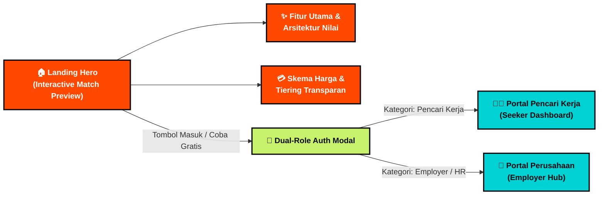
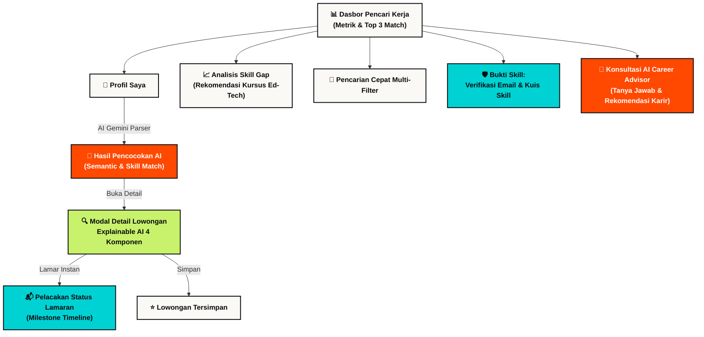
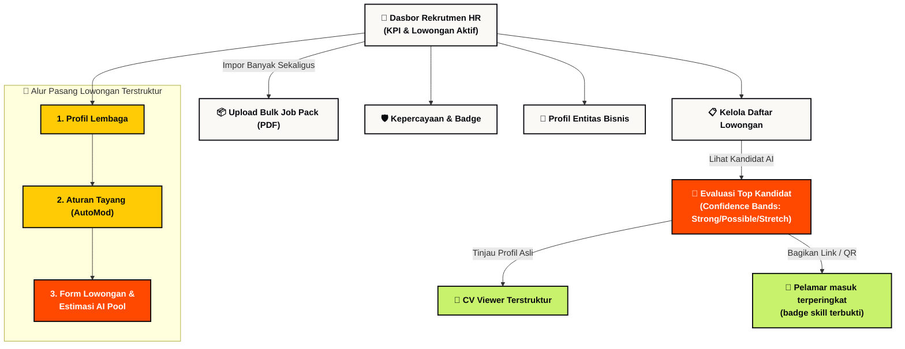
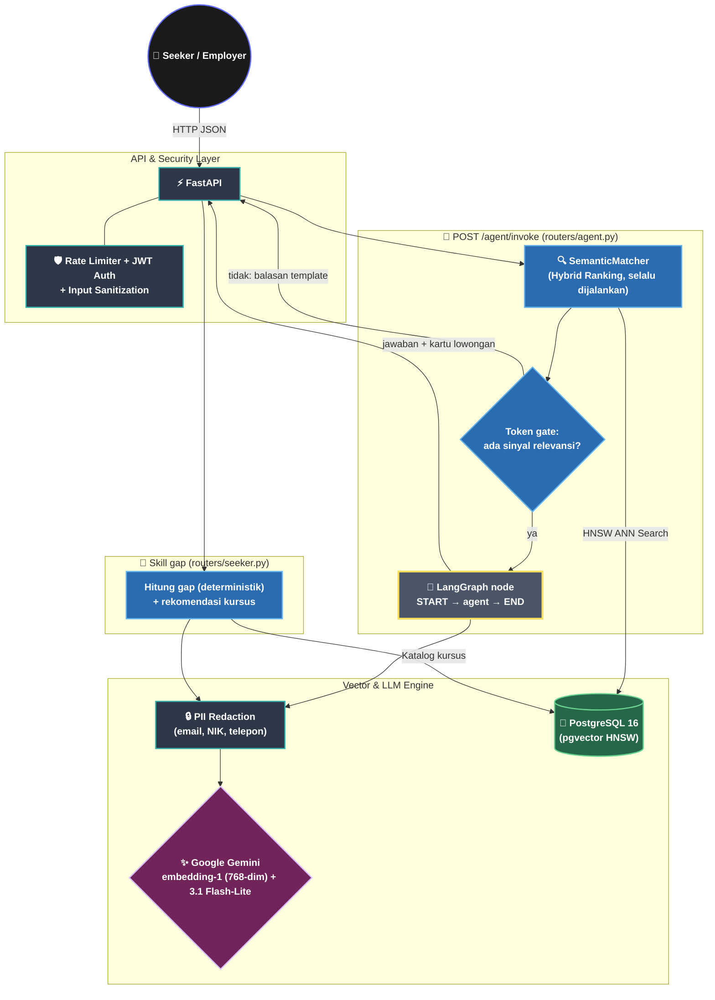
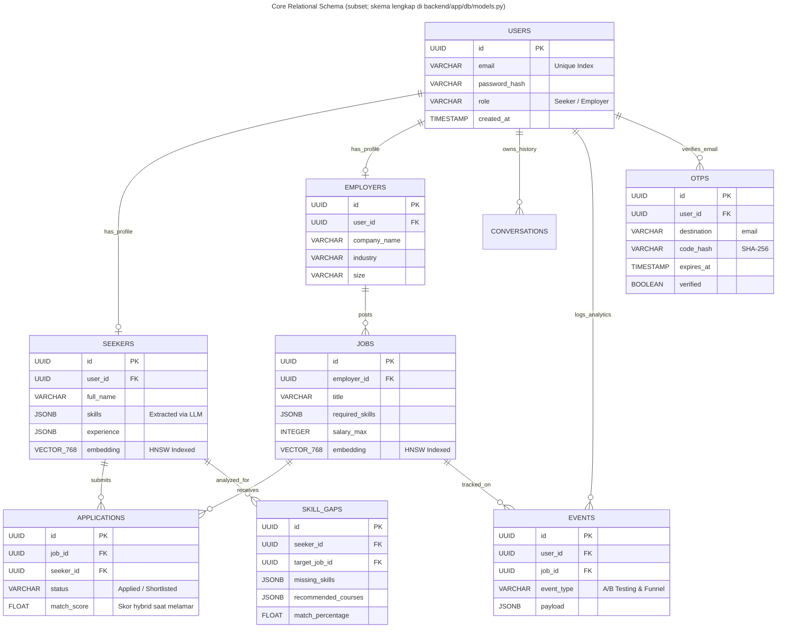

<div align="center">

# 💼 KerjaCerdas

**AI Job Matching yang Menilai Skill Terbukti — Semantic Matching, Kuis Skill & LangGraph Response Layer**

[](https://www.python.org/)
[](https://fastapi.tiangolo.com/)
[](https://langchain-ai.github.io/langgraph/)
[](https://ai.google.dev/)
[](https://github.com/pgvector/pgvector)
[](https://react.dev/)
[](https://vitejs.dev/)
[](https://tailwindcss.com/)
[](https://docs.docker.com/compose/)

</div>

A functional prototype of an AI talent-matching platform that ranks candidates by *proven* skills, not CV keywords: semantic vector search, short skill quizzes that earn a "✓ Terbukti" badge, shareable job links/QR posters, and AutoMod for scam or discriminatory job ads.

---

## 📌 Platform Overview

**KerjaCerdas** memecahkan masalah ketimpangan ganda (*Triple Mismatch*) di pasar tenaga kerja melalui pendekatan AI semantik.

## 🎯 Fitur Utama

- **AI Job Matching berbasis bukti**: skor = 35% kemiripan semantik CV–lowongan + 40% skill (bobot bukti) + 15% pengalaman + 10% pendidikan. Bagian skill ditimbang bukti: klaim CV 30%, lulus kuis 85%, dikonfirmasi HR 100% — jadi menumpuk kata kunci di CV tidak lagi menang.
- **Kuis skill → badge ✓ Terbukti**: 5 soal skenario per skill (Excel, layanan pelanggan, kasir, administrasi, dll), dinilai server dengan kunci jawaban (tanpa biaya AI per percobaan), berlaku 6 bulan.
- **Link + poster QR lowongan**: employer membagikan `/j/<kode>` di Instagram/WhatsApp atau mencetak poster; pelamar masuk ke satu daftar yang sudah diperingkat, bukan membanjiri WhatsApp.
- **AutoMod lowongan**: lowongan yang meminta biaya dari pelamar ditolak; syarat usia/penampilan/jenis kelamin ditahan untuk tinjauan admin. Pemasang menerima kalimat yang bermasalah + cara memperbaiki + banding (strike ladder).
- **Skill Gap Analyzer & Career Advisor**: peta skill gap, rekomendasi kursus, dan advisor LangGraph (kuota per paket).
- **Paket sederhana**: Spark (gratis, semua pelamar diperingkat) · Beacon Rp49.000/lowongan · Lighthouse Rp149.000/bulan · Prism Rp15.000/30 hari untuk pencari kerja. Membayar tidak pernah menaikkan skor maupun urutan.

Detail lengkap mengenai fitur produk dapat dilihat di [Product Features](docs/PRODUCT_FEATURES.md).

## 🚀 Pembaruan MVP v1.0.0 (Latest Release)
Sistem telah berevolusi menjadi arsitektur yang tangguh dan siap pakai untuk uji beta publik, dengan peningkatan berikut:
- **Performa Backend**: Pemrosesan asinkron untuk ekstraksi CV, cache lowongan in-memory (TTL 5 menit), dan index HNSW pgvector.
- **Agentic AI & Keamanan**: *Token Efficiency Gate* (mencegah *cost overrun* LLM jika *vector match* terlalu rendah), *Hallucination Guards*, serta filter kata teknis untuk UI yang lebih humanis.
- **UX & Frontend**: Alur Onboarding Wizard yang ramah, *Empty States* cerdas dengan rekomendasi, *Mobile-First CSS*, dukungan pengeditan profil pasca-unggah PDF, dan sistem Notifikasi Global (Toast) untuk *Error/Auth Session*.
- **DevOps & CI/CD**: Workflow CI dengan 5 job (lint & audit backend, lint & build frontend, unit test, integrasi database, benchmark matching), serta *Docker Compose* produksi.

## 🧩 Component Architecture & Business Value

Setiap komponen dalam aplikasi ini dirancang tidak hanya untuk fungsi teknis, melainkan untuk memberikan nilai bisnis dan *user experience* terbaik.

### 💼 Frontend Components (React 18 & React Router & Zustand)
| Komponen UI | Fungsi Teknikal | Dampak Bisnis & UX |
|---|---|---|
| **`LandingHero`** | Entry point SPA (termasuk header navigasi & footer publik) dengan direct route navigation. | Mengkonversi pengunjung (Lead Gen) melalui CVR yang dioptimasi dan copy persuasif. |
| **`CVUploader`** | Menghandle PDF parsing multipart form data + auto-navigate ke match. | Menghilangkan friksi data entry manual. AI Gemini mengekstrak data JSON dalam detik. |
| **`SeekerDashboard`** | Mengorkestrasi data profil (trust score, matches) dari `useStore`. | Memberikan umpan balik instan ke kandidat, membangun retensi Active Users. |
| **`SeekerMatchResults`** | Render hasil ranking hybrid (4 komponen skor) dari mesin matching. | Menyajikan hasil pencocokan berbasis band (Strong, Possible, Stretch). |
| **`JobDetailModal`** | Modal detail lowongan dengan **Explainable AI Score Breakdown**. | Transparansi 4 komponen skor pencocokan (Semantik, Skill, Pengalaman, Pendidikan) untuk trust kandidat. |
| **`ApplicationsPage`** | Visual milestone pipeline status lamaran interaktif. | Menghilangkan ketidakpastian kandidat dengan pelacakan tahapan lamaran real-time. |
| **`SkillGapPanel`** | Membandingkan array `skills` pengguna dengan top lowongan (Set Difference). | Agregasi Ed-Tech: menghubungkan pengguna ke kursus/bootcamp partner (potensi komisi referal). |
| **`FloatingAdvisor`** | Interface chat ke LangGraph response node (satu panggilan Gemini per pesan, tanpa tool calling). | Tanya jawab karier kapan saja, dengan kuota pesan harian per paket. |
| **`EmployerDashboard`** | Dasbor analitik (KPIs) pelamar real-time per lowongan dengan context passing. | Meminimalisasi beban kognitif HRD dengan funnel view pelamar yang jelas. |
| **`EmployerPostJob`** | Wizard pasang lowongan (1: Profil $\rightarrow$ 2: Aturan tayang/AutoMod $\rightarrow$ 3: Lowongan). | Menjelaskan aturan tayang sebelum publish, sehingga lowongan tidak ditahan karena hal yang bisa dihindari. |
| **`JobPackUploader`** | Drag-and-drop uploader untuk file PDF berisi kumpulan lowongan massal. | Mereduksi waktu input lowongan dari jam menjadi detik dengan AI auto-parsing. |
| **`EmployerProfile`** | Data perusahaan + badge kepercayaan nyata (email terverifikasi, email domain perusahaan, ditinjau admin) dan paket aktif. | Kredibilitas tanpa dokumen legal pihak ketiga; angka paket/lowongan diambil dari API, bukan placeholder. |
| **`EmployerCandidates` / `ApplicantList` / `TalentSearch`** | Tab Pelamar (diperingkat skor proof-weighted, badge bukti, status pipeline, pertanyaan wawancara AI, konfirmasi "skill terbukti", ekspor CSV) dan Talent pool anonim. | HR mewawancarai kandidat yang layak; kandidat yang belum melamar tetap anonim (UU PDP). |
| **`UpgradeModal`** | Pilihan paket & upgrade untuk seeker dan employer; pembayaran manual (QRIS/transfer) diaktifkan admin. | Harga transparan; membayar tidak pernah mengubah skor maupun peringkat. |
| **`SkillProofPage` / `QuizModal`** | Halaman "Bukti Skill": verifikasi email (OTP) + kuis skill bertimer yang menghasilkan badge ✓ Terbukti. | Pencari kerja membuktikan skill sekali dan dipakai di semua lamaran. KerjaCerdas **tidak** mengumpulkan NIK/KTP/ijazah/NPWP. |
| **`TrustCenter`** | Badge kepercayaan employer, pengajuan "Ditinjau admin", pedoman lowongan, status strike. | Kepercayaan dibangun in-house tanpa Dukcapil/DJP. |
| **`PublicJobPage` / `AdminPanel`** | Halaman lamaran publik `/j/<kode>` (target QR), panel admin (moderasi, tinjauan usaha, aktivasi paket, bank soal, metrik). | Distribusi lowongan dan operasi harian dalam satu aplikasi. |

---

## 📸 UI / UX Prototype Flow & Screenshots (Live Interface)

Platform **KerjaCerdas** mengadopsi arsitektur desain **Modern Neobrutalism** yang bersih, profesional, berani (*high-contrast*), dan mudah dinavigasi tanpa *visual clutter*. Di bawah ini adalah peta alur lengkap (*user flow*) interaktif untuk **Pencari Kerja (Job Seeker)** dan **Perusahaan / Rekruter (Employer / HR)** beserta tangkapan layar antarmuka langsung (*live screenshots*).

---

### 🌐 1. Landing & Public Onboarding Flow


```mermaid
flowchart LR
    classDef public fill:#FF4800,stroke:#090A0F,stroke-width:2.5px,color:#fff,font-weight:bold
    classDef modal fill:#C8F26B,stroke:#090A0F,stroke-width:2.5px,color:#090A0F,font-weight:bold
    classDef portal fill:#00D2D3,stroke:#090A0F,stroke-width:2.5px,color:#090A0F,font-weight:bold

    A["🏠 Landing Hero\n(Interactive Match Preview)"]:::public --> B["✨ Fitur Utama &\nArsitektur Nilai"]:::public
    A --> C["💳 Skema Harga &\nTiering Transparan"]:::public
    A -->|Tombol Masuk / Coba Gratis| D["🔐 Dual-Role Auth Modal"]:::modal
    D -->|Kategori: Pencari Kerja| E["👨‍💼 Portal Pencari Kerja\n(Seeker Dashboard)"]:::portal
    D -->|Kategori: Employer / HR| F["🏢 Portal Perusahaan\n(Employer Hub)"]:::portal
```

| 1. Landing Hero (Neobrutalism) | 2. Keunggulan Platform | 3. Skema Harga Transparan |
|:---:|:---:|:---:|
|  |  |  |

| 4. Modal Autentikasi (Masuk Akun) | 5. Modal Pendaftaran (Daftar Akun) |
|:---:|:---:|
|  |  |

---

### 👨‍💼 2. Alur Pencari Kerja (Seeker Flow)


```mermaid
flowchart TD
    classDef page fill:#FAF9F5,stroke:#090A0F,stroke-width:2px,color:#090A0F,font-weight:bold
    classDef ai fill:#FF4800,stroke:#090A0F,stroke-width:2px,color:#fff,font-weight:bold
    classDef modal fill:#C8F26B,stroke:#090A0F,stroke-width:2px,color:#090A0F,font-weight:bold
    classDef action fill:#00D2D3,stroke:#090A0F,stroke-width:2px,color:#090A0F,font-weight:bold

    A["📊 Dasbor Pencari Kerja\n(Metrik & Top 3 Match)"]:::page --> B["📄 Profil Saya"]:::page
    B -->|AI Gemini Parser| C["🎯 Hasil Pencocokan AI\n(Semantic & Skill Match)"]:::ai
    
    C -->|Buka Detail| D["🔍 Modal Detail Lowongan\nExplainable AI 4 Komponen"]:::modal
    D -->|Lamar Instan| E["📬 Pelacakan Status Lamaran\n(Milestone Timeline)"]:::action
    D -->|Simpan| F["⭐ Lowongan Tersimpan"]:::page
    
    A --> G["📈 Analisis Skill Gap\n(Rekomendasi Kursus Ed-Tech)"]:::page
    A --> H["🔎 Pencarian Cepat Multi-Filter"]:::page
    A --> I["🛡️ Bukti Skill:\nVerifikasi Email & Kuis Skill"]:::action
    A --> J["💬 Konsultasi AI Career Advisor\n(Tanya Jawab & Rekomendasi Karir)"]:::ai
```

| 6. Dasbor Analitik Pencari Kerja | 7. Hasil Pencocokan AI (Top Matches) | 8. Explainable AI Score Modal |
|:---:|:---:|:---:|
|  |  |  |

| 9. Analisis Skill Gap & Kursus | 10. Pencarian Cepat & Filter | 11. Lowongan Tersimpan |
|:---:|:---:|:---:|
|  |  |  |

| 12. Pelacakan Lamaran Saya | 13. Bukti Skill (Kuis) | 14. Ekstraksi CV PDF Cerdas |
|:---:|:---:|:---:|
|  |  |  |

| 22. Konsultasi Interaktif AI Career Advisor (Tanya Jawab & Rekomendasi Karir) |
|:---:|
|  |

---

### 🏢 3. Alur Perusahaan & Rekruter (Employer / HR Flow)


```mermaid
flowchart TD
    classDef page fill:#FAF9F5,stroke:#090A0F,stroke-width:2px,color:#090A0F,font-weight:bold
    classDef step fill:#FFCB05,stroke:#090A0F,stroke-width:2px,color:#090A0F,font-weight:bold
    classDef ai fill:#FF4800,stroke:#090A0F,stroke-width:2px,color:#fff,font-weight:bold
    classDef modal fill:#C8F26B,stroke:#090A0F,stroke-width:2px,color:#090A0F,font-weight:bold

    A["🏢 Dasbor Rekrutmen HR\n(KPI & Lowongan Aktif)"]:::page --> B["📋 Kelola Daftar Lowongan"]:::page
    
    subgraph Wizard_Pasang ["📝 Alur Pasang Lowongan Terstruktur"]
        C["1. Profil Lembaga"]:::step --> D["2. Aturan Tayang (AutoMod)"]:::step
        D --> E["3. Form Lowongan &\nEstimasi AI Pool"]:::ai
    end
    
    A --> C
    A -->|Impor Banyak Sekaligus| F["📦 Upload Bulk Job Pack (PDF)"]:::page
    
    B -->|Lihat Kandidat AI| G["👥 Evaluasi Top Kandidat\n(Confidence Bands: Strong/Possible/Stretch)"]:::ai
    G -->|Tinjau Profil Asli| H["📄 CV Viewer Terstruktur"]:::modal
    G -->|Bagikan Link / QR| I["🔗 Pelamar masuk terperingkat\n(badge skill terbukti)"]:::modal
    
    A --> J["🛡️ Kepercayaan & Badge"]:::page
    A --> K["🏢 Profil Entitas Bisnis"]:::page
```

| 15. Dasbor Perusahaan & HR Hub | 16. Manajemen Daftar Lowongan | 17. Wizard Pasang Lowongan (AI Estimator) |
|:---:|:---:|:---:|
|  |  |  |

| 18. Bulk Job Pack PDF Uploader | 19. Evaluasi Pelamar (bukti skill) | 20. Kepercayaan & Badge Perusahaan |
|:---:|:---:|:---:|
|  |  |  |

| 21. Profil Perusahaan & Paket Aktif |
|:---:|
|  |

---

## 🚀 Quick Start (Panduan Eksekusi Lengkap)

### Persyaratan Sistem
- **Docker Desktop** terinstal dan berjalan pada sistem Anda.
- **Git** untuk mengklon repositori.
- **Kunci API Gemini (`GEMINI_API_KEY`)** dari Google AI Studio. Diperlukan untuk fitur AI (parsing CV, rekomendasi kursus, chat advisor); tanpa kunci, parsing CV memakai heuristik teks dan chat advisor tidak aktif.
- **Opsional — object storage S3/Cloudflare R2 (`S3_*`)**. Mengarsipkan PDF job-pack yang diunggah perusahaan; CV tidak pernah diarsipkan. Tanpa konfigurasi, unggahan tetap berjalan. Cek status via `GET /api/v1/admin/storage/health`.

### Langkah 1 — Kloning & Konfigurasi
```powershell
git clone https://github.com/LouSens/KerjaCerdas.git
cd KerjaCerdas
Copy-Item .env.example .env
```
Buka berkas `.env` yang baru saja dibuat, lalu isi dengan kredensial Anda:
```env
# Contoh konfigurasi .env
JWT_SECRET_KEY=rahasia-jwt-kerjacerdas-super-aman
GEMINI_API_KEY=AIzaSy... (Masukkan kunci Gemini Anda)
```

### Langkah 2 — Menjalankan Seluruh Ekosistem (Docker Compose)
Platform ini diorkestrasi sepenuhnya menggunakan Docker. Jalankan perintah berikut di terminal/PowerShell pada *root directory* proyek:
```powershell
docker compose up --build
```
> [!NOTE]
> Proses ini akan mengunduh *image* yang diperlukan, meng-kompilasi *frontend* React, membangun *backend* FastAPI, serta menjalankan PostgreSQL 16 lengkap dengan ekstensi `pgvector` (skema dikelola oleh Alembic). Tunggu hingga terminal menampilkan log bahwa *backend* dan *frontend* telah siap (biasanya memakan waktu 1-3 menit).

Basis data dimulai **kosong** — jalankan skrip seed Python sekali untuk mengisi data demo (lowongan, kandidat, dan kursus berbasis pasar kerja Indonesia nyata):
```powershell
docker compose exec api env SEED_DEFAULT_PASSWORD=demo python -m scripts.seed_all
```

### Langkah 3 — Akses Lingkungan Demo
Setelah semua kontainer berjalan (*healthy*), buka tautan berikut di *browser*:
- **Aplikasi Web (Frontend):** [http://localhost:3000](http://localhost:3000)
- **API Server (Backend):** [http://localhost:8000/health](http://localhost:8000/health)
- **Dokumentasi API (Swagger UI):** [http://localhost:8000/docs](http://localhost:8000/docs)

### Langkah 4 — Uji Coba (Akun Demo)
Akun demo di [DEMO_ACCOUNTS.md](docs/DEMO_ACCOUNTS.md) sudah tersedia di **database deployment demo (Replit)**. Database lokal dimulai kosong: akun-akun itu baru ada setelah Anda menjalankan skrip seed di Langkah 2, dengan sandi sesuai `SEED_DEFAULT_PASSWORD` yang Anda berikan (pada contoh di atas: `demo`).

Setelah seed lokal, coba:

**A. Sebagai Pencari Kerja (Seeker):**
- **Email:** `maya.sari@example.com`
- *(Fokus Uji Coba: Lamaran Saya → alasan penolakan dari HR → Rencana Belajar untuk lowongan target → lamar lagi)*

**B. Sebagai HRD Perusahaan (Employer):**
- **Email:** `hr@kliniksehat.id` (Klinik Sehat Keluarga — fiktif) atau `hr@kelontongmakmur.id`
- *(Fokus Uji Coba: Pelamar Terperingkat, Peta Skill Pelamar, Tolak dengan alasan, Konfirmasi skill setelah wawancara, Pasang Lowongan + AutoMod)*

### Langkah 5 — Menghentikan & Membersihkan Sistem
Jika ingin menghentikan sistem, tekan `CTRL+C` pada terminal yang menjalankan *docker-compose*.
Untuk menghapus kontainer dan menghapus basis data (reset total), gunakan:
```powershell
docker compose down -v
```

### Langkah 6 — Deployment ke VPS (Produksi)
Proyek ini menggunakan **GitHub Actions** (`release.yml`) untuk membangun (build) dan mempublikasikan image Docker ke GitHub Container Registry (`ghcr.io`) secara otomatis saat Anda membuat Rilis (Release) dengan *git tag* (contoh: `v1.0.0`).

**Langkah-langkah di server VPS:**
1. Clone repositori ke server VPS Anda.
2. Buat file `.env` (lihat bagian `VPS Production Deployment` di `.env.example`).
3. Setel `IMAGE_TAG` ke versi rilis yang ingin digunakan (contoh: `v1.0.0`) atau `latest`.
4. Jalankan perintah berikut untuk mengunduh dan menyalakan kontainer:
   ```bash
   docker-compose -f docker-compose.prod.yml pull
   docker-compose -f docker-compose.prod.yml up -d
   ```

> **Catatan Pengembangan di Masa Depan (Future Improvement):**  
> Proses ini dapat diotomatisasi 100% menggunakan aksi `appleboy/ssh-action` di dalam `release.yml`. Ketika kunci SSH VPS sudah tersedia, tambahkan *step* deployment otomatis sehingga server VPS langsung menarik (pull) image baru tanpa perlu intervensi manual (login SSH) setiap kali ada rilis versi baru.

---

## 🧠 Arsitektur Sistem Inti

Platform ini menggunakan **LangGraph** sebagai response layer, **`gemini-embedding-1`** (768-dim, MRL-truncated) untuk embedding semantik, dan **`gemini-3.1-flash-lite`** untuk generasi teks (dengan fallback berantai ke model lain bila kuota habis; lihat `backend/app/config/settings.py`). Arsitektur saat ini berupa *single-node LangGraph graph* yang menghasilkan respons natural-language, sementara matching dan skill-gap dijalankan secara prosedural di luar graph.

> **Status:** Tidak ada intent router terpisah. `routers/agent.py` selalu menjalankan matcher, lalu memanggil satu node LangGraph untuk menulis jawaban; analisis skill-gap adalah endpoint terpisah di `routers/seeker.py`. `nodes.py` kini hanya berisi helper rekomendasi kursus, dan tool calling nonaktif. Topologi multi-node ada di roadmap teknis `[PLANNED]`.


```mermaid
flowchart TD
    classDef user fill:#1A1A1A,stroke:#646CFF,stroke-width:2px,color:#FFF,font-weight:bold
    classDef api fill:#2D3748,stroke:#38B2AC,stroke-width:2px,color:#FFF,font-weight:bold
    classDef node fill:#4A5568,stroke:#F6E05E,stroke-width:3px,color:#FFF,font-weight:bold
    classDef proc fill:#2B6CB0,stroke:#63B3ED,stroke-width:2px,color:#FFF
    classDef db fill:#276749,stroke:#68D391,stroke-width:2px,color:#FFF
    classDef llm fill:#702459,stroke:#D6BCFA,stroke-width:2px,color:#FFF,font-weight:bold

    User(("👤 Seeker / Employer")):::user

    subgraph API_Layer ["API & Security Layer"]
        FastAPI["⚡ FastAPI"]:::api
        Middleware["🛡️ Rate Limiter + JWT Auth\n+ Input Sanitization"]:::api
        FastAPI --- Middleware
    end

    subgraph Chat ["💬 POST /agent/invoke (routers/agent.py)"]
        Matcher["🔍 SemanticMatcher\n(Hybrid Ranking, selalu dijalankan)"]:::proc
        Gate{"Token gate:\nada sinyal relevansi?"}:::proc
        AgentNode["📝 LangGraph node\nSTART → agent → END"]:::node
    end

    subgraph Gap ["🎯 Skill gap (routers/seeker.py)"]
        SkillGap["Hitung gap (deterministik)\n+ rekomendasi kursus"]:::proc
    end

    subgraph Infrastructure ["Vector & LLM Engine"]
        Redact["🔒 PII Redaction\n(email, NIK, telepon)"]:::api
        Gemini{"✨ Google Gemini\nembedding-1 (768-dim) + 3.1 Flash-Lite"}:::llm
        PG[("🐘 PostgreSQL 16\n(pgvector HNSW)")]:::db
    end

    User -->|HTTP JSON| FastAPI
    FastAPI --> Matcher
    Matcher -->|HNSW ANN Search| PG
    Matcher --> Gate
    Gate -->|tidak: balasan template| FastAPI
    Gate -->|ya| AgentNode
    AgentNode --> Redact --> Gemini
    AgentNode -->|jawaban + kartu lowongan| FastAPI
    FastAPI --> SkillGap
    SkillGap -->|Katalog kursus| PG
    SkillGap --> Redact
```

### 1. Pipeline Proses AI
Setiap pesan chat menjalankan matcher lebih dulu. Bila tidak ada lowongan dengan sinyal relevansi sama sekali, API langsung membalas tanpa memanggil LLM (*token efficiency gate*). Bila ada, satu node LangGraph memanggil Gemini dengan nama dan daftar skill kandidat serta pesannya; kartu lowongan dikirim terpisah ke UI, dan ID lowongan yang tidak ada di database dibuang (*hallucination guard*).

### 2. Hibridisasi Penilaian (Hybrid Ranking)
Sistem menggunakan komposit metrik matematis untuk mereplikasi prioritas SDM:
```python
final_score = (
    cosine_similarity  * 0.35 +   # Relevansi Semantik (Vektor Gemini)
    proven_skill_score * 0.40 +   # Skor Keahlian Tertimbang Bukti
    experience_fit     * 0.15 +   # Validasi Masa Kerja
    education_fit      * 0.10     # Kesesuaian Jenjang Pendidikan
)
```

### 3. Kepatuhan Privasi (Data Isolation)
Sebelum teks dikirim ke Gemini, `backend/app/services/privacy/redact.py` mengganti alamat email, NIK 16 digit, dan nomor telepon dengan placeholder. Alamat rumah tidak disaring. KerjaCerdas tidak mengumpulkan NIK/KTP/ijazah/NPWP sama sekali.

### 4. Skema Basis Data (Entity-Relationship)
Infrastruktur relasional kami direkayasa untuk menangani entitas dalam skala tinggi (High-Volume) sekaligus memfasilitasi pencarian jarak vektor komputasional menggunakan `pgvector`.

### 5. Data Acquisition & AI Feedback Loop
Roadmap item: sistem dirancang untuk mengakuisisi data melalui tiga jalur di masa depan: **Kemitraan Data** dengan institusi ketenagakerjaan, **Internal Feedback Loop** dari aktivitas pengguna (lolos wawancara, tingkat retensi), serta integrasi kursus terverifikasi. Saat ini, data bersumber dari seeder manual dan input pengguna langsung.


```mermaid
---
title: Core Relational Schema (subset; skema lengkap di backend/app/db/models.py)
---
erDiagram
    USERS ||--o| SEEKERS : "has_profile"
    USERS ||--o| EMPLOYERS : "has_profile"
    USERS ||--o{ CONVERSATIONS : "owns_history"
    USERS ||--o{ EVENTS : "logs_analytics"
    USERS ||--o{ OTPS : "verifies_email"
    EMPLOYERS ||--o{ JOBS : "posts"
    SEEKERS ||--o{ APPLICATIONS : "submits"
    JOBS ||--o{ APPLICATIONS : "receives"
    JOBS ||--o{ EVENTS : "tracked_on"
    SEEKERS ||--o{ SKILL_GAPS : "analyzed_for"

    USERS {
        UUID id PK
        VARCHAR email "Unique Index"
        VARCHAR password_hash
        VARCHAR role "Seeker / Employer"
        TIMESTAMP created_at
    }
    SEEKERS {
        UUID id PK
        UUID user_id FK
        VARCHAR full_name
        JSONB skills "Extracted via LLM"
        JSONB experience
        VECTOR_768 embedding "HNSW Indexed"
    }
    EMPLOYERS {
        UUID id PK
        UUID user_id FK
        VARCHAR company_name
        VARCHAR industry
        VARCHAR size
    }
    JOBS {
        UUID id PK
        UUID employer_id FK
        VARCHAR title
        JSONB required_skills
        INTEGER salary_max
        VECTOR_768 embedding "HNSW Indexed"
    }
    APPLICATIONS {
        UUID id PK
        UUID job_id FK
        UUID seeker_id FK
        VARCHAR status "Applied / Shortlisted"
        FLOAT match_score "Skor hybrid saat melamar"
    }
    SKILL_GAPS {
        UUID id PK
        UUID seeker_id FK
        UUID target_job_id FK
        JSONB missing_skills
        JSONB recommended_courses
        FLOAT match_percentage
    }
    EVENTS {
        UUID id PK
        UUID user_id FK
        UUID job_id FK
        VARCHAR event_type "A/B Testing & Funnel"
        JSONB payload
    }
    OTPS {
        UUID id PK
        UUID user_id FK
        VARCHAR destination "email"
        VARCHAR code_hash "SHA-256"
        TIMESTAMP expires_at
        BOOLEAN verified
    }
```

---

## 📂 Struktur Repositori

```
KerjaCerdas/
│
├── backend/                  # API FastAPI & Logika Single-Node LangGraph Response Layer
│   ├── app/
│   │   ├── api/              # Interface Endpoints FastAPI
│   │   │   ├── routers/
│   │   │   │   ├── agent.py       # Endpoint invokasi LangGraph response node
│   │   │   │   ├── auth.py        # Login/Register (JWT)
│   │   │   │   ├── employer.py    # Endpoint perusahaan & kandidat pelamar
│   │   │   │   ├── events.py      # Analytics event tracking
│   │   │   │   ├── experiments.py # A/B testing flag retrieval
│   │   │   │   ├── inquiries.py   # Endpoint kemitraan & enterprise
│   │   │   │   ├── jobs.py        # Pencarian dan paginasi lowongan
│   │   │   │   ├── seeker.py      # Profil, bookmark, history aplikasi
│   │   │   │   ├── uploads.py     # Endpoint Multi-modal PDF Parser (%PDF- validated)
│   │   │   │   ├── verify.py      # Verifikasi email (OTP) — satu-satunya cek identitas in-house
│   │   │   │   ├── quiz.py        # Kuis skill → badge ✓ Terbukti
│   │   │   │   ├── public_jobs.py # Halaman /j/<kode>, QR SVG, laporan lowongan
│   │   │   │   ├── hiring.py      # Interview kit, konfirmasi skill, ekspor CSV, banding, trust
│   │   │   │   ├── billing.py     # Paket & pesanan (pembayaran manual)
│   │   │   │   ├── admin.py       # Moderasi, tinjauan usaha, aktivasi paket, metrik
│   │   │   ├── schemas/           # Pydantic validation schemas
│   │   │   └── services/          # Business logic helpers
│   │   ├── agents/           # LLM & LangGraph single-node response layer (routing antar matcher/skill-gap/advisor berjalan prosedural, bukan multi-agent graph)
│   │   │   ├── graph/
│   │   │   │   ├── builder.py     # LangGraph single-node graph (START → agent → END)
│   │   │   │   └── nodes.py       # Helper rekomendasi kursus untuk skill gap
│   │   │   ├── tools/
│   │   │   │   └── superpowers.py # Fungsi tool (belum di-bind; tool calling nonaktif)
│   │   │   ├── memory/            # Checkpointer & conversational state
│   │   │   └── telemetry/         # Cek batas token (belum dipanggil di mana pun)
│   │   ├── services/
│   │   │   └── matching/          # Core Recommendation Engine
│   │   │       ├── embeddings/    # Gemini Vector generator
│   │   │       └── matcher.py     # Algoritma Cosine Similarity + Heuristik
│   │   ├── db/
│   │   │   ├── postgres_store.py  # Abstraksi Async Session & SQLAlchemy Repository
│   │   │   ├── models.py          # Definisi Skema Tabel PostgreSQL (pgvector)
│   │   │   ├── schemas.py         # Skema Validasi Pydantic
│   │   │   └── session.py         # Konfigurasi Koneksi Asyncpg
│   │   └── config/
│   │       └── settings.py        # Manajemen variabel lingkungan (.env)
│   ├── tests/                # Unit & Integration Tests (Pytest)
│   ├── alembic/              # Skrip Migrasi Basis Data (Alembic)
│   └── pyproject.toml        # Dependensi Python (dikelola via pip/uv)
│
├── frontend/                 # Aplikasi Web React.js (Vite + React Router)
│   ├── src/
│   │   ├── components/       # UI Library (Neo-Brutalism)
│   │   │   ├── _design.jsx           # Komponen dasar desain sistem (Button, Card, Tag)
│   │   │   ├── SeekerDashboard.jsx   # Dasbor utama pencari kerja
│   │   │   ├── SeekerMatchResults.jsx# UI visualisasi skor kecocokan vektor
│   │   │   ├── SeekerSearch.jsx      # Dual-Track Manual Search
│   │   │   ├── SkillGapPanel.jsx     # Panel rekomendasi kursus Ed-Tech
│   │   │   ├── ApplicationsPage.jsx  # Pelacakan status lamaran milestone
│   │   │   ├── FloatingAdvisor.jsx   # Antarmuka chat interaktif (JSON response, bukan SSE streaming)
│   │   │   ├── JobDetailModal.jsx    # Detail lowongan + Explainable AI Breakdown
│   │   │   ├── EmployerDashboard.jsx # Analitik kolam kandidat untuk HRD
│   │   │   ├── EmployerCandidates.jsx# Tab Pelamar (proof-weighted) & Talent pool anonim
│   │   │   ├── EmployerHelpPanel.jsx # Panel panduan rekrutmen untuk HRD
│   │   │   ├── EmployerPostJob.jsx   # Form pembuatan lowongan (Timeline Step)
│   │   │   ├── EmployerProfile.jsx   # Pengaturan data profil perusahaan
│   │   │   ├── JobPackUploader.jsx   # Bulk PDF job parser dengan drag-drop
│   │   │   ├── CVUploader.jsx        # Komponen unggah PDF kandidat
│   │   │   ├── SkillProofPage.jsx    # Bukti Skill: verifikasi email + kuis skill
│   │   │   ├── QuizModal.jsx         # Kuis bertimer 5 soal
│   │   │   ├── TrustCenter.jsx       # Badge kepercayaan employer + pedoman lowongan
│   │   │   ├── PublicJobPage.jsx     # Halaman lamaran publik /j/<kode>
│   │   │   ├── AdminPanel.jsx        # Panel admin
│   │   │   ├── UpgradeModal.jsx      # Modal paket & upgrade (seeker/employer)
│   │   │   ├── AuthModal.jsx         # Popup Login/Register terintegrasi
│   │   │   ├── OnboardingWizard.jsx  # Alur onboarding pengguna baru
│   │   │   └── LandingHero.jsx       # Halaman pendaratan publik (termasuk header & footer)
│   │   ├── services/
│   │   │   └── api.js        # Wrapper fetch API dengan auto-logout 401 & auth header
│   │   ├── store/
│   │   │   └── useStore.js   # State Management global (Zustand) + Router Bridge
│   │   └── App.jsx           # Root layout & React Router routing table
│   └── package.json
│
├── scripts/                  # Skrip Data & Seeders (Root)
│   ├── seed_all.py           # Skrip data utama
│   ├── seed_employers.py     # Data Perusahaan
│   ├── seed_seekers.py       # Data Kandidat
│   └── seed_courses.py       # Data Kursus
│
├── docs/                     # Dokumentasi Resmi
│   ├── ARCHITECTURE.md       # Arsitektur Sistem & Pemetaan 3-Layer (UX/Logic/Infra)
│   ├── PRODUCT_FEATURES.md   # Deskripsi Detail Fitur Utama Produk
│   ├── ROADMAP.md            # Roadmap Teknis, A/B Testing & Skalabilitas Cloud
│   ├── DEMO_ACCOUNTS.md      # Akun demo (database Replit; lokal via seed)
│   ├── API_SPEC.md           # Spesifikasi API Lengkap (semua endpoint + schema)
│   ├── SEQUENCE_DIAGRAMS.md  # Diagram Alur Mermaid (Auth, AI, Bukti Skill, Moderasi, dll.)
│   ├── THREAT_MODEL.md       # Model Ancaman & Mitigasi Keamanan
│   ├── RULES.md              # Aturan lowongan yang dipublikasikan (sumber: services/trust/rules.py)
│   └── internals/            # Dokumentasi Teknis Internal Modul (00-10)
```

---

## 📚 Dokumen Referensi

Seluruh dokumentasi produk dan teknis ada di folder `docs/`. Mulai dari [ARCHITECTURE.md](docs/ARCHITECTURE.md) untuk gambaran sistem secara keseluruhan.

| Dokumen | Deskripsi | Tautan |
|---|---|---|
| **Arsitektur** | Arsitektur sistem, pemetaan Layer 1/2/3 (UX/System Logic/Technical Architecture), dan status Built vs Planned, disitasi ke file kode. | [ARCHITECTURE.md](docs/ARCHITECTURE.md) |
| **Fitur Produk** | Uraian fitur beserta status Built/Planned: matching berbobot bukti, kuis skill, link/QR lowongan, AutoMod, verifikasi email (OTP), dan paket. | [PRODUCT_FEATURES.md](docs/PRODUCT_FEATURES.md) |
| **Roadmap** | Roadmap infrastruktur cloud, A/B testing, integrasi mitra, dan roadmap algoritma matching/AI agent. | [ROADMAP.md](docs/ROADMAP.md) |
| **Akun Demo** | Daftar akun uji coba di database demo (Replit); lokal dibuat oleh skrip seed. | [DEMO_ACCOUNTS.md](docs/DEMO_ACCOUNTS.md) |
| **Spesifikasi API** | Kontrak lengkap semua endpoint FastAPI: skema request/response, rate limit, middleware, dan error codes. | [API_SPEC.md](docs/API_SPEC.md) |
| **Diagram Alur (Sequence)** | Diagram Mermaid untuk alur kerja kritis: Auth, AI Agent, CV Upload, Bukti Skill, Moderasi lowongan, dan lainnya. | [SEQUENCE_DIAGRAMS.md](docs/SEQUENCE_DIAGRAMS.md) |
| **Threat Model** | Aset, batas kepercayaan, dan mitigasi per kategori ancaman (STRIDE). | [THREAT_MODEL.md](docs/THREAT_MODEL.md) |
| **Aturan Lowongan** | Rulebook publik yang dipakai AutoMod, pelapor, dan peninjau. | [RULES.md](docs/RULES.md) |

---
<div align="center">

**KerjaCerdas © 2026** — *Enterprise Talent AI Infrastructure*

<br>

[](#) [](http://localhost:8000/docs) 

</div>
