<div align="center">


# KerjaCerdas
**Autonomous Recruitment Platform powered by Semantic Matching & Multi-Agent Swarm**

[](https://fastapi.tiangolo.com) [](https://react.dev) [](https://ai.google.dev) [](https://langchain-ai.github.io/langgraph/) [](https://vitejs.dev) 

*An enterprise-grade talent matching infrastructure utilizing high-dimensional vector search and ReAct-based autonomous agents to streamline recruitment pipelines.*

<br>
</div>

---

## 📌 Problem We Solve

Indonesia memiliki **7,86 juta pengangguran terbuka** (BPS, Feb 2025). Di sisi lain, sektor industri mengeluhkan kesulitan mencari talenta yang tepat. Akar permasalahan ini adalah **ketimpangan ganda (Triple Mismatch)**:

| Mismatch | Dampak |
|---|---|
| **Structural Mismatch** (Kelebihan pelamar umum vs Kekurangan talenta digital) | Ekspansi industri modern terhambat oleh kelangkaan SDM berkualifikasi. |
| **Relevance Mismatch** (Pencarian *keyword* yang mengabaikan semantik) | Kandidat berkualitas tidak terdeteksi; kandidat yang kurang tepat masuk daftar pendek (shortlist). |
| **Trust Mismatch** (CV tak terverifikasi & penipuan lowongan) | Talenta terhambat validasi; pelamar berisiko terkena penipuan (*fraud*). |

Portal pekerjaan konvensional beroperasi sebagai **mesin pencari berbasis kata kunci (keyword)** yang statis. KerjaCerdas memecahkan masalah ini dengan memahami konteks dan semantik kompetensi.

---

## ✨ Key Differences

| Fitur | Portal Konvensional | **KerjaCerdas (Enterprise AI)** |
|---|---|---|
| **Mesin Pencocokan** | Filter *Keyword* Kaku | **Gemini Semantic Embeddings (3072-dim)** |
| **Arsitektur Agen** | Chat Bot Sederhana | **ReAct Multi-Agent Supervisor Swarm** |
| **Sistem Navigasi UI** | Linear & Searah | **Dual-Track (AI Autopilot & Manual Search)** |
| **Analisis Celah Keahlian** | Tidak Ada | **Identifikasi spesifik + Rekomendasi program Ed-Tech** |
| **Monetisasi B2B** | Biaya Berlangganan di Muka | **Hybrid: Pay-to-Unlock (Rp 50rb/10 kandidat) & SaaS Pro** |

---

## 🎯 Fitur Utama (Live Demo Ready)

### 1. AI Job Matching (Pencocokan Pekerjaan AI)
Fitur ini mengubah cara kandidat mencari pekerjaan dengan menggantikan sistem pencarian *keyword* manual (seperti mengetik "Python Backend Developer") menjadi pencocokan semantik otomatis. Saat kandidat mengunggah CV PDF, model AI Gemini bertugas membaca dan mengekstrak keahlian, pengalaman, serta pendidikan kandidat secara *real-time*, lalu mengubahnya menjadi "Vektor Semantik" berdimensi tinggi. Vektor ini kemudian dicocokkan dengan seluruh vektor lowongan pekerjaan yang ada di *database* PostgreSQL menggunakan algoritma Cosine Similarity. Hasilnya, kandidat langsung mendapatkan rekomendasi pekerjaan dengan persentase skor kecocokan yang sangat akurat, karena sistem memahami konteks keahlian pelamar—bukan sekadar kemiripan kata.

### 2. Proactive Skill Gap Analyzer (Analisis Celah Keahlian Proaktif)
Sistem tidak hanya menolak kandidat jika kemampuannya kurang sesuai, tetapi secara proaktif memberi tahu apa kelemahan mereka. Melalui arsitektur *Multi-Agent Swarm* (agen AI otonom dari LangGraph), sistem akan menganalisis kesenjangan (gap) antara spesifikasi lowongan yang dilamar dan keahlian yang tercantum di CV kandidat. Jika kandidat memiliki skor kecocokan rendah (misalnya kurang menguasai "AWS" atau "Google Analytics"), agen AI akan merinci kelemahan tersebut secara interaktif dan langsung memberikan rekomendasi program *upskilling* spesifik (seperti pelatihan dari Prakerja atau platform Ed-Tech) agar kandidat bisa meningkatkan keahliannya sebelum mencoba melamar kembali.

### 3. Employer Dashboard & Direct Contact Unlock (Dasbor Perusahaan & Buka Kontak)
Modul ini dirancang untuk menyelesaikan masalah kelelahan administratif (*screening fatigue*) bagi HRD serta menawarkan model monetisasi yang bersahabat bagi UMKM. Saat HRD mengetik rancangan lowongan baru, AI memprediksi ketersediaan jumlah talenta yang cocok secara *real-time* dari *Live Pool* sebelum lowongan diterbitkan. Setelah lowongan tayang, agen AI sudah menyortir ratusan pelamar ke dalam daftar pendek (*Shortlist*) Top-5 Kandidat Terbaik lengkap dengan ringkasan alasan kecocokannya. Alih-alih mengharuskan HRD atau UMKM membayar biaya berlangganan mahal di muka, platform ini menggunakan sistem transaksi mikro (*Pay-to-Unlock*): profil asli dan skor kandidat disajikan secara transparan, namun akses email/telepon disensor. Perusahaan hanya perlu membayar biaya mikro (misal Rp 50.000) pada saat mereka memutuskan untuk menghubungi kandidat unggulan tersebut.

---

## 📸 Screenshots (Live Demo)

*Geser ke kanan untuk melihat semua tampilan aplikasi (Horizontal Scroll).*

| Home | Pricing | About | Login | Register | Seeker Dashboard | Seeker Match | Seeker Profile | Employer Dashboard | Post Job |
|:---:|:---:|:---:|:---:|:---:|:---:|:---:|:---:|:---:|:---:|
| 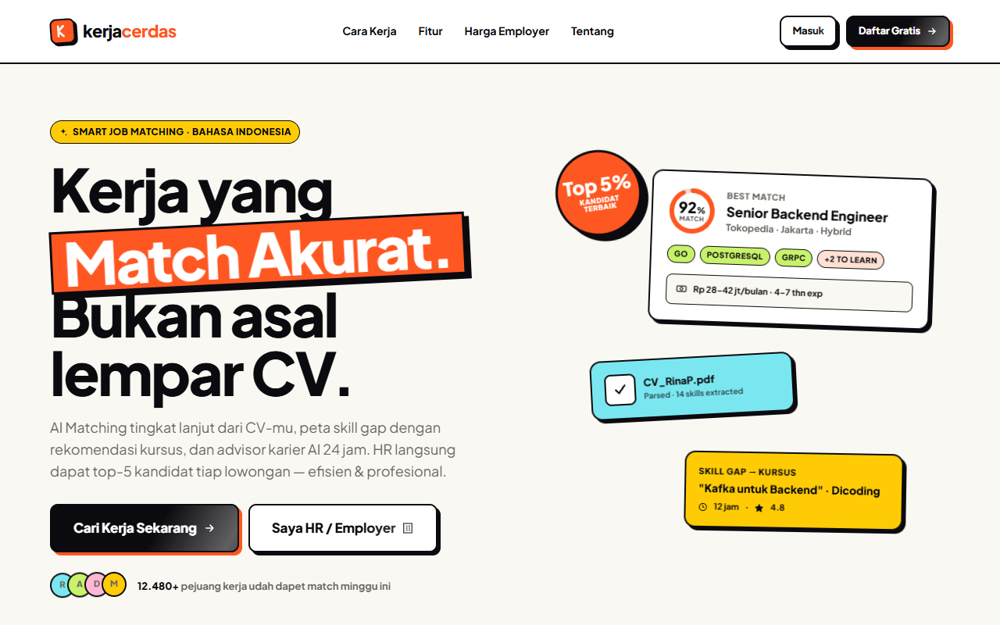 | 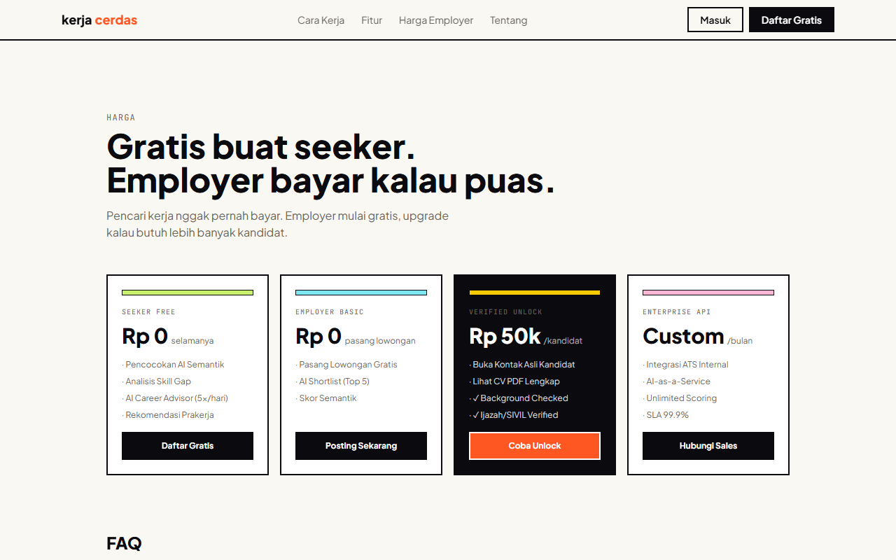 | 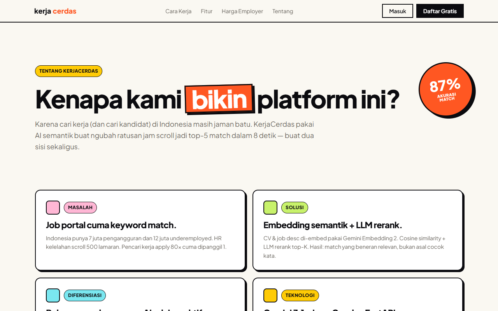 | 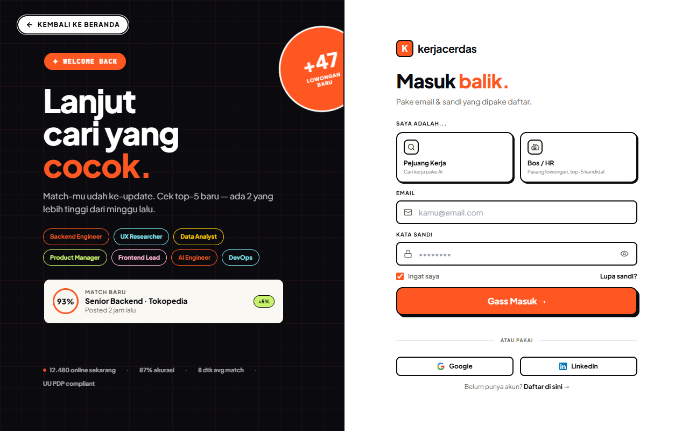 | 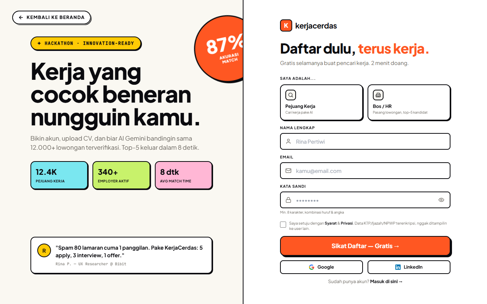 | 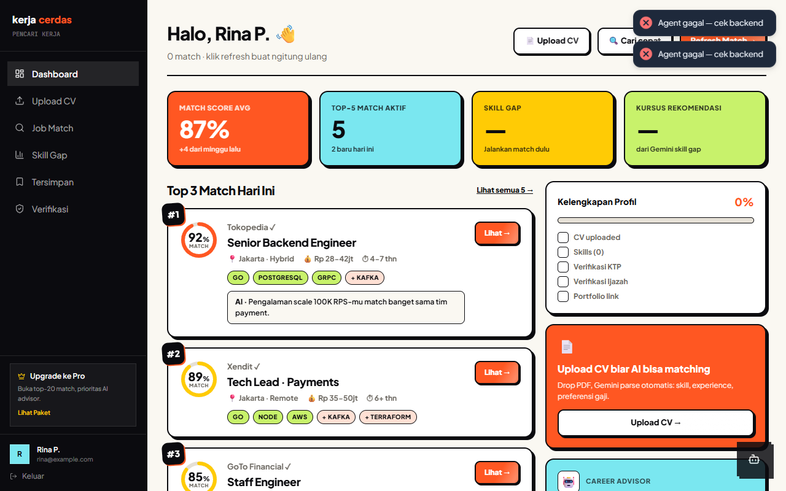 | 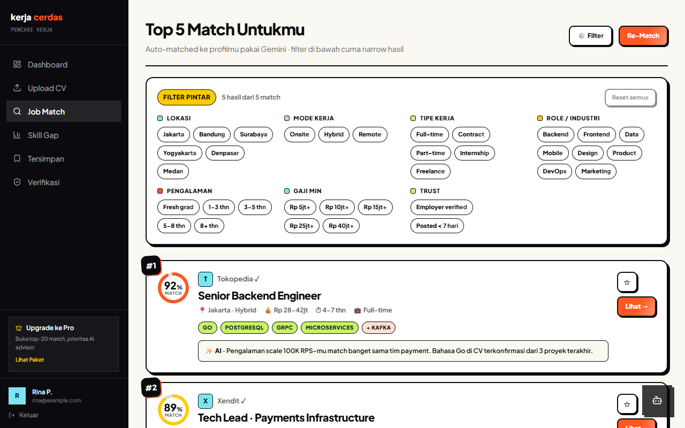 | 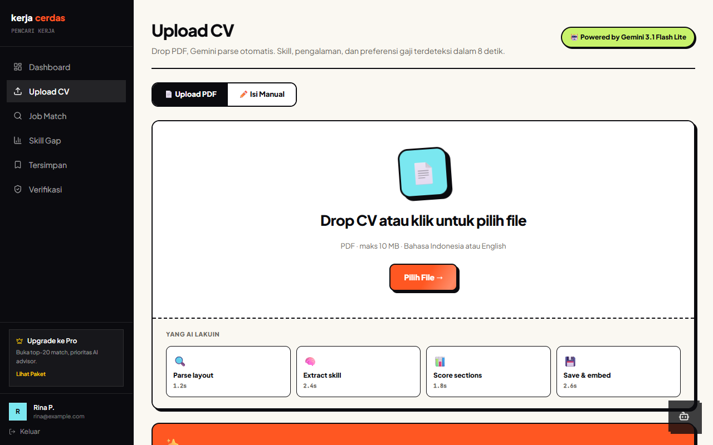 | 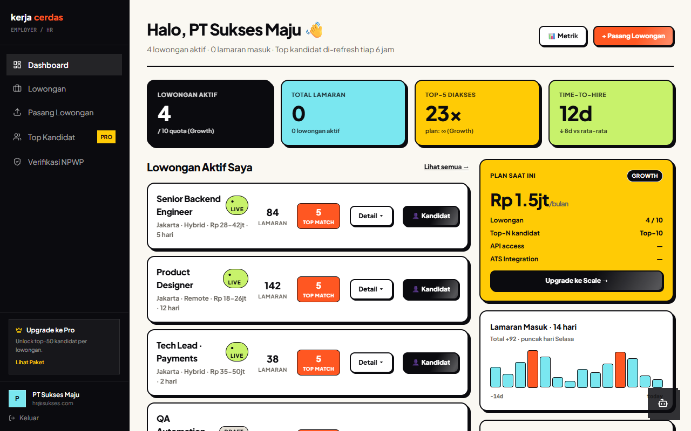 | 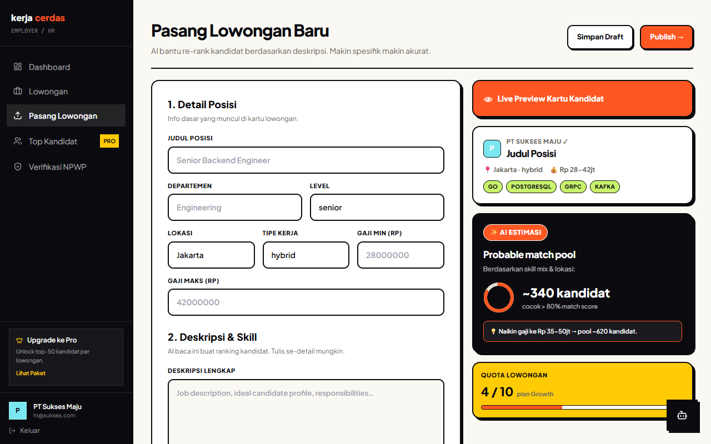 |

---

## 🚀 Quick Start (Panduan Eksekusi Lengkap)

### Persyaratan Sistem
- **Docker Desktop** terinstal dan berjalan pada sistem Anda.
- **Git** untuk mengklon repositori.
- **Kunci API Gemini (`GEMINI_API_KEY`)** dari Google AI Studio (Wajib untuk fitur *Resume Parsing* dan *Skill Gap Analyzer*).

### Langkah 1 — Kloning & Konfigurasi
```powershell
git clone https://github.com/LouSens/KerjaCerdas.git
cd KerjaCerdas
Copy-Item .env.example .env
```
Buka berkas `.env` yang baru saja dibuat, lalu isi dengan kredensial Anda:
```env
# Contoh konfigurasi .env
JWT_SECRET_KEY=rahasia-jwt-kerjacerdas-super-aman
GEMINI_API_KEY=AIzaSy... (Masukkan kunci Gemini Anda)
```

### Langkah 2 — Menjalankan Seluruh Ekosistem (Docker Compose)
Platform ini diorkestrasi sepenuhnya menggunakan Docker. Jalankan perintah berikut di terminal/PowerShell pada *root directory* proyek:
```powershell
docker compose up --build
```
> [!NOTE]
> Proses ini akan mengunduh *image* yang diperlukan, meng-kompilasi *frontend* React, membangun *backend* FastAPI, serta menjalankan PostgreSQL 16 lengkap dengan ekstensi `pgvector`. Basis data akan secara **otomatis terisi** dengan 21 lowongan pekerjaan asli Indonesia dan 20 kandidat (via skrip `init.sql`). Tunggu hingga terminal menampilkan log bahwa *backend* dan *frontend* telah siap (biasanya memakan waktu 1-3 menit).

### Langkah 3 — Akses Lingkungan Demo
Setelah semua kontainer berjalan (*healthy*), buka tautan berikut di *browser*:
- **Aplikasi Web (Frontend):** [http://localhost:3000](http://localhost:3000)
- **API Server (Backend):** [http://localhost:8000/health](http://localhost:8000/health)
- **Dokumentasi API (Swagger UI):** [http://localhost:8000/docs](http://localhost:8000/docs)

### Langkah 4 — Uji Coba (Akun Demo)
Gunakan kredensial bawaan berikut untuk langsung mengeksplorasi fitur tanpa perlu mendaftar dari awal:

**A. Sebagai Pencari Kerja (Seeker):**
- **Email:** `budi.santoso@example.com`
- **Sandi:** `demo`
- *(Fokus Uji Coba: Unggah CV, AI Job Matching, Skill Gap Analyzer)*

**B. Sebagai HRD Perusahaan (Employer):**
- **Email:** `hr@goto.id` (GoTo Group) atau `hr@mandiri.id` (Bank Mandiri)
- **Sandi:** `demo`
- *(Fokus Uji Coba: Pembuatan Lowongan Instan, AI Candidate Shortlisting, Buka Akses Kontak)*

### Langkah 5 — Menghentikan & Membersihkan Sistem
Jika ingin menghentikan sistem, tekan `CTRL+C` pada terminal yang menjalankan *docker-compose*.
Untuk menghapus kontainer dan menghapus basis data (reset total), gunakan:
```powershell
docker compose down -v
```

---

## 🧠 Arsitektur Sistem Inti

Platform kami tidak mengandalkan *Prompt Wrapper* statis. Pusat logika diorkestrasi oleh arsitektur *Autonomous Multi-Agent Swarm* memanfaatkan framework **LangGraph** dan model **Gemini 3.1 Flash**.

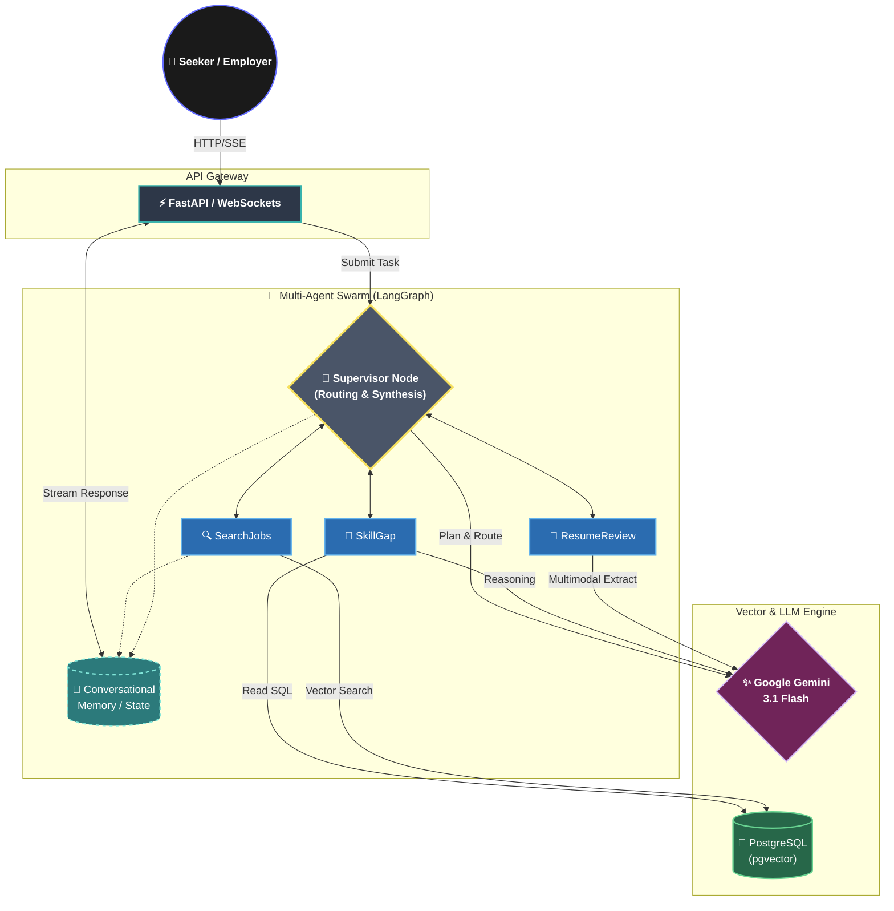
```mermaid
flowchart TD
    %% Modern Startup Aesthetics
    classDef user fill:#1A1A1A,stroke:#646CFF,stroke-width:2px,color:#FFF,font-weight:bold
    classDef api fill:#2D3748,stroke:#38B2AC,stroke-width:2px,color:#FFF,font-weight:bold
    classDef supervisor fill:#4A5568,stroke:#F6E05E,stroke-width:3px,color:#FFF,font-weight:bold
    classDef worker fill:#2B6CB0,stroke:#63B3ED,stroke-width:2px,color:#FFF
    classDef state fill:#2C7A7B,stroke:#81E6D9,stroke-width:2px,color:#FFF,stroke-dasharray: 5 5
    classDef db fill:#276749,stroke:#68D391,stroke-width:2px,color:#FFF
    classDef llm fill:#702459,stroke:#D6BCFA,stroke-width:2px,color:#FFF,font-weight:bold

    User((👤 Seeker / Employer)):::user

    subgraph API_Layer ["API Gateway"]
        FastAPI["⚡ FastAPI / WebSockets"]:::api
    end

    subgraph LangGraph_Swarm ["🧠 Multi-Agent Swarm (LangGraph)"]
        Supervisor{"👑 Supervisor Node\n(Routing & Synthesis)"}:::supervisor
        
        %% Agents
        SearchAgent["🔍 SearchJobs"]:::worker
        ReviewAgent["📄 ResumeReview"]:::worker
        GapAgent["🎯 SkillGap"]:::worker
        
        GraphState[("💬 Conversational\nMemory / State")]:::state

        Supervisor <--> SearchAgent
        Supervisor <--> ReviewAgent
        Supervisor <--> GapAgent
        
        Supervisor -.-> GraphState
        SearchAgent -.-> GraphState
    end

    subgraph Infrastructure ["Vector & LLM Engine"]
        Gemini{"✨ Google Gemini\n3.1 Flash"}:::llm
        PG[("🐘 PostgreSQL\n(pgvector)")]:::db
        
        Gemini ~~~ PG
    end

    %% Vertical Data Flow
    User -->|HTTP/SSE| FastAPI
    FastAPI -->|Submit Task| Supervisor
    FastAPI <-->|Stream Response| GraphState

    %% Agents to Infrastructure
    SearchAgent -->|Vector Search| PG
    GapAgent -->|Read SQL| PG

    ReviewAgent -->|Multimodal Extract| Gemini
    GapAgent -->|Reasoning| Gemini
    Supervisor -->|Plan & Route| Gemini
```

### 1. Eksekusi Otonom Paralel (Parallel Function Calling)
*Supervisor Node* merutekan permintaan kandidat secara dinamis. Apabila kandidat meminta pencarian lowongan sekaligus evaluasi CV, sistem akan mengeksekusi modul `SearchJobsAgent` dan `ResumeReviewAgent` secara bersamaan, kemudian mensintesis laporan gabungan.

### 2. Hibridisasi Penilaian (Hybrid Ranking)
Sistem menggunakan komposit metrik matematis untuk mereplikasi prioritas SDM:
```python
final_score = (
    cosine_similarity * 0.50 +   # Relevansi Semantik (Vektor Gemini)
    skill_overlap     * 0.30 +   # Irisan Keahlian Eksplisit
    region_boost      * 0.10 +   # Kesesuaian Geografis
    salary_fit        * 0.05 +   # Penyesuaian Anggaran
    experience_fit    * 0.05     # Validasi Masa Kerja
)
```

### 3. Kepatuhan Privasi (Data Isolation)
Sebelum diproses oleh model eksternal, komponen PII (Personally Identifiable Information) dimitigasi secara otomatis oleh modul penyaring Regex guna memenuhi standar kepatuhan operasional.

### 4. Skema Basis Data (Entity-Relationship)
Infrastruktur relasional kami direkayasa untuk menangani entitas dalam skala tinggi (High-Volume) sekaligus memfasilitasi pencarian jarak vektor komputasional menggunakan `pgvector`.

### 5. Data Acquisition & AI Feedback Loop
Sistem mengakuisisi data riwayat lowongan (*historical data*) melalui tiga jalur: **B2B Web Scraping (ETL)** terhadap lowongan lama, **Kemitraan Data B2G** dengan Kemnaker/BPS, serta yang paling krusial, **Internal Feedback Loop**. Platform mencatat aktivitas kandidat secara *closed-loop* (lolos wawancara, tingkat retensi). Data organik ini akan melatih-ulang (*fine-tuning*) rekomendasi agen AI agar relevansinya mengungguli pangkalan data rekrutmen manapun.

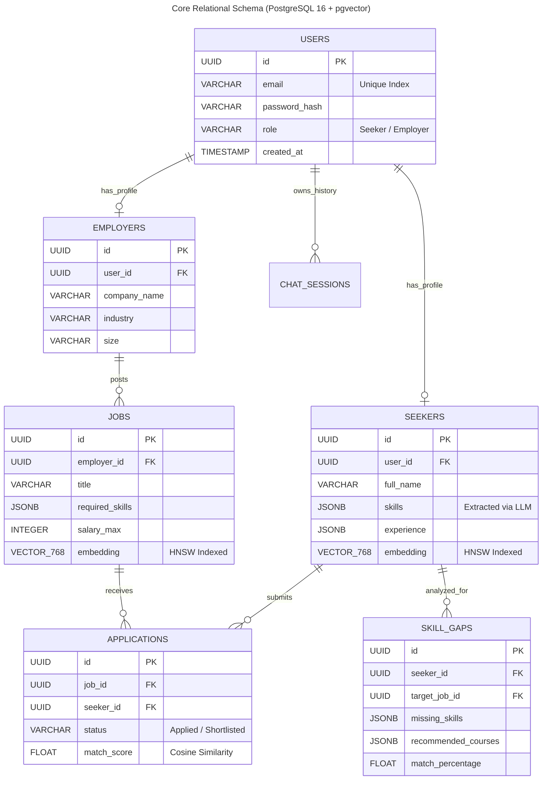
```mermaid
---
title: Core Relational Schema (PostgreSQL 16 + pgvector)
---
erDiagram
    USERS ||--o| SEEKERS : "has_profile"
    USERS ||--o| EMPLOYERS : "has_profile"
    USERS ||--o{ CHAT_SESSIONS : "owns_history"
    EMPLOYERS ||--o{ JOBS : "posts"
    SEEKERS ||--o{ APPLICATIONS : "submits"
    JOBS ||--o{ APPLICATIONS : "receives"
    SEEKERS ||--o{ SKILL_GAPS : "analyzed_for"

    USERS {
        UUID id PK
        VARCHAR email "Unique Index"
        VARCHAR password_hash
        VARCHAR role "Seeker / Employer"
        TIMESTAMP created_at
    }
    SEEKERS {
        UUID id PK
        UUID user_id FK
        VARCHAR full_name
        JSONB skills "Extracted via LLM"
        JSONB experience
        VECTOR_768 embedding "HNSW Indexed"
    }
    EMPLOYERS {
        UUID id PK
        UUID user_id FK
        VARCHAR company_name
        VARCHAR industry
        VARCHAR size
    }
    JOBS {
        UUID id PK
        UUID employer_id FK
        VARCHAR title
        JSONB required_skills
        INTEGER salary_max
        VECTOR_768 embedding "HNSW Indexed"
    }
    APPLICATIONS {
        UUID id PK
        UUID job_id FK
        UUID seeker_id FK
        VARCHAR status "Applied / Shortlisted"
        FLOAT match_score "Cosine Similarity"
    }
    SKILL_GAPS {
        UUID id PK
        UUID seeker_id FK
        UUID target_job_id FK
        JSONB missing_skills
        JSONB recommended_courses
        FLOAT match_percentage
    }
```

---

## 📂 Struktur Repositori

```
KerjaCerdas/
│
├── backend/                  # API FastAPI & Logika LangGraph Swarm
│   ├── app/
│   │   ├── api/              # Interface Endpoints FastAPI
│   │   │   ├── routers/
│   │   │   │   ├── agent.py       # Endpoint streaming SSE untuk LangGraph
│   │   │   │   ├── auth.py        # Login/Register (JWT)
│   │   │   │   ├── employer.py    # Endpoint perusahaan & kandidat pelamar
│   │   │   │   ├── jobs.py        # Pencarian dan paginasi lowongan
│   │   │   │   ├── seeker.py      # Profil, bookmark, history aplikasi
│   │   │   │   ├── uploads.py     # Endpoint Multi-modal PDF Parser
│   │   │   │   └── verify.py      # E-KYC Dukcapil/SIVIL webhook
│   │   │   ├── schemas/           # Pydantic validation schemas
│   │   │   └── services/          # Business logic helpers
│   │   ├── agents/           # Arsitektur Multi-Agent & LLM
│   │   │   ├── graph/
│   │   │   │   ├── builder_v2.py  # Konstruktor ReAct Supervisor Swarm
│   │   │   │   └── nodes.py       # Worker Nodes (Search, SkillGap, Advisor)
│   │   │   ├── tools/
│   │   │   │   └── superpowers.py # Kumpulan fungsi (tools) untuk Gemini
│   │   │   ├── memory/            # Checkpointer & conversational state
│   │   │   └── telemetry/         # Logger & tracing performa AI
│   │   ├── services/
│   │   │   └── matching/          # Core Recommendation Engine
│   │   │       ├── embeddings/    # Gemini Vector generator
│   │   │       ├── matcher.py     # Algoritma Cosine Similarity + Heuristik
│   │   │       └── ranker.py      # Pembobotan skor
│   │   ├── db/
│   │   │   ├── postgres_store.py  # Abstraksi Async Session & SQLAlchemy Repository
│   │   │   ├── models.py          # Definisi Skema Tabel PostgreSQL (pgvector)
│   │   │   ├── schemas.py         # Skema Validasi Pydantic
│   │   │   └── session.py         # Konfigurasi Koneksi Asyncpg
│   │   └── config/
│   │       └── settings.py        # Manajemen variabel lingkungan (.env)
│   ├── tests/                # Unit & Integration Tests (Pytest)
│   ├── alembic/              # Skrip Migrasi Basis Data (Alembic)
│   ├── scripts/
│   │   ├── seed_all.py       # Skrip data utama
│   │   ├── seed_employers.py # Data Perusahaan
│   │   ├── seed_seekers.py   # Data Kandidat
│   │   └── seed_courses.py   # Data Kursus
│   └── requirements.txt
│
├── frontend/                 # Aplikasi Web React.js (Vite)
│   ├── src/
│   │   ├── components/       # UI Library (Neo-Brutalism)
│   │   │   ├── _design.jsx           # Komponen dasar desain sistem (Button, Card)
│   │   │   ├── SeekerDashboard.jsx   # Dasbor utama pencari kerja
│   │   │   ├── SeekerMatchResults.jsx# UI visualisasi skor kecocokan vektor
│   │   │   ├── SeekerSearch.jsx      # Dual-Track Manual Search
│   │   │   ├── SkillGapPanel.jsx     # Panel rekomendasi kursus Ed-Tech
│   │   │   ├── FloatingAdvisor.jsx   # Antarmuka chat interaktif dengan Swarm
│   │   │   ├── EmployerDashboard.jsx # Analitik kolam kandidat untuk HRD
│   │   │   ├── EmployerCandidates.jsx# AI Shortlist & tombol "Unlock Kontak"
│   │   │   ├── EmployerPostJob.jsx   # Form pembuatan lowongan instan
│   │   │   ├── CVUploader.jsx        # Komponen unggah PDF kandidat
│   │   │   ├── AuthModal.jsx         # Popup Login/Register terintegrasi
│   │   │   ├── PublicHeader.jsx      # Navigasi utama
│   │   │   └── LandingHero.jsx       # Halaman pendaratan publik
│   │   ├── services/
│   │   │   └── api.js        # Wrapper fetch API dengan auto-logout 401
│   │   ├── store/
│   │   │   └── useStore.js   # State Management global (Zustand)
│   │   └── App.jsx
│   └── package.json
│
├── database/                 # Basis Data
│   └── init.sql              # Dump awal PostgreSQL (pgvector)
│
├── docs/                     # Dokumentasi Resmi & Presentasi
│   ├── PROPOSAL_FINAL.md     # Proposal Bisnis Lengkap
│   ├── VERIFICATION_DEMO.md  # Skenario Demo Produk & Panduan Presentasi
│   ├── BUSINESS_MODEL.md     # Dokumen Detail Keuangan & Arus Kas
│   ├── ROADMAP_TECH_STACK.md # Roadmap Infrastruktur Skala Korporasi
│   └── API_SPEC.md           # Spesifikasi API OpenAPI/Swagger
```

---

## 📚 Dokumen Referensi

Semua panduan demonstrasi, proposal korporat, dokumen finansial, dan pemetaan arsitektur masa depan kini dipisahkan ke dalam struktur dokumentasi formal (folder `docs/`) untuk memudahkan peninjauan komprehensif oleh dewan juri dan investor.

| Dokumen | Deskripsi | Tautan |
|---|---|---|
| **Business Proposal** | Penjelasan problem, solusi, validasi ekosistem pasar, dan strategi produk terpadu KerjaCerdas. | [PROPOSAL_FINAL.md](docs/PROPOSAL_FINAL.md) |
| **Panduan Live Demo** | Skrip presentasi rinci (*step-by-step*) simulasi alur pencari kerja dan pewawancara untuk demonstrasi. | [VERIFICATION_DEMO.md](docs/VERIFICATION_DEMO.md) |
| **Laporan Finansial & Bisnis** | Model keuntungan (Profit Model), proyeksi arus kas, *Unit Economics*, dan *Pro Forma Income Statement*. | [BUSINESS_MODEL.md](docs/BUSINESS_MODEL.md) |
| **Roadmap Arsitektur** | Transformasi infrastruktur *Cloud SQL, PostgreSQL pgvector, Vertex AI*, dan arsitektur data pasca-MVP. | [ROADMAP_TECH_STACK.md](docs/ROADMAP_TECH_STACK.md) |

---
<div align="center">

**KerjaCerdas © 2026** — *Enterprise Talent AI Infrastructure*

<br>

[](#) [](http://localhost:8000/docs) 

</div>
