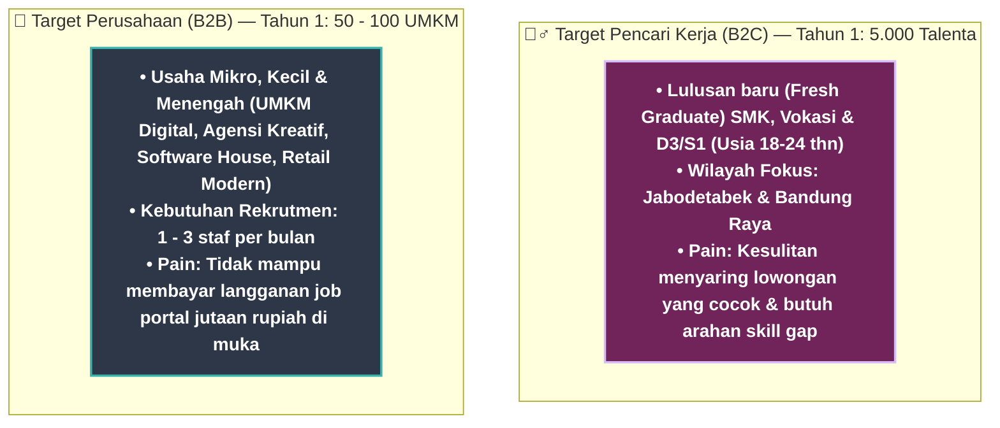
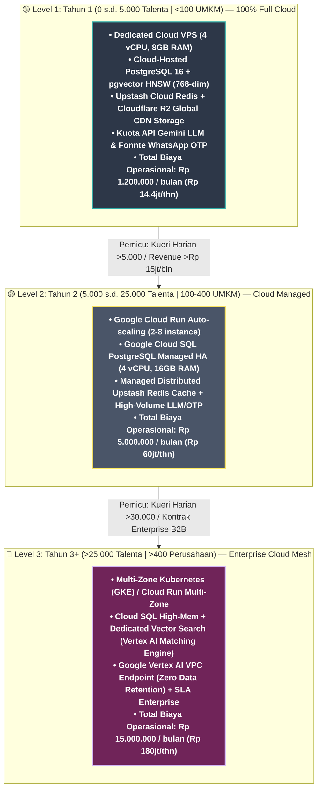

# Laporan Finansial Komprehensif, Proyeksi Tahunan & Model Bisnis: KerjaCerdas

> **Laporan Analisis Finansial Realistis & Peta Skalabilitas (Tahap Peluncuran & Pertumbuhan 3 Tahun)**: Dokumen ini menyajikan pemodelan ekonomi menyeluruh (*Deep Financial & Unit Economics Analysis*), struktur monetisasi B2B dan B2C, rincian biaya arsitektur *cloud-native* 100% online per level, alokasi budget operasional awal Bulan ke-1 (Rp 3.850.000/bulan), proyeksi pendapatan tahunan (Tahun 1 s.d. Tahun 3), kalkulasi titik impas (*Break-Even Point*), dan peta pemicu peningkatan tier infrastruktur (*Infrastructure Scaling Triggers*).

---

## 1. Definisi Persona Target Pengguna Nyata (*Target User Persona*)

Untuk memastikan proyeksi keuangan dapat dipertanggungjawabkan di hadapan dewan juri, target pengguna pada tahap awal didefinisikan secara spesifik dan terukur:



---

## 2. Aliran Pendapatan (*Revenue Streams*) & Mekanisme Monetisasi

1. **B2B Pay-to-Unlock (Fokus Utama Traksi Awal):**
   - Perusahaan meninjau kandidat teratas (*shortlist*) secara gratis dengan format sensor (*The Teaser Method*).
   - Membayar **Rp 50.000 per kandidat** saat ingin membuka kontak dan mengunduh CV lengkap.
   - HPP per Transaksi: E-KYC pass-through (Rp 4.000) + Payment Gateway MDR (Rp 1.000) = Rp 5.000 $\rightarrow$ **Marjin Kotor: Rp 45.000 (90%)**.
   - *Freemium Hook:* 5 kredit unlock gratis untuk setiap perusahaan baru.

2. **B2B KerjaCerdas Pro (Langganan Retensi):**
   - Skema langganan **Rp 299.000 / bulan** bagi perusahaan dengan intensitas rekrutmen berkelanjutan (akses kuota shortlisting lebih besar & branding terverifikasi).

3. **B2C Komisi Afiliasi Pelatihan Ed-Tech:**
   - Komisi **10% – 15% (rata-rata Rp 48.000 / referral)** saat pencari kerja mengambil kursus berbayar dari mitra pelatihan (Dicoding, Prakerja LPK) melalui rekomendasi *Skill Gap Analyzer*.

---

## 3. Rencana Alokasi Budget yang Dibutuhkan (Bulan ke-1 Pilot: Rp 3.850.000)

Rincian alokasi budget awal untuk tahap pembuktian konsep (*proof of concept*) dan demonstrasi *pitching*:

| Pos Alokasi Pengeluaran | Biaya (IDR) | Proporsi | Rasionalisasi & Peruntukan Operasional |
|---|---|---|---|
| **Server Hosting (FastAPI & Docker VPS)** | Rp 450.000 | 11.7% | 1 Cloud VPS (4 vCPU, 8GB RAM) online 24/7 untuk menjamin latensi API <200ms |
| **Database & Cache (PostgreSQL pgvector & Redis)** | Rp 100.000 | 2.6% | PostgreSQL pgvector cloud-hosted + Upstash Redis Serverless |
| **Penyimpanan Berkas CV (Cloudflare R2)** | Rp 0 (Free 10GB) | 0.0% | Kapasitas penyimpanan gratis 10GB (>10.000 PDF) tanpa biaya transfer bandwidth |
| **Kuota API LLM & Embeddings (Gemini Flash)** | Rp 500.000 | 13.0% | Kuota parsing ~100.000 token ekstraksi CV, skill gap, dan conversational advisor |
| **WhatsApp OTP Gateway (Fonnte / Wablas)** | Rp 300.000 | 7.8% | Paket 2.000 pesan OTP untuk verifikasi nomor telepon pengguna baru |
| **Domain Resmi `.id` & Keamanan SSL Cloudflare** | Rp 250.000 | 6.5% | Registrasi domain resmi `.id` 1 tahun + proteksi mitigasi serangan DDoS |
| **Program Outreach Pilot (5 UMKM & 100 Penguji)** | Rp 1.800.000 | 46.7% | Insentif pengujian validasi, onboarding langsung 5 UMKM, dan akuisisi talenta awal |
| **Cadangan Kontinjensi & Operasional (10%)** | Rp 450.000 | 11.7% | Buffer fluktuasi kurs mata uang dan kebutuhan operasional tak terduga |
| **TOTAL BUDGET BULAN KE-1 (PITCHING / PILOT)** | **Rp 3.850.000** | **100.0%** | **Budget awal yang rasional untuk tahap validasi pilot (rentang Rp 2–5 jt/bln)** |

---

## 4. Analisis Titik Impas (*Break-Even Point / BEP Analysis*)

Kalkulasi titik impas didasarkan pada biaya operasional bulanan tetap (*Fixed OPEX Level 1 Full Cloud*) yang mencakup seluruh arsitektur server, basis data, API LLM, kuota OTP, dan pemeliharaan:

```
Biaya Operasional Tetap Bulanan (Fixed OPEX Level 1 Full Cloud) = Rp 1.200.000 / bulan
  - Cloud VPS Server (4 vCPU, 8GB RAM)   : Rp  450.000
  - Kuota API LLM Gemini 3.1 Flash       : Rp  400.000
  - WhatsApp OTP Gateway                 : Rp  200.000
  - Redis Cache & Cloud Tools            : Rp  100.000
  - Domain, SSL & Maintenance            : Rp   50.000

Harga Jual per Pay-to-Unlock (P)            = Rp 50.000
Biaya Variabel per Transaksi (VC)           = Rp  5.000 (E-KYC Rp 4.000 + Gateway MDR Rp 1.000)
Marjin Kontribusi per Transaksi (CM = P - VC)= Rp 45.000 (90%)
```

### 4.1 Perhitungan BEP Unit & BEP Rupiah
$$\text{BEP (Unit Transaksi)} = \frac{\text{Fixed OPEX}}{\text{Contribution Margin}} = \frac{\text{Rp 1.200.000}}{\text{Rp 45.000}} = \mathbf{26,67 \approx 27 \text{ Transaksi Unlock / Bulan}}$$

$$\text{BEP (Rupiah)} = 27 \times \text{Rp 50.000} = \mathbf{\text{Rp 1.350.000 / Bulan}}$$

### 4.2 Evaluasi Kelayakan:
- Untuk menutup seluruh biaya arsitektur cloud dan operasional tetap bulanan, platform memerlukan **27 transaksi unlock per bulan** (senilai Rp 1.350.000/bulan).
- Angka ini dapat dipenuhi hanya dari **5 hingga 7 UMKM aktif** per bulan (yang masing-masing merekrut 4-5 staf).
- Target titik impas diproyeksikan tercapai pada **Bulan ke-3 operasional**.

---

## 5. Proyeksi Keuangan Realistis 3 Tahun (Income Statement Tahunan)

Proyeksi keuangan disusun secara konservatif-realistis berdasarkan kurva adopsi B2B UMKM Indonesia dan struktur biaya arsitektur cloud:

```
Asumsi Parameter Pertumbuhan:
- Tahun 1 (Validasi & Traksi): 5.000 Talenta, 60 UMKM Aktif (Total 800 unlock/thn) + 15 Pengguna Pro
- Tahun 2 (Ekspansi Regional): 20.000 Talenta, 200 UMKM Aktif (Total 3.500 unlock/thn) + 60 Pengguna Pro
- Tahun 3 (Skala Nasional)   : 50.000 Talenta, 500 UMKM/Korporasi (Total 10.000 unlock/thn) + 180 Pengguna Pro
```

| Komponen Keuangan (IDR) | Tahun 1 (Fase Validasi: Level 1) | Tahun 2 (Fase Ekspansi: Level 2) | Tahun 3 (Fase Skala: Level 3) |
|---|---|---|---|
| **Pendapatan Pay-to-Unlock** | Rp 40.000.000 (800 unlock) | Rp 175.000.000 (3.500 unlock) | Rp 500.000.000 (10.000 unlock) |
| **Pendapatan SaaS Pro** | Rp 5.382.000 (15 sub × 1.2 bln) | Rp 21.528.000 (60 sub × 1.2 bln) | Rp 64.584.000 (180 sub × 1.2 bln) |
| **Komisi Pelatihan Ed-Tech (B2C)** | Rp 4.800.000 (100 referral) | Rp 19.200.000 (400 referral) | Rp 48.000.000 (1.000 referral) |
| **TOTAL PENDAPATAN KOTOR (*Gross Revenue*)** | **Rp 50.182.000** | **Rp 215.728.000** | **Rp 612.584.000** |
| HPP / Variable COGS (E-KYC & MDR) | (Rp 4.000.000) | (Rp 17.500.000) | (Rp 50.000.000) |
| **LABA KOTOR (*Gross Profit*)** | **Rp 46.182.000 (92.0%)** | **Rp 198.228.000 (91.9%)** | **Rp 562.584.000 (91.8%)** |
| Beban Infrastruktur Cloud & API LLM | (Rp 14.400.000 - Level 1) | (Rp 60.000.000 - Level 2) | (Rp 180.000.000 - Level 3) |
| Beban Pemasaran & Akuisisi Pengguna | (Rp 12.000.000) | (Rp 36.000.000) | (Rp 80.000.000) |
| Beban Operasional Tim & Maintenance | (Rp 10.000.000) | (Rp 40.000.000) | (Rp 100.000.000) |
| **EBITDA** | **Rp 9.782.000** | **Rp 62.228.000** | **Rp 202.584.000** |
| Pajak Badan PPh Final UMKM (0.5%) | (Rp 250.910) | (Rp 1.078.640) | (Rp 3.062.920) |
| **LABA BERSIH (*Net Income*)** | **Rp 9.531.090 (19.0%)** | **Rp 61.149.360 (28.3%)** | **Rp 199.521.080 (32.6%)** |

---

## 6. Peta Peningkatan Infrastruktur (*Infrastructure Scaling & Upgrade Triggers*)

Seluruh tingkatan infrastruktur KerjaCerdas beroperasi **100% Full Online & Cloud-Native (Zero Local Device Dependency)** yang aktif 24/7 di jaringan internet publik:



### Tabel Rincian Pemicu & Spesifikasi Peningkatan Sistem:

| Tingkatan (*Tier*) | Periode & Skala | Pemicu Peningkatan (*Upgrade Triggers*) | Komposisi Arsitektur Cloud (100% Online) | Estimasi Biaya Bulanan Total | Sumber Pembiayaan |
|---|---|---|---|---|---|
| **Level 1 (Full Cloud Pilot)** | **Tahun 1**<br>0 – 5.000 Seeker<br><100 UMKM | Tahap peluncuran awal, pilot project, dan demonstrasi produk | 1 Dedicated Cloud VPS Server (4 vCPU, 8GB RAM) + Cloud-Hosted pgvector + Cloudflare R2 + Gemini Flash + WhatsApp OTP Gateway | **Rp 1.200.000 / bln**<br>(Rp 14.400.000 / thn) | Budget Awal Bulan 1 + Laba Operasional Pay-to-Unlock |
| **Level 2 (Managed Cloud)** | **Tahun 2**<br>5.000 – 25.000 Seeker<br>100 – 400 UMKM | 1. Kueri harian > 5.000 kueri/hari<br>2. Transaksi unlock > 10 unlock/hari<br>3. Pendapatan > Rp 15.000.000/bln | Google Cloud Run Auto-scaling + Google Cloud SQL PostgreSQL Managed HA + Upstash Redis Paid + High-Volume Gemini/OTP | **Rp 5.000.000 / bln**<br>(Rp 60.000.000 / thn) | 100% didanai Laba Kotor Pay-to-Unlock Tahun 2 |
| **Level 3 (Enterprise Cloud)** | **Tahun 3+**<br>>25.000 Seeker<br>>400 B2B | 1. Kueri harian > 30.000 kueri/hari<br>2. Transaksi unlock > 30 unlock/hari<br>3. Integrasi SLA Enterprise ATS | Multi-Zone Kubernetes (GKE) + Vertex AI Vector Search Engine + Vertex AI VPC Endpoint + Enterprise Security | **Rp 15.000.000 / bln**<br>(Rp 180.000.000 / thn) | 100% didanai Arus Kas Surplus Mandiri (>Rp 200jt) |

---

## 7. Metrik *Unit Economics* Realistis

```
Customer Acquisition Cost (CAC) B2B:
- Alokasi Anggaran Pemasaran B2B Tahun 1 = Rp 6.000.000 (Outreach LinkedIn, Komunitas UMKM)
- Target Akuisisi B2B Tahun 1 = 60 UMKM
  ==> CAC = Rp 6.000.000 / 60 = Rp 100.000 per UMKM

Customer Lifetime Value (LTV) B2B (Tahun 1):
- Rata-rata transaksi unlock per UMKM = 13.3 unlock × Rp 45.000 (margin bersih) = Rp 600.000
- Retensi berlangganan SaaS Pro (25% konversi × Rp 299.000 × 2 bln) = Rp 149.500
  ==> LTV = Rp 749.500
```

| Metrik Finansial | Nilai Realistis KerjaCerdas | Standar Industri SaaS | Evaluasi Kesehatan Finansial |
|---|---|---|---|
| **Rasio LTV : CAC** | **7.5×** | 3.0× – 5.0× | **Sangat Sehat & Realistis** |
| **CAC Payback Period** | **< 2 Bulan** | 6 – 12 Bulan | Modal akuisisi kembali pada unlock ke-3 |
| **Gross Margin** | **92.0%** | 70% – 80% | Sangat efisien berkat embedding caching |
| **Break-Even Point** | **Bulan ke-3** | Bulan ke-12 – 18 | Risiko operasional (*downside risk*) terkendali |
| **Laba Bersih Tahun 1** | **Rp 9.531.090** | Umumnya Masih Negatif | Model bisnis langsung menghasilkan arus kas positif |
