# Peta Jalan Teknis, Arsitektur Sistem & Rencana Anggaran: KerjaCerdas

> **Dokumen Arsitektur & Perencanaan Teknis**: Menguraikan peta jalan migrasi infrastruktur dari fase MVP menuju skala enterprise, kerangka kerja A/B testing, integrasi kemitraan strategis, mitigasi dependensi pihak ketiga, serta estimasi anggaran operasional *pre-seed* untuk 6 bulan ke depan.

---

## Bagian 1 — Arsitektur & Peta Jalan Migrasi Infrastruktur

```mermaid
flowchart LR
    classDef phase fill:#2D3748,stroke:#38B2AC,stroke-width:2px,color:#FFF,font-weight:bold
    classDef target fill:#4A5568,stroke:#F6E05E,stroke-width:2px,color:#FFF,font-weight:bold

    subgraph Fase1 ["Fase 1: MVP & Beta (Bulan 1-3)"]
        F1_1["Docker Compose / Container"]:::phase
        F1_2["PostgreSQL 16 + pgvector HNSW (768-dim)"]:::phase
        F1_3["In-Process LRU Cache (512 entry)"]:::phase
        F1_4["Demo Verification & OTP Engine"]:::phase
    end

    subgraph Fase2 ["Fase 2: Cloud Stabilitas (Bulan 4-8)"]
        F2_1["Google Cloud SQL (pgvector HA)"]:::phase
        F2_2["Cloudflare R2 / GCS (10GB Free Storage)"]:::phase
        F2_3["Redis / Upstash (Semantic Cache & Rate Limiter)"]:::phase
        F2_4["WhatsApp Gateway (Fonnte) & Midtrans Sandbox"]:::phase
    end

    subgraph Fase3 ["Fase 3: Enterprise & B2G (Bulan 9-18)"]
        F3_1["Google Vertex AI Endpoint (Zero Data Retention)"]:::phase
        F3_2["E-KYC B2B Live API (Vida / Privy)"]:::phase
        F3_3["Payment Gateway Produksi (Pay-to-Unlock Live)"]:::phase
        F3_4["ATS Enterprise Copilot API Integration"]:::phase
    end

    Fase1 ==> Fase2 ==> Fase3
```



### 1.1 Fase 1 (Bulan 1 - 3): Enterprise Relational Backend (PostgreSQL + pgvector)
*Target: Menjamin integritas data untuk 50.000 pengguna MVP dan kueri analitik dengan latensi di bawah 200ms.*

- **pgvector & LangGraph-Assisted Pipeline:** Vektor 768-dimensi (MRL-truncated dari 3072-dimensi Gemini Embedding 2) diolah langsung di PostgreSQL dengan indeks HNSW (`ef_construction=64, m=16`).
- **Alembic ORM Migrations:** Skema tabel dikelola progresif menggunakan Alembic, menjamin *Zero-Downtime Migration*.
- **Injeksi Kontainer Otomatis:** Infrastruktur diorkestrasi mutlak menggunakan Docker Compose, mendemonstrasikan keandalan peluncuran (*plug-and-play*).

### 1.2 Fase 2 (Bulan 4 - 8): Migrasi Stabilitas Awan (GCP Cloud SQL, Redis & Cloudflare R2)
*Target: Skalabilitas tinggi hingga 1 juta kueri API/hari dengan latensi rendah dan biaya operasional ramping.*

1. **Google Cloud SQL (Postgres + pgvector):** Database dipindahkan secara *managed* dengan *Read Replica* menjamin ketersediaan tinggi (*High Availability*) 99.9% Uptime.
2. **Cloudflare R2 Storage:** Penyimpanan dokumen CV PDF dan berkas identitas menggunakan Cloudflare R2 (gratis 10GB pertama, $0.015/GB setelahnya tanpa biaya *egress*), dengan enkripsi AES-256 pada level aplikasi sebelum berkas diunggah.
3. **Upstash / Cloud Redis:** Cache semantik untuk komputasi kalkulasi jarak vektor yang identik, memangkas biaya API LLM bulanan hingga 20%, serta menjadi backend penyimpanan terdistribusi untuk `RateLimiterMiddleware` — implementasi kode sudah ada (`rate_limit_backend="redis"`), tinggal provisioning `REDIS_URL` di deployment.
4. **Celery / Background Worker:** Menangani tugas ekstraksi dokumen dan pemrosesan batch secara asinkron terisolasi.

### 1.3 Fase 3 (Bulan 9 - 18): Privasi Kognitif Mutlak (Vertex AI & B2G Enterprise)
*Target: Kepatuhan penuh terhadap standar keamanan tingkat perbankan dan pemerintahan (UU PDP No.27/2022).*

- **Kedaulatan Perlindungan Data (Vertex AI VPC):** *Vertex AI Endpoint* memastikan data *prompt* LLM dieksekusi dalam ruang komputasi *Virtual Private Cloud (VPC)* terisolasi dengan *Zero Data Retention*.
- **Micro-Tuning Berkelanjutan (LoRA):** Menala model secara internal dengan dialek khas rekrutmen Indonesia (nomenklatur kampus lokal, istilah teknis Disnaker).
- **Payment Gateway Korporasi Terintegrasi:** Otomatisasi penagihan B2B (*Pay-to-Unlock* Rp 50.000 / 10 kandidat atau Rp 5.000/kontak) melalui integrasi Midtrans/Xendit live.

### 1.4 AI Agent & Matching Algorithm Roadmap

> **Status saat ini (desain permanen, bukan langkah antara):** satu node LangGraph (`START → agent_node → END`) memanggil Gemini untuk sintesis teks; routing intent dan pemanggilan `SemanticMatcher`/skill-gap berjalan sebagai fungsi Python prosedural, dipanggil langsung dari `agent.py` router — **bukan** node/edge LangGraph. Tool-calling (`bind_tools()`) dinonaktifkan karena inkompatibilitas `google-generativeai` dengan skema Pydantic v2. Lihat [`ARCHITECTURE.md`](ARCHITECTURE.md) untuk detail arsitektur lengkap.

**Item roadmap matching/skill-gap (belum dibangun, urutan prioritas):**
1. **Skill Taxonomy terbuka (ESCO/O*NET)** dan **Fuzzy/Semantic Subsumption Matrix** — bobot hierarkis antar skill terkait (mis. `PostgreSQL` sebagai subset `SQL/Relational DB`), menggantikan exact-match pada skill ternormalisasi saat ini.
2. **Multi-Vector Representation** — embedding terpisah untuk *Role Summary Vector* vs *Hard Skills Vector*, dengan pencarian berbobot (*late interaction*/RRF), menggantikan satu vektor gabungan tunggal saat ini.
3. **Dynamic Reranking Rules berbasis Seniority Level** — bobot statis saat ini tidak membedakan role junior (lebih mementingkan edukasi/potensi) dari role senior (lebih mementingkan pengalaman).
4. **Domain-Specific Experience Tagging** — memisahkan *Total Work Experience* dari *Relevant Domain Experience* per skill/role target.
5. **Knowledge Graph katalog kursus/sertifikasi lokal terverifikasi** untuk Skill Gap Analyzer, menggantikan katalog kurasi statis saat ini.
6. **Local Lightweight NER (SpaCy transformer/GLiNER)** untuk fallback parsing CV saat Gemini offline, menggantikan `_SKILL_VOCAB` hardcoded yang bias ke profil software engineer.

Known edge cases already handled in the current matcher (skill alias normalization via `_CANONICAL_SKILL_MAP`, overlapping-employment date merging in `_experience_years()`, and sanitization of extracted CV text before it reaches the database or the LLM) are documented in [`docs/internals/01-matching-algorithm.md`](internals/01-matching-algorithm.md).

---

## Bagian 2 — Kerangka Kerja Eksperimen A/B Testing

### 2.1 Konsep & Metrik Eksperimen
A/B Testing pada KerjaCerdas dirancang untuk memvalidasi alur antarmuka secara empiris berdasarkan data konversi nyata:

| Eksperimen | Varian A (Control) | Varian B | Metrik Keberhasilan yang Diukur |
|---|---|---|---|
| `onboarding_flow` | Langsung ke Dashboard | Wizard 3-Langkah (Welcome $\rightarrow$ CV $\rightarrow$ Match) | % pengguna yang mengunggah CV dalam 24 jam pertama |
| `match_cta_label` | "Refresh Match" | "Temukan Pekerjaan Impian" | Click-Through Rate (CTR) ke detail lowongan |
| `skill_gap_prompt` | Tampilkan gap otomatis | Tanya posisi impian terlebih dahulu | % pengguna yang mengklik rekomendasi kursus |
| `pricing_layout` | Tabel horizontal | Tabel vertikal dengan badge highlight | Tingkat konversi ke akun berbayar |

### 2.2 Arsitektur Stateless Feature Flagging
Sistem menggunakan modul stateless assignment berbasis hash `user_id` atau `session_id` (`GET /api/v1/experiments/assignments`):

```python
# Backend: Deterministik & Stateless Assignment
def get_user_variant(user_id: str, experiment_name: str, variants: list[str]) -> str:
    hash_val = int(hashlib.sha256(f"{user_id}:{experiment_name}".encode()).hexdigest(), 16)
    return variants[hash_val % len(variants)]
```

### 2.3 Closed-Loop Event Tracking
Setiap interaksi krusial dikirim ke endpoint `POST /api/v1/events/track` untuk analisis corong konversi:
```javascript
trackEvent('cv_uploaded', {
    experiment: 'onboarding_flow',
    variant: getExperiment('onboarding_flow'),
    time_to_upload_seconds: 45
})
```

---

## Bagian 3 — Rencana Kemitraan Ekosistem & Integrasi Pihak Ketiga

### 3.1 Integrasi Kursus Ed-Tech (Dicoding & Mitra Pelatihan)
- **Status Saat Ini:** Rekomendasi kursus menggunakan katalog terstruktur 35+ keahlian digital dari platform terkemuka.
- **Rencana Kemitraan:** Program afiliasi resmi (*Affiliate Partnership*) dengan skema komisi 10–15% untuk setiap kandidat yang mengambil modul berbayar via tautan rekomendasi KerjaCerdas.

### 3.2 Program Kartu Prakerja
- **Status Saat Ini:** Kurasi modul pelatihan yang memenuhi kualifikasi standar Prakerja.
- **Roadmap Kemitraan:** Pendaftaran sebagai Mitra Platform Digital / Lembaga Pelatihan Kerja (LPK) melalui Kemenko Perekonomian untuk integrasi API langsung dalam 6–12 bulan pasca-inkubasi.

### 3.3 E-KYC KTP & Ijazah (Dukcapil & SIVIL Dikti)
- **Status Saat Ini:** Mode demo interaktif dengan validasi format NIK 16-digit dan nomor ijazah Dikti.
- **Integrasi Produksi:** Menggunakan agregator resmi berlisensi BSSN seperti **Vida** (vida.id) atau **Privy** (privy.id) dengan biaya per verifikasi ~Rp 3.000–5.000 yang dibebankan dalam biaya rekrutmen B2B.

### 3.4 Gateway Komunikasi OTP (WhatsApp & SMS)
- **Status Saat Ini:** Demo OTP Engine mengembalikan kode verifikasi 6-digit langsung pada respons/toast pengujian.
- **Integrasi Produksi:** Terhubung ke WhatsApp Business API via Fonnte atau Twilio Verify (~Rp 150–200/pesan).

### 3.5 Payment Gateway (Midtrans / Xendit)
- **Status Saat Ini:** Endpoint backend `POST /employer/jobs/{id}/unlock/{seeker_id}` siap menerima token pembayaran.
- **Integrasi Produksi:** Aktivasi Sandbox $\rightarrow$ Production Midtrans/Xendit dengan biaya MDR standar (1.5–2.9%) per transaksi Pay-to-Unlock.

---

## Bagian 4 — Rencana Budget yang Dibutuhkan & Peta Peningkatan Infrastruktur

### 4.1 Rencana Budget Operasional Bulan ke-1 (Fase Validasi Pilot)
Anggaran ini diajukan untuk mendanai peluncuran pilot awal (rentang budget Rp 2–5 juta/bulan):

| Pos Alokasi Pengeluaran | Biaya (IDR) | Proporsi | Rasionalisasi & Peruntukan Operasional |
|---|---|---|---|
| **Server Hosting (FastAPI & Docker VPS)** | Rp 450.000 | 11.7% | 1 Cloud VPS (4 vCPU, 8GB RAM) online 24/7 untuk menjamin latensi API <200ms |
| **Database & Cache (PostgreSQL pgvector & Redis)** | Rp 100.000 | 2.6% | PostgreSQL pgvector cloud-hosted + Upstash Redis Serverless |
| **Penyimpanan Berkas CV (Cloudflare R2)** | Rp 0 (Free 10GB) | 0.0% | Kapasitas penyimpanan gratis 10GB (>10.000 PDF) tanpa biaya transfer bandwidth |
| **Kuota API LLM & Embeddings (Gemini Flash)** | Rp 500.000 | 13.0% | Kuota parsing ~100.000 token ekstraksi CV, skill gap, dan conversational advisor |
| **WhatsApp OTP Gateway (Fonnte / Wablas)** | Rp 300.000 | 7.8% | Paket 2.000 pesan OTP untuk verifikasi nomor telepon pengguna baru |
| **Domain Resmi `.id` & Keamanan SSL Cloudflare** | Rp 250.000 | 6.5% | Registrasi domain resmi `.id` 1 tahun + proteksi mitigasi DDoS |
| **Program Outreach Pilot (5 UMKM & 100 Penguji)** | Rp 1.800.000 | 46.7% | Insentif pengujian validasi, onboarding langsung 5 UMKM, dan akuisisi talenta awal |
| **Cadangan Kontinjensi & Operasional (10%)** | Rp 450.000 | 11.7% | Buffer fluktuasi kurs mata uang dan kebutuhan operasional tak terduga |
| **TOTAL BUDGET BULAN KE-1 (PILOT)** | **Rp 3.850.000** | **100.0%** | **Budget awal yang rasional untuk tahap validasi pilot (rentang Rp 2–5 jt/bln)** |

---

### 4.2 Peta Peningkatan Infrastruktur (*Infrastructure Scaling & Upgrade Triggers*)
Seluruh tingkatan infrastruktur (termasuk Level 1) beroperasi **100% Full Online & Cloud-Native (Zero Local Device Dependency)**, dapat diakses publik 24/7 melalui domain HTTPS tanpa ketergantungan pada komputer lokal:

| Tingkatan (*Tier*) | Periode & Skala | Pemicu Peningkatan (*Upgrade Triggers*) | Komposisi Arsitektur Cloud (100% Online) | Estimasi Biaya Bulanan Total | Sumber Pembiayaan |
|---|---|---|---|---|---|
| **Level 1 (Full Cloud Pilot)** | **Tahun 1**<br>0 – 5.000 Seeker<br><100 UMKM | Tahap peluncuran awal, pilot project, dan demonstrasi produk | 1 Dedicated Cloud VPS Server (4 vCPU, 8GB RAM) + Cloud-Hosted pgvector + Cloudflare R2 + Gemini Flash + WhatsApp OTP Gateway | **Rp 1.200.000 / bln**<br>(Rp 14.400.000 / thn) | Budget Awal Bulan 1 + Laba Operasional Pay-to-Unlock |
| **Level 2 (Managed Cloud)** | **Tahun 2**<br>5.000 – 25.000 Seeker<br>100 – 400 UMKM | 1. Kueri harian > 5.000 kueri/hari<br>2. Transaksi unlock > 10 unlock/hari<br>3. Pendapatan > Rp 15.000.000/bln | Google Cloud Run Auto-scaling + Google Cloud SQL PostgreSQL Managed HA + Upstash Redis Paid + High-Volume Gemini/OTP | **Rp 5.000.000 / bln**<br>(Rp 60.000.000 / thn) | 100% didanai Laba Kotor Pay-to-Unlock Tahun 2 |
| **Level 3 (Enterprise Cloud)** | **Tahun 3+**<br>>25.000 Seeker<br>>400 B2B | 1. Kueri harian > 30.000 kueri/hari<br>2. Transaksi unlock > 30 unlock/hari<br>3. Integrasi SLA Enterprise ATS | Multi-Zone Kubernetes (GKE) + Vertex AI Vector Search Engine + Vertex AI VPC Endpoint + Enterprise Security | **Rp 15.000.000 / bln**<br>(Rp 180.000.000 / thn) | 100% didanai Arus Kas Surplus Mandiri (>Rp 200jt) |

---

## Bagian 5 — Kesimpulan & Kesiapan Operasional

1. **Efisiensi Modal:** Alokasi budget awal pada Bulan ke-1 difokuskan pada validasi 5 UMKM percontohan dan infrastruktur dasar yang ramping.
2. **Kemandirian Fitur:** Seluruh fungsionalitas inti (AI Matching, Explainable AI, Skill Gap, Pelacakan Lamaran, Onboarding Timeline, dan Pay-to-Unlock) dapat beroperasi mandiri tanpa dependensi pemblokir dari pihak ketiga.
3. **Peningkatan Bertahap Berkelanjutan:** Transisi dari Level 1 menuju Level 2 dan 3 didanai secara mandiri oleh pertumbuhan volume transaksi tanpa membebani kas tim di awal.
