# Peta Jalan Teknis, Arsitektur Sistem & Rencana Anggaran: KerjaCerdas

> **Dokumen Arsitektur & Perencanaan Teknis**: Menguraikan peta jalan migrasi infrastruktur dari fase MVP menuju skala enterprise, kerangka kerja A/B testing, integrasi kemitraan strategis, mitigasi dependensi pihak ketiga, serta estimasi anggaran operasional *pre-seed* untuk 6 bulan ke depan.

---

## Bagian 1 — Arsitektur & Peta Jalan Migrasi Infrastruktur

```mermaid
flowchart LR
    classDef phase fill:#2D3748,stroke:#38B2AC,stroke-width:2px,color:#FFF,font-weight:bold
    classDef target fill:#4A5568,stroke:#F6E05E,stroke-width:2px,color:#FFF,font-weight:bold

    subgraph Fase1 ["Fase 1: MVP & Beta (Bulan 1-3)"]
        F1_1["Docker Compose / Container"]:::phase
        F1_2["PostgreSQL 16 + pgvector HNSW (768-dim)"]:::phase
        F1_3["In-Process LRU Cache (512 entry)"]:::phase
        F1_4["Verifikasi Email (OTP) + Kuis Skill + AutoMod"]:::phase
    end

    subgraph Fase2 ["Fase 2: Cloud Stabilitas (Bulan 4-8)"]
        F2_1["Google Cloud SQL (pgvector HA)"]:::phase
        F2_2["Cloudflare R2 (10GB Free Storage)"]:::phase
        F2_3["Payment Gateway (Midtrans/Xendit) & Bank Soal Ditinjau HR"]:::phase
    end

    subgraph Fase3 ["Fase 3: Enterprise & B2G (Bulan 9-18)"]
        F3_1["Google Vertex AI Endpoint (Zero Data Retention)"]:::phase
        F3_2["Kalibrasi Skor dgn Hasil Wawancara & Penerimaan"]:::phase
        F3_3["Kemitraan Ed-Tech & Kampus (opsional)"]:::phase
        F3_4["ATS Enterprise Copilot API Integration"]:::phase
    end

    Fase1 ==> Fase2 ==> Fase3
```



### 1.1 Fase 1 (Bulan 1 - 3): Enterprise Relational Backend (PostgreSQL + pgvector)
*Target: Menjamin integritas data untuk 50.000 pengguna MVP dan kueri analitik dengan latensi di bawah 200ms.*

> **Status: sudah dibangun, bukan lagi target.** Seluruh tiga item di bawah sudah berjalan di repo saat ini — `docker-compose.prod.yml` (image dari GHCR, health check, Supabase pooler sebagai `DATABASE_URL`), `backend/alembic/` (migrasi terkelola, dijalankan otomatis oleh `[deployment]` di `.replit` sebelum start), dan pipeline CI (`.github/workflows/ci.yml` — lint, `pip-audit`, unit test dengan coverage gate — plus `.github/workflows/release.yml` yang mem-build & mem-push image ke GHCR pada tag rilis). Deployment harian berjalan di Replit (autoscale, lihat `.replit`); `docker-compose.prod.yml` melayani deployment VPS mandiri. Database terkelola saat ini adalah **Supabase** (pooler Postgres+pgvector terkelola), bukan instance mandiri — sehingga sebagian tujuan "Cloud SQL terkelola" di Fase 2 di bawah sudah tercapai lebih awal lewat Supabase; migrasi ke GCP Cloud SQL tetap menjadi opsi Fase 2 jika kebutuhan region/HA berubah, bukan prasyarat yang belum terpenuhi.

- **pgvector & LangGraph-Assisted Pipeline:** Vektor 768-dimensi (MRL-truncated dari 3072-dimensi Gemini Embedding 2) diolah langsung di PostgreSQL dengan indeks HNSW (`ef_construction=64, m=16`).
- **Alembic ORM Migrations:** Skema tabel dikelola progresif menggunakan Alembic, menjamin *Zero-Downtime Migration*.
- **Injeksi Kontainer Otomatis:** Infrastruktur diorkestrasi mutlak menggunakan Docker Compose, mendemonstrasikan keandalan peluncuran (*plug-and-play*).

### 1.2 Fase 2 (Bulan 4 - 8): Migrasi Stabilitas Awan (GCP Cloud SQL & GCS)
*Target: Skalabilitas tinggi hingga 1 juta kueri API/hari dengan latensi rendah dan biaya operasional ramping.*

1. **Google Cloud SQL (Postgres + pgvector):** Database dipindahkan secara *managed* dengan *Read Replica* menjamin ketersediaan tinggi (*High Availability*) 99.9% Uptime.
2. **Google Cloud Storage (GCS):** Penyimpanan dokumen CV PDF dan berkas identitas menggunakan GCS, dengan enkripsi AES-256 pada level aplikasi sebelum berkas diunggah.
3. **Celery / Background Worker:** Menangani tugas ekstraksi dokumen dan pemrosesan batch secara asinkron terisolasi.

### 1.3 Fase 3 (Bulan 9 - 18): Privasi Kognitif Mutlak (Vertex AI & B2G Enterprise)
*Target: Kepatuhan penuh terhadap standar keamanan tingkat perbankan dan pemerintahan (UU PDP No.27/2022).*

- **Kedaulatan Perlindungan Data (Vertex AI VPC):** *Vertex AI Endpoint* memastikan data *prompt* LLM dieksekusi dalam ruang komputasi *Virtual Private Cloud (VPC)* terisolasi dengan *Zero Data Retention*.
- **Micro-Tuning Berkelanjutan (LoRA):** Menala model secara internal dengan dialek khas rekrutmen Indonesia (nomenklatur kampus lokal, istilah teknis Disnaker).
- **Payment Gateway Terintegrasi:** Otomatisasi penagihan paket Beacon (Rp49.000/lowongan), Lighthouse (Rp149.000/bulan), dan Prism (Rp15.000/30 hari) lewat Midtrans/Xendit — menggantikan aktivasi manual oleh admin.

### 1.4 AI Agent & Matching Algorithm Roadmap

> **Status saat ini (desain permanen, bukan langkah antara):** satu node LangGraph (`START → agent_node → END`) memanggil Gemini untuk sintesis teks; routing intent dan pemanggilan `SemanticMatcher`/skill-gap berjalan sebagai fungsi Python prosedural, dipanggil langsung dari `agent.py` router — **bukan** node/edge LangGraph. Tool-calling (`bind_tools()`) dinonaktifkan karena inkompatibilitas `google-generativeai` dengan skema Pydantic v2. Lihat [`ARCHITECTURE.md`](ARCHITECTURE.md) untuk detail arsitektur lengkap.

**Item roadmap matching/skill-gap (belum dibangun, urutan prioritas):**
0. **Skill-aware SQL prefilter untuk retrieval berskala besar** — di atas `matching_full_scan_safe_limit` baris aktif, prefilter ANN saat ini hanya mengurutkan berdasarkan cosine similarity, sehingga kandidat dengan kecocokan skill/pengalaman kuat tapi kemiripan embedding lemah berisiko terlewat sebelum sampai ke formula hybrid lengkap. Solusi tercepat (union query berbasis kecocokan `skills`/`required_skills`) memerlukan migrasi kolom `JSON` → `JSONB` + indeks GIN pada nama skill yang diekstrak — belum ada saat ini. Item termurah/tercepat untuk dikerjakan di daftar ini; item 2 di bawah (Multi-Vector Representation) adalah solusi jangka panjang untuk masalah yang sama.
1. **Skill Taxonomy terbuka (ESCO/O*NET)** dan **Fuzzy/Semantic Subsumption Matrix** — bobot hierarkis antar skill terkait (mis. `PostgreSQL` sebagai subset `SQL/Relational DB`), menggantikan exact-match pada skill ternormalisasi saat ini.
2. **Multi-Vector Representation** — embedding terpisah untuk *Role Summary Vector* vs *Hard Skills Vector*, dengan pencarian berbobot (*late interaction*/RRF), menggantikan satu vektor gabungan tunggal saat ini.
3. **Dynamic Reranking Rules berbasis Seniority Level** — bobot statis saat ini tidak membedakan role junior (lebih mementingkan edukasi/potensi) dari role senior (lebih mementingkan pengalaman).
4. **Domain-Specific Experience Tagging** — memisahkan *Total Work Experience* dari *Relevant Domain Experience* per skill/role target.
5. **Knowledge Graph katalog kursus/sertifikasi lokal terverifikasi** untuk Skill Gap Analyzer, menggantikan katalog kurasi statis saat ini.
6. **Local Lightweight NER (SpaCy transformer/GLiNER)** untuk fallback parsing CV saat Gemini offline, menggantikan `_SKILL_VOCAB` hardcoded yang bias ke profil software engineer.

Known edge cases already handled in the current matcher (skill alias normalization via `_CANONICAL_SKILL_MAP`, overlapping-employment date merging in `_experience_years()`, and sanitization of extracted CV text before it reaches the database or the LLM) are documented in [`docs/internals/01-matching-algorithm.md`](internals/01-matching-algorithm.md).

---

## Bagian 2 — Kerangka Kerja Eksperimen A/B Testing

### 2.1 Konsep & Metrik Eksperimen
A/B Testing pada KerjaCerdas dirancang untuk memvalidasi alur antarmuka secara empiris berdasarkan data konversi nyata. Berikut adalah registry eksperimen yang **benar-benar terdaftar dan aktif** di `EXPERIMENTS` (`backend/app/api/routers/experiments.py`), masing-masing 50/50 split:

| Eksperimen | Varian | Deskripsi |
|---|---|---|
| `onboarding_flow` | `cv_first` vs `skill_wizard` | Urutan langkah onboarding: unggah CV dulu vs wizard skill terpandu dulu |
| `band_legend_default` | `collapsed` vs `open` | Apakah legenda band (Strong/Possible/Stretch) terbuka secara default untuk pengguna baru |
| `stretch_band_copy` | `challenge_framing` vs `goal_framing` | Framing band "Stretch": "tantangan" vs "tujuan yang bisa dikejar" |
| `profile_completeness_nudge` | `progress_bar` vs `tooltip_nudge` | Cara kelengkapan profil dikomunikasikan ke pencari kerja |

Metrik keberhasilan (CTR, waktu-ke-upload, konversi) belum dihitung otomatis oleh sistem — event mentah dicatat via `POST /events/track` (lihat §2.3) untuk dianalisis manual/offline; agregasi otomatis per-eksperimen adalah item roadmap, bukan yang sudah berjalan.

### 2.2 Arsitektur Stateless Feature Flagging
Sistem menggunakan modul stateless assignment berbasis hash `user_id` (`GET /api/v1/experiments/assignments`), diimplementasikan persis seperti berikut (bukan pseudocode — ini kutipan nyata dari `experiments.py`):

```python
# Backend: Deterministik & Stateless Assignment (kutipan nyata, backend/app/api/routers/experiments.py)
def get_variant(user_id: str, experiment: str) -> str:
    exp = EXPERIMENTS[experiment]
    hash_val = int(hashlib.md5(f"{user_id}:{experiment}".encode()).hexdigest(), 16)
    cumulative = 0.0
    for variant, alloc in zip(exp["variants"], exp["allocation"]):
        cumulative += alloc
        if (hash_val % 10_000) / 10_000.0 < cumulative:
            return variant
    return exp["variants"][-1]
```

Catatan: hash yang dipakai adalah MD5 (bukan SHA-256) — cukup untuk keperluan pembagian trafik deterministik non-keamanan ini.

### 2.3 Closed-Loop Event Tracking
Setiap interaksi krusial dikirim ke endpoint `POST /api/v1/events/track` untuk analisis corong konversi:
```javascript
trackEvent('cv_uploaded', {
    experiment: 'onboarding_flow',
    variant: getExperiment('onboarding_flow'),
    time_to_upload_seconds: 45
})
```

---

## Bagian 3 — Rencana Kemitraan Ekosistem & Integrasi Pihak Ketiga

### 3.1 Integrasi Kursus Ed-Tech (Dicoding & Mitra Pelatihan)
- **Status Saat Ini:** Rekomendasi kursus menggunakan katalog terstruktur 35+ keahlian digital dari platform terkemuka.
- **Rencana Kemitraan:** Program afiliasi resmi (*Affiliate Partnership*) dengan skema komisi 10–15% untuk setiap kandidat yang mengambil modul berbayar via tautan rekomendasi KerjaCerdas.

### 3.2 Program Kartu Prakerja
- **Status Saat Ini:** Kurasi modul pelatihan yang memenuhi kualifikasi standar Prakerja.
- **Roadmap Kemitraan:** Pendaftaran sebagai Mitra Platform Digital / Lembaga Pelatihan Kerja (LPK) melalui Kemenko Perekonomian untuk integrasi API langsung dalam 6–12 bulan pasca-inkubasi.

### 3.3 Verifikasi identitas — **dihapus dari produk**
- **Status:** KerjaCerdas **tidak lagi mengumpulkan NIK/KTP, nomor ijazah, atau NPWP.** Kolom terkait
  sudah dihapus dari basis data (migrasi `a2b4c6d8e0f1`), endpoint `/verify/identity`, `/verify/education`,
  `/verify/npwp`, dan `/verify/documents` dihapus.
- **Alasan:** mock format-check tidak punya otoritas apa pun, sementara menyimpan NIK menambah
  kewajiban UU PDP tanpa manfaat. Identitas diperiksa perusahaan saat wawancara, seperti praktik hari ini.
- **Gantinya:** verifikasi **email (OTP)** untuk akun, **kuis skill + konfirmasi HR** untuk kemampuan,
  serta **AutoMod + tinjauan admin** untuk lowongan.
- **Jika suatu saat dibutuhkan** (mis. syarat klien besar), integrasi e-KYC berlisensi baru dievaluasi —
  bukan prasyarat produk saat ini.

### 3.4 Pengiriman email transaksional
- **Status Saat Ini:** Resend (gratis 3.000 email/bulan, Pro $20 untuk 50.000) dipakai untuk kode OTP.
  Tanpa `RESEND_API_KEY`, kode hanya dikembalikan di respons saat mode demo — tidak pernah di produksi.
- **Rencana:** domain pengirim terverifikasi + template notifikasi (pelamar baru, hasil moderasi).
- **Catatan:** OTP SMS/WhatsApp **dibatalkan** — email cukup, gratis, dan tanpa kontrak provider.

### 3.5 Payment Gateway (Midtrans / Xendit)
- **Status Saat Ini:** `[BUILT, MANUAL PAYMENT]`. Pengguna membuat pesanan paket di aplikasi
  (`POST /billing/orders`), membayar lewat QRIS/transfer, lalu **admin mengaktifkan** paket 30 hari
  (`POST /admin/orders/{id}/activate`). Seluruh kuota paket sudah ditegakkan di backend.
- **Integrasi Produksi:** butuh badan usaha (PT) untuk verifikasi merchant. Biaya rujukan Midtrans:
  QRIS 0,7%, VA Rp4.000, kartu 2,9% + Rp2.000, tanpa biaya setup. Stripe belum bisa dipakai di
  Indonesia (undangan, tanpa lintas negara).

### 3.6 Bank soal kuis skill
- **Status Saat Ini:** bank terisi otomatis sampai **30 soal per skill** dan disaring validator mekanis; provenance dicatat per soal (`human` vs `ai_auto`). Tinjauan praktisi manusia atas bank **belum dilakukan**
  (`reviewed=false`) dan ditandai begitu di UI.
- **Rencana:** tinjauan praktisi HR/pengajar per soal lewat panel admin, lalu perluasan ke ~30 soal per
  skill agar soal yang bocor tidak lagi berarti, dan penambahan skill baru sesuai lowongan nyata.

---

## Bagian 4 — Rencana Budget yang Dibutuhkan & Peta Peningkatan Infrastruktur

### 4.1 Rencana Budget Operasional Bulan ke-1 (Fase Validasi Pilot)

> **Catatan:** rincian biaya bersumber, unit economics, proyeksi 24 bulan, skenario, dan kebutuhan
> pendanaan v2 ada di dokumen model bisnis (di luar repositori). Tabel di bawah adalah rencana pilot
> versi ringkas dan harus dibaca bersama dokumen itu bila ada selisih angka.
Anggaran ini diajukan untuk mendanai peluncuran pilot awal (rentang budget Rp 2–5 juta/bulan):

| Pos Alokasi Pengeluaran | Biaya (IDR) | Proporsi | Rasionalisasi & Peruntukan Operasional |
|---|---|---|---|
| **Server Hosting (FastAPI & Docker VPS)** | Rp 450.000 | 11.7% | 1 Cloud VPS (4 vCPU, 8GB RAM) online 24/7 untuk menjamin latensi API <200ms |
| **Database (PostgreSQL pgvector)** | Rp 100.000 | 2.6% | PostgreSQL pgvector cloud-hosted |
| **Penyimpanan Berkas CV (GCS)** | Rp 0 (Free 10GB) | 0.0% | Kapasitas penyimpanan gratis 10GB (>10.000 PDF) tanpa biaya transfer bandwidth |
| **Kuota API LLM & Embeddings (Gemini Flash)** | Rp 500.000 | 13.0% | Kuota parsing ~100.000 token ekstraksi CV, skill gap, dan conversational advisor |
| **Email transaksional (Resend)** | Rp 0–350.000 | 0–9% | Gratis 3.000 email/bulan; paket Pro $20 untuk 50.000 email bila volume naik |
| **Domain Resmi `.id` & Keamanan SSL** | Rp 250.000 | 6.5% | Registrasi domain resmi `.id` 1 tahun + proteksi mitigasi DDoS |
| **Program Outreach Pilot (5 UMKM & 100 Penguji)** | Rp 1.800.000 | 46.7% | Insentif pengujian validasi, onboarding langsung 5 UMKM, dan akuisisi talenta awal |
| **Cadangan Kontinjensi & Operasional (10%)** | Rp 450.000 | 11.7% | Buffer fluktuasi kurs mata uang dan kebutuhan operasional tak terduga |
| **TOTAL BUDGET BULAN KE-1 (PILOT)** | **Rp 3.850.000** | **100.0%** | **Budget awal yang rasional untuk tahap validasi pilot (rentang Rp 2–5 jt/bln)** |

---

### 4.2 Peta Peningkatan Infrastruktur (*Infrastructure Scaling & Upgrade Triggers*)
Seluruh tingkatan infrastruktur (termasuk Level 1) beroperasi **100% Full Online & Cloud-Native (Zero Local Device Dependency)**, dapat diakses publik 24/7 melalui domain HTTPS tanpa ketergantungan pada komputer lokal:

| Tingkatan (*Tier*) | Periode & Skala | Pemicu Peningkatan (*Upgrade Triggers*) | Komposisi Arsitektur Cloud (100% Online) | Estimasi Biaya Bulanan Total | Sumber Pembiayaan |
|---|---|---|---|---|---|
| **Level 1 (Full Cloud Pilot)** | **Tahun 1**<br>0 – 5.000 Seeker<br><100 UMKM | Tahap peluncuran awal, pilot project, dan demonstrasi produk | 1 Dedicated Cloud VPS Server (4 vCPU, 8GB RAM) + Cloud-Hosted pgvector + GCS + Gemini Flash + Email OTP (Resend) | **Rp 1.200.000 / bln**<br>(Rp 14.400.000 / thn) | Budget awal bulan 1 + laba operasional paket (Beacon/Lighthouse/Prism) |
| **Level 2 (Managed Cloud)** | **Tahun 2**<br>5.000 – 25.000 Seeker<br>100 – 400 UMKM | 1. Kueri harian > 5.000 kueri/hari<br>2. Paket aktif > 100/bln<br>3. Pendapatan > Rp 15.000.000/bln | Google Cloud Run Auto-scaling + Google Cloud SQL PostgreSQL Managed HA + High-Volume Gemini/OTP | **Rp 5.000.000 / bln**<br>(Rp 60.000.000 / thn) | 100% didanai laba kotor paket Tahun 2 |
| **Level 3 (Enterprise Cloud)** | **Tahun 3+**<br>>25.000 Seeker<br>>400 B2B | 1. Kueri harian > 30.000 kueri/hari<br>2. Paket aktif > 400/bln<br>3. Integrasi SLA Enterprise ATS | Multi-Zone Kubernetes (GKE) + Vertex AI Vector Search Engine + Vertex AI VPC Endpoint + Enterprise Security | **Rp 15.000.000 / bln**<br>(Rp 180.000.000 / thn) | 100% didanai Arus Kas Surplus Mandiri (>Rp 200jt) |

---

## Bagian 5 — Kesimpulan & Kesiapan Operasional

1. **Efisiensi Modal:** Alokasi budget awal pada Bulan ke-1 difokuskan pada validasi 5 UMKM percontohan dan infrastruktur dasar yang ramping.
2. **Kemandirian Fitur:** Seluruh fungsionalitas inti (AI Matching, Explainable AI, Skill Gap, Pelacakan Lamaran, Kuis Bukti Skill, AutoMod, dan paket berbayar) dapat beroperasi mandiri tanpa dependensi pemblokir dari pihak ketiga.
3. **Peningkatan Bertahap Berkelanjutan:** Transisi dari Level 1 menuju Level 2 dan 3 didanai secara mandiri oleh pertumbuhan volume transaksi tanpa membebani kas tim di awal.
