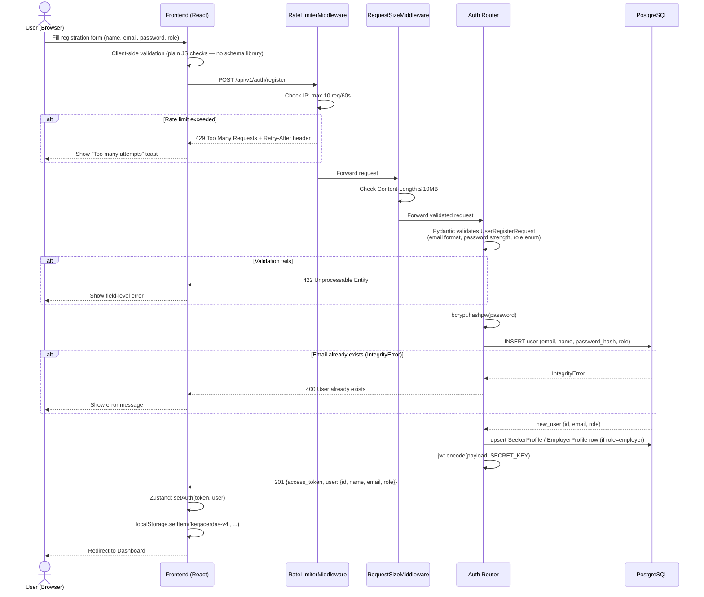
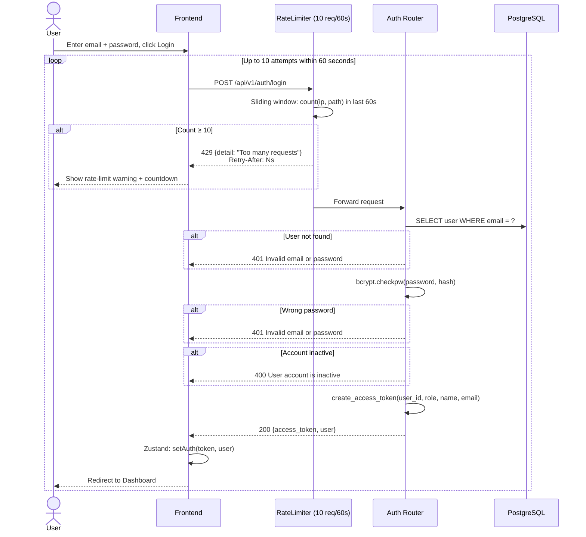
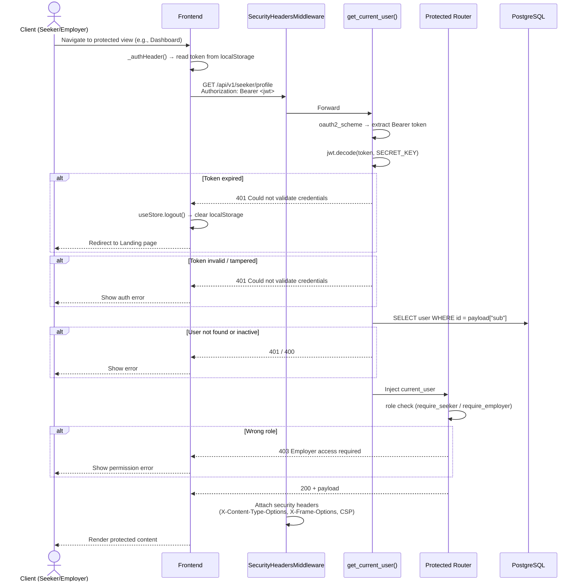
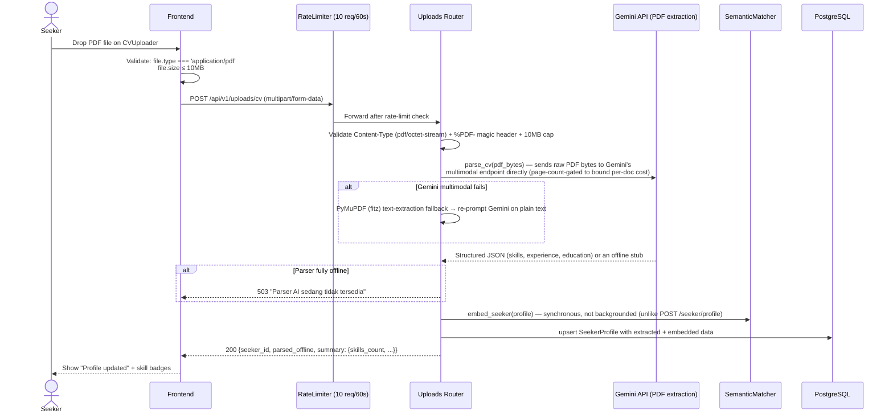
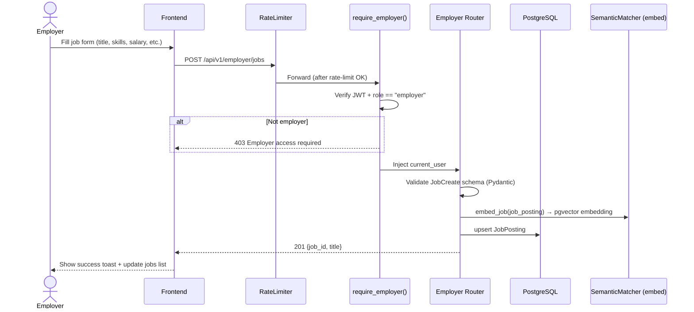

# KerjaCerdas — Sequence Diagrams

Common workflows documented as Mermaid sequence diagrams.

> The storage layer throughout is PostgreSQL via `backend/app/db/postgres_store.py` repositories. The AI agent invocation (#3) is a single-node LangGraph call, not a ReAct tool-calling loop — tool-calling is explicitly disabled (see [`ARCHITECTURE.md`](ARCHITECTURE.md)). The Zustand persist key is `kerjacerdas-v4`.

## Table of Contents

1. [User Registration](#1-user-registration)
2. [User Login with Rate Limiting](#2-user-login-with-rate-limiting)
3. [AI Agent Invoke with Input Sanitization](#3-ai-agent-invoke-with-input-sanitization)
4. [JWT-Protected Endpoint Access](#4-jwt-protected-endpoint-access)
5. [CV Upload & Profile Extraction](#5-cv-upload--profile-extraction)
6. [Employer Posts a Job](#6-employer-posts-a-job)
7. [E-KYC Identity & Education Verification](#7-e-kyc-identity--education-verification)

---

## 1. User Registration



---

## 2. User Login with Rate Limiting



---

## 3. AI Agent Invoke with Input Sanitization

```mermaid
sequenceDiagram
    actor S as Seeker
    participant F as Frontend
    participant RL as RateLimiter (20 req/60s)
    participant DP as get_current_user() (JWT guard)
    participant AG as Agent Router (agent.py)
    participant SN as sanitize_text()
    participant SM as SemanticMatcher
    participant LG as LangGraph single node (agent_node)
    participant DB as PostgreSQL (Jobs, Seekers)

    S->>F: Type message in FloatingAdvisor chat
    F->>RL: POST /api/v1/agent/invoke<br/>{user_message, seeker_id, explicit_intent}<br/>Authorization: Bearer <jwt>
    RL->>RL: Sliding window check (20/60s per IP)
    RL->>DP: Forward
    DP->>DP: Validate JWT (this endpoint has no anonymous path)
    alt Missing/invalid token
        DP-->>F: 401 Could not validate credentials
    end
    DP->>AG: Inject current_user
    AG->>SN: sanitize_text(user_message, max=2000)<br/>sanitize_text(explicit_intent, max=200)
    SN->>SN: Truncate → strip control chars → strip dangerous<br/>HTML tags (not HTML-escaped) → check injection patterns
    alt Injection detected
        SN-->>AG: raise HTTPException 422
        AG-->>F: 422 {detail: "Input field '...' contains disallowed content."}
        F-->>S: Show error toast
    end
    AG->>DB: Resolve seeker (inline seeker if owned → owned seeker_id →<br/>caller's own profile → in-memory anonymous placeholder)
    AG->>SM: rank_jobs_for_seeker(seeker, filters) — jobs=None,<br/>so the pgvector HNSW prefilter runs DB-side (no "load all jobs" step)
    SM-->>AG: raw MatchResult list
    AG->>DB: get_many(matched job_ids) — only the matched jobs, for enrichment
    AG->>AG: Token Efficiency Gate: if max(match.score) < 0.10, skip the LLM call entirely
    Note over AG: Routing/dispatch (route_intent/run_matcher/run_skill_gap/run_advisor)<br/>does not exist in this build — matching always runs procedurally here;<br/>the graph's only job is generating final_response text.
    alt Gate fires (early_exit)
        AG-->>F: 200 templated "belum ada lowongan relevan" reply, matches only, no Gemini call
    else
        AG->>LG: ainvoke single agent_node (Gemini call, no tool-calling), thread_id = sha256(user_id:session_id)
        alt LLM busy / graph recursion limit / not configured
            LG-->>AG: LLMBusyError / GraphRecursionError / RuntimeError
            AG->>AG: Degrade: canned "matches ready, narrative unavailable" text instead of a 500
        else
            LG-->>AG: {messages: [...]}
        end
    end
    AG->>AG: Hallucination Guard: drop matches whose job_id isn't in the loaded job set
    AG->>DB: Resolve employer company_name per match (cached per request)
    AG-->>F: 200 AgentInvokeResponse
    F-->>S: Render job cards + AI response
```

**Catatan arsitektur:** pemanggilan `SemanticMatcher` berjalan sebagai kode Python prosedural langsung di dalam `backend/app/api/routers/agent.py` (bukan di `nodes.py` — modul itu sekarang hanya berisi helper rekomendasi kursus `_recommend_courses`, dipanggil dari `seeker.py`'s skill-gap endpoint). Tidak ada fungsi/edge routing bernama `route_intent`/`run_matcher`/`run_skill_gap`/`run_advisor` di build ini. LangGraph **bukan** ReAct tool-calling loop — `bind_tools()` dinonaktifkan secara eksplisit di `builder.py` karena inkompatibilitas library — dan hanya dipanggil sekali sebagai node tunggal untuk menghasilkan teks jawaban akhir (`final_response`). Lihat [`ARCHITECTURE.md`](ARCHITECTURE.md) untuk detail lengkap.

---

## 4. JWT-Protected Endpoint Access



---

## 5. CV Upload & Profile Extraction



---

## 6. Employer Posts a Job



---

## 7. E-KYC Identity & Education Verification

```mermaid
sequenceDiagram
    actor S as Seeker
    participant F as Frontend (VerificationDashboard)
    participant VR as Verify Router (/api/v1/verify)
    participant ID as MockIdentityVerificationService
    participant SI as SIVIL Mock (Kemdikbud)
    participant DJ as DJP Online Mock (NPWP)

    note over F,VR: All data handling complies with UU PDP No.27/2022<br/>NIK is hashed via SHA-256; raw identity numbers are never stored in plaintext

    %% Step 1 — KTP Identity
    S->>F: Enter NIK (16 digits) + Full Name + optional selfie
    F->>F: Validate NIK length === 16, name non-empty
    F->>VR: POST /api/v1/verify/identity<br/>{nik, full_name, date_of_birth, selfie_image_base64}
    VR->>VR: Compute SHA-256 hash of NIK (raw NIK is never stored)
    VR->>ID: verify_identity(nik, full_name)
    Note over ID: Format check ONLY — 16-digit length and not<br/>prefixed "99" (demo fail rule). full_name is never<br/>checked against anything; this cannot confirm the<br/>NIK belongs to the submitting seeker.
    alt Format valid
        ID-->>VR: {is_valid: true, match_score: 98.5, verification_hash}
        VR->>DB: find_seeker_by_user_id, then<br/>update_seeker_verification_status(nik_verified='pending')
        VR-->>F: 200 {status: "PENDING", match_percentage: 98.5, verification_hash}
        F-->>S: Show "Format Tervalidasi — Menunggu Verifikasi Resmi" badge
    else Format invalid (prefix "99")
        ID-->>VR: {is_valid: false, match_score: 45.2}
        VR->>DB: update_seeker_verification_status(nik_verified='failed')
        VR-->>F: 200 {status: "FAILED", message: "Verifikasi identitas gagal."}
        F-->>S: Show red "Gagal" badge + retry prompt
    end
    Note over VR,DB: PENDING/FAILED persist durably (survive reload/another<br/>browser) but PENDING is never upgraded to VERIFIED by this<br/>mock — that value is reserved for a real Dukcapil integration.

    %% Step 2 — Ijazah / Education
    S->>F: Enter Ijazah Number + University + Major
    F->>VR: POST /api/v1/verify/education<br/>{ijazah_number, university_name, major}
    VR->>SI: Check ijazah_number format (mock — length >= 6, not an<br/>obvious placeholder like "000000" or "test")
    alt Format valid
        SI-->>VR: {ok: true, graduation_year, degree, status: "Lulus"}
        VR->>DB: update_seeker_verification_status(ijazah_verified='pending')
        VR-->>F: 200 {status: "PENDING", verified_data: {university, major, degree}}
        F-->>S: Show "Format Tervalidasi — Menunggu Verifikasi Resmi"
    else Placeholder / too short
        SI-->>VR: {ok: false}
        VR->>DB: update_seeker_verification_status(ijazah_verified='failed')
        VR-->>F: 200 {status: "NOT_FOUND", message: "Nomor ijazah tidak valid."}
        F-->>S: Show warning
    end

    %% Step 3 — NPWP (Employer only)
    note over S,DJ: NPWP verification is used by Employer accounts
    S->>F: Enter NPWP (15 numeric digits) + Company Name
    F->>VR: POST /api/v1/verify/npwp<br/>{npwp, company_name}
    VR->>DJ: Validate NPWP format (15 digits, non-zero)
    alt Valid NPWP
        DJ-->>VR: {ok: true, status: "AKTIF", valid_until: "2027-12-31"}
        VR-->>F: 200 {status: "VERIFIED", verified_data: {npwp, company_name, status}}
        F-->>S: Show "NPWP Terverifikasi ✓" + DJP badge
    else Invalid format or blacklisted
        DJ-->>VR: {ok: false}
        VR-->>F: 200 {status: "NOT_FOUND"}
        F-->>S: Show error
    end

    %% Document registry
    S->>F: View verified documents panel
    F->>VR: GET /api/v1/verify/documents
    VR-->>F: {encryption: "AES-256-GCM", compliance: ["UU-PDP-2022","ISO-27001"], documents: [...]}
    Note over VR,F: "encryption": "AES-256-GCM" is a descriptive string literal in this mock<br/>response, not an implemented encryption routine. NIK/OTP are stored as<br/>one-way SHA-256 hashes. Do not present this as an active capability.
    F-->>S: Render privacy promise row with masked file_id
```
