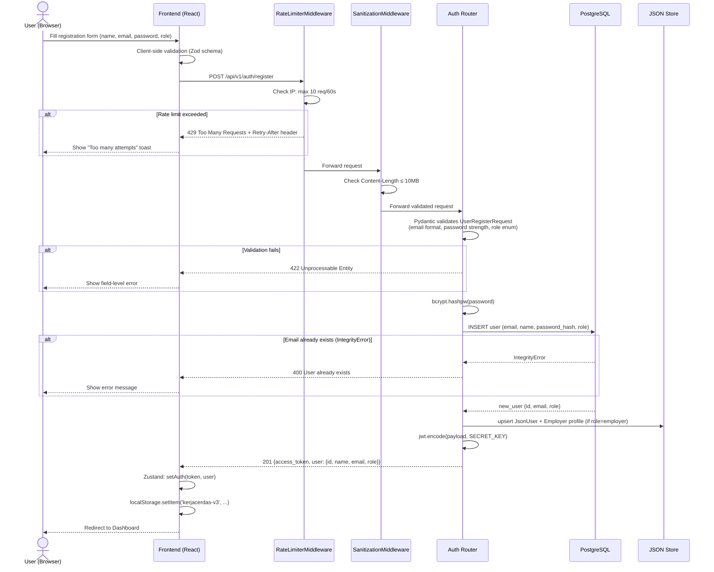
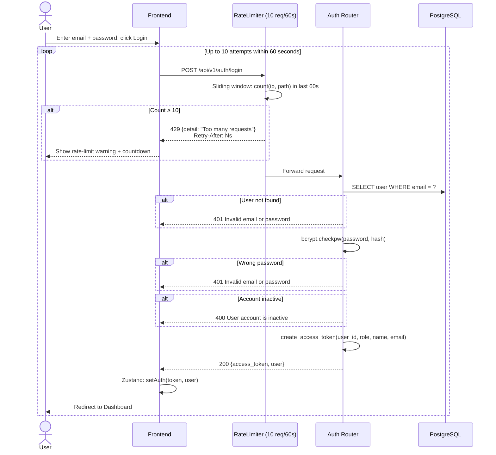
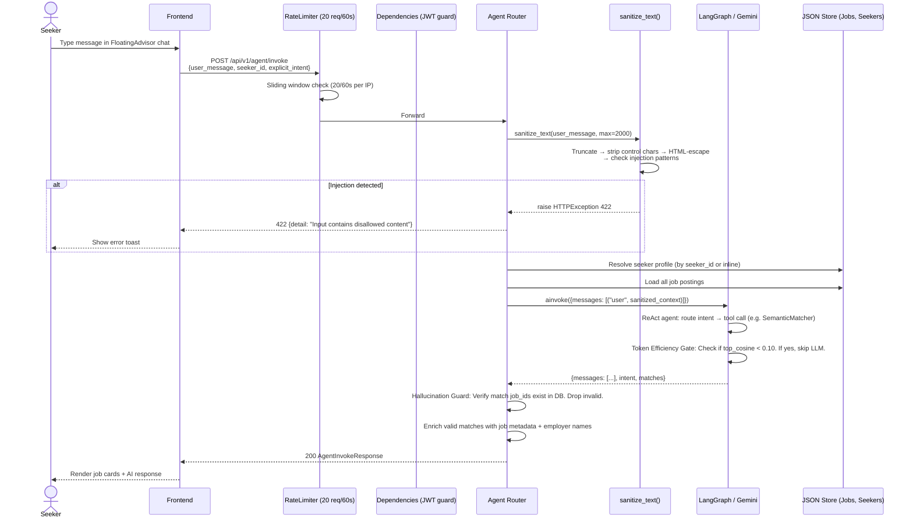
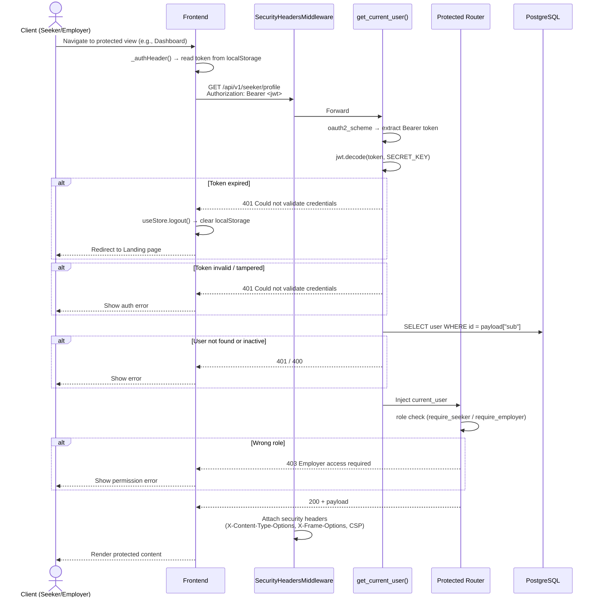
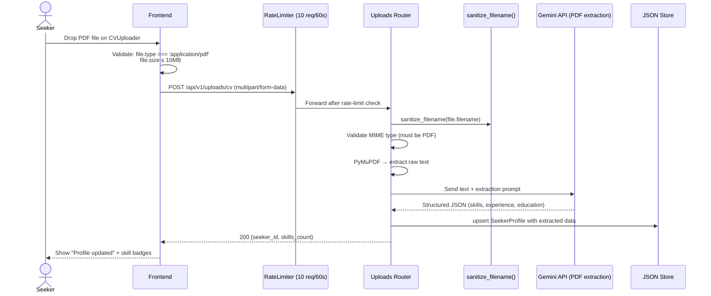

# KerjaCerdas — Sequence Diagrams

Common workflows documented as Mermaid sequence diagrams.

## Table of Contents

1. [User Registration](#1-user-registration)
2. [User Login with Rate Limiting](#2-user-login-with-rate-limiting)
3. [AI Agent Invoke with Input Sanitization](#3-ai-agent-invoke-with-input-sanitization)
4. [JWT-Protected Endpoint Access](#4-jwt-protected-endpoint-access)
5. [CV Upload & Profile Extraction](#5-cv-upload--profile-extraction)
6. [Employer Posts a Job](#6-employer-posts-a-job)
7. [E-KYC Identity & Education Verification](#7-e-kyc-identity--education-verification)

---

## 1. User Registration



---

## 2. User Login with Rate Limiting



---

## 3. AI Agent Invoke with Input Sanitization



---

## 4. JWT-Protected Endpoint Access



---

## 5. CV Upload & Profile Extraction



---

## 6. Employer Posts a Job


---

## 7. E-KYC Identity & Education Verification

```mermaid
sequenceDiagram
    actor S as Seeker
    participant F as Frontend (VerificationDashboard)
    participant VR as Verify Router (/api/v1/verify)
    participant ID as MockIdentityVerificationService
    participant SI as SIVIL Mock (Kemdikbud)
    participant DJ as DJP Online Mock (NPWP)

    note over F,VR: All data handling complies with UU PDP No.27/2022<br/>NIK is hashed via SHA-256; raw identity numbers are never stored in plaintext

    %% Step 1 — KTP Identity
    S->>F: Enter NIK (16 digits) + Full Name + optional selfie
    F->>F: Validate NIK length === 16, name non-empty
    F->>VR: POST /api/v1/verify/identity<br/>{nik, full_name, date_of_birth, selfie_image_base64}
    VR->>VR: Compute SHA-256 hash of NIK
    VR->>ID: verify_identity(nik, full_name)
    ID->>ID: Fuzzy-match name against registry<br/>Compute match_score (0–1)
    alt Match score ≥ 0.7
        ID-->>VR: {is_valid: true, match_score, verification_hash, pii_redacted: true}
        VR->>DB: Update SeekerProfile (nik=nik_hash, nik_verified='verified')
        VR-->>F: 200 {status: "VERIFIED", match_percentage: 0.97, verification_hash}
        F-->>S: Show green "Identitas Terverifikasi ✓" badge
    else Match failed
        ID-->>VR: {is_valid: false, match_score}
        VR-->>F: 200 {status: "FAILED", message: "Verifikasi identitas gagal."}
        F-->>S: Show red "Gagal" badge + retry prompt
    end

    %% Step 2 — Ijazah / Education
    S->>F: Enter Ijazah Number + University + Major
    F->>VR: POST /api/v1/verify/education<br/>{ijazah_number, university_name, major}
    VR->>SI: Query SIVIL registry (mock)
    alt Ijazah found & valid
        SI-->>VR: {ok: true, graduation_year, degree, status: "Lulus"}
        VR-->>F: 200 {status: "VERIFIED", verified_data: {university, major, degree}}
        F-->>S: Show "Ijazah Terverifikasi ✓"
    else Not found (ijazah_number == "0000" or empty)
        SI-->>VR: {ok: false}
        VR-->>F: 200 {status: "NOT_FOUND", message: "Ijazah tidak ditemukan."}
        F-->>S: Show warning
    end

    %% Step 3 — NPWP (Employer only)
    note over S,DJ: NPWP verification is used by Employer accounts
    S->>F: Enter NPWP (15 numeric digits) + Company Name
    F->>VR: POST /api/v1/verify/npwp<br/>{npwp, company_name}
    VR->>DJ: Validate NPWP format (15 digits, non-zero)
    alt Valid NPWP
        DJ-->>VR: {ok: true, status: "AKTIF", valid_until: "2027-12-31"}
        VR-->>F: 200 {status: "VERIFIED", verified_data: {npwp, company_name, status}}
        F-->>S: Show "NPWP Terverifikasi ✓" + DJP badge
    else Invalid format or blacklisted
        DJ-->>VR: {ok: false}
        VR-->>F: 200 {status: "NOT_FOUND"}
        F-->>S: Show error
    end

    %% Document registry
    S->>F: View verified documents panel
    F->>VR: GET /api/v1/verify/documents
    VR-->>F: {encryption: "AES-256-GCM", compliance: ["UU-PDP-2022","ISO-27001"], documents: [...]}
    F-->>S: Render privacy promise row with masked file_id
```
